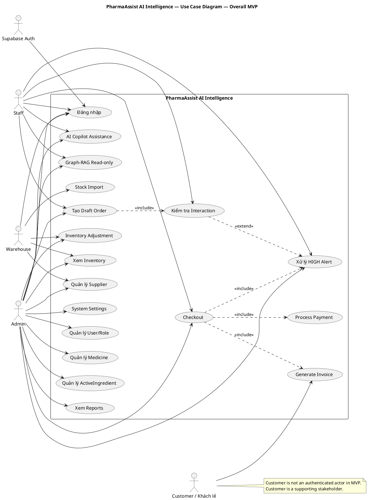
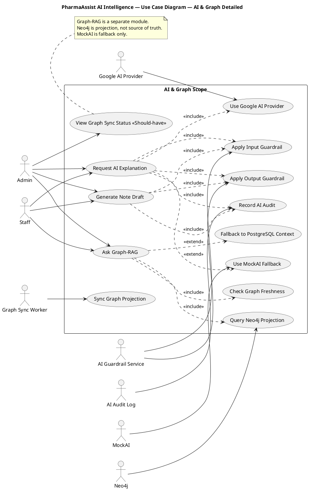
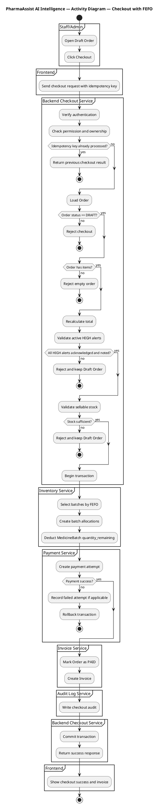
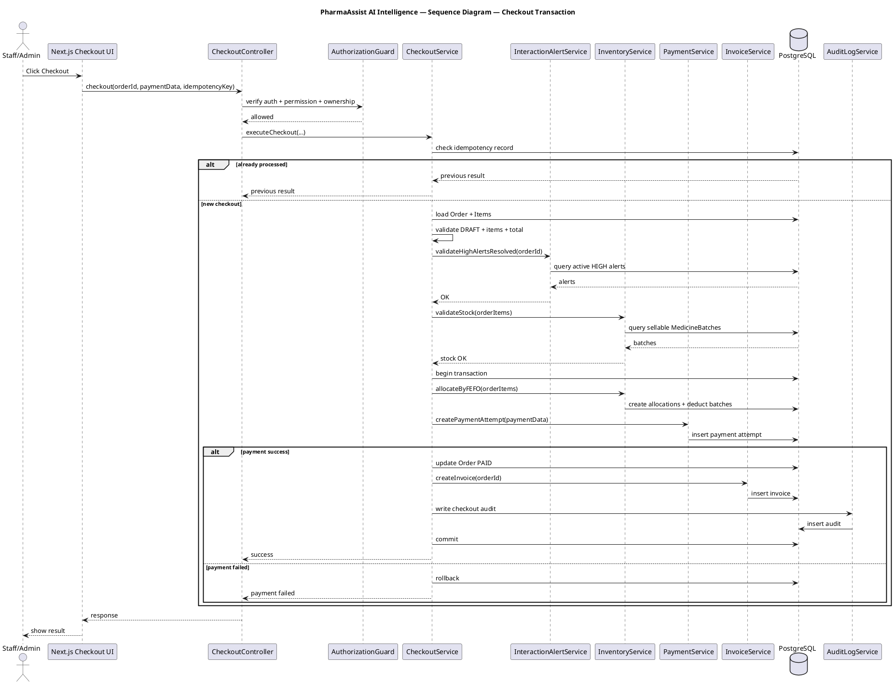
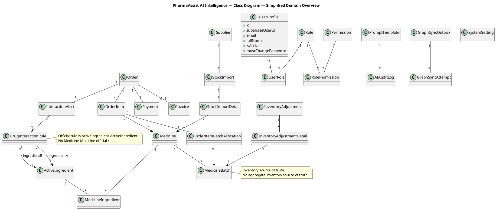
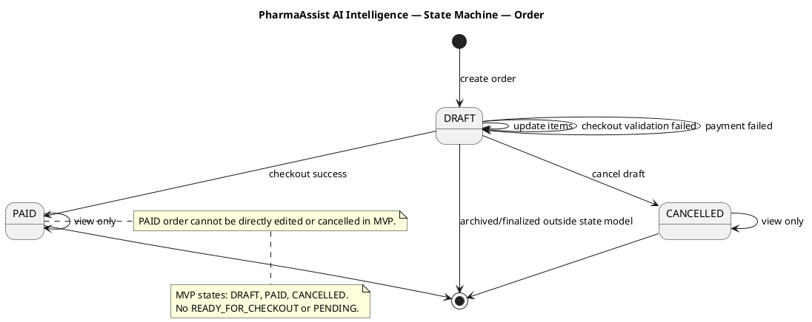
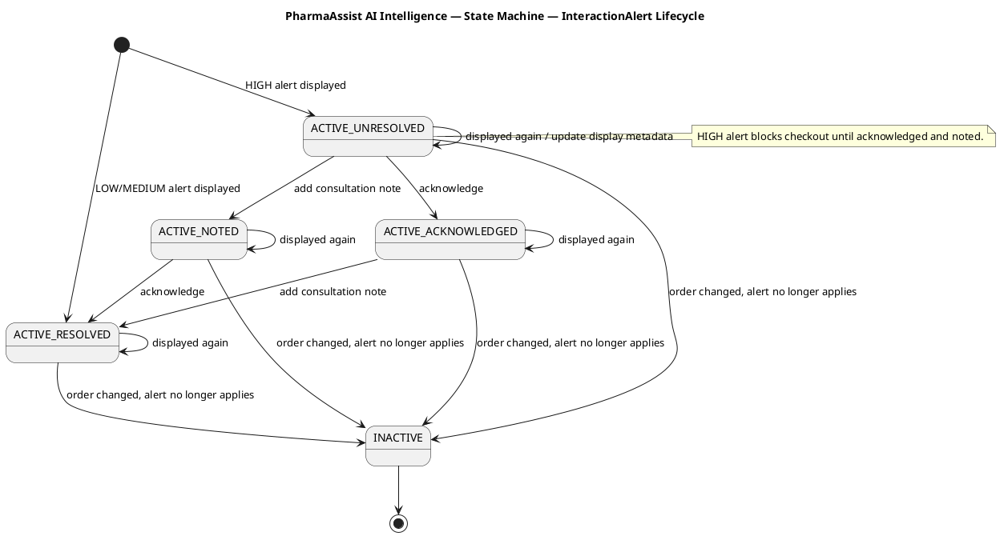

# Document 09 — UML Diagram Package

# Tài liệu 09 — Gói sơ đồ UML chính thức

---

## Metadata

| Mục               | Nội dung                                                                                                                                                     |
| ----------------- | ------------------------------------------------------------------------------------------------------------------------------------------------------------ |
| Document ID       | DOC-09                                                                                                                                                       |
| File name         | `09_uml_diagram_package.md`                                                                                                                                  |
| Document Name     | UML Diagram Package                                                                                                                                          |
| Tên tiếng Việt    | Gói sơ đồ UML chính thức                                                                                                                                     |
| Project           | PharmaAssist AI Intelligence                                                                                                                                 |
| Version           | 1.0 Draft                                                                                                                                                    |
| Status            | Draft                                                                                                                                                        |
| Created Date      | 08/06/2026                                                                                                                                                   |
| Last Updated      | 08/06/2026                                                                                                                                                   |
| Owner             | System Analyst / Project Leader                                                                                                                              |
| Reviewer          | Developer, Database Designer, Tester, Giảng viên hướng dẫn, Người viết báo cáo                                                                               |
| Baseline Source   | Document 06 — Software Requirements Specification, Document 07 — User Roles, Permissions & Authorization Specification, Document 08 — Use Case Specification |
| Related Documents | Document 08, Document 10, Document 11, Document 12, Document 13, Document 16, Document 17                                                                    |
| Language Rule     | Nội dung chính viết bằng tiếng Việt; tên file/tên tài liệu có thể giữ tiếng Anh                                                                              |
| Terminology Rule  | Giữ nguyên tên công nghệ, module, entity, API, table, enum, class/service/component và thuật ngữ kỹ thuật cần thiết bằng tiếng Anh                           |

---

## 1. Mục đích tài liệu

Tài liệu **UML Diagram Package** xác định gói sơ đồ UML chính thức cần có cho dự án **PharmaAssist AI Intelligence**.

Mục đích chính:

1. Xác định danh mục UML diagrams cần tạo.
2. Chuẩn hóa naming convention cho diagram.
3. Xác định phạm vi vẽ cho từng loại diagram.
4. Đảm bảo diagram bám đúng baseline mới.
5. Đảm bảo không quay lại thiết kế cũ đã bị thay thế.
6. Cung cấp mô tả chi tiết cho từng sơ đồ.
7. Cung cấp traceability từ Use Case, SRS sang UML.
8. Cung cấp traceability từ UML sang API, database, UI và testing.
9. Cung cấp PlantUML/Mermaid starter code nếu cần.
10. Làm cơ sở cho báo cáo, trình bày, thiết kế hệ thống và kiểm thử.

Tài liệu này không viết lại SRS, không viết API contract đầy đủ, không viết ERD/data dictionary đầy đủ, không viết UI spec đầy đủ và không viết test case chi tiết.

---

## 2. UML Package Overview

### 2.1. Vai trò của UML package trong dự án

UML package là cầu nối giữa:

1. **Requirements** trong Document 06.
2. **Authorization rules** trong Document 07.
3. **Use Cases** trong Document 08.
4. **Architecture** trong Document 10.
5. **Module Design** trong Document 11.
6. **API Specification** trong Document 12.
7. **Database Design & ERD** trong Document 13.
8. **AI Architecture** trong Document 16.
9. **Knowledge Graph / Neo4j / Graph-RAG Design** trong Document 17.
10. **Testing & Demo** trong Document 20.

UML package giúp nhóm hiểu:

1. Ai tương tác với hệ thống?
2. Hệ thống có những use case nào?
3. Luồng nghiệp vụ chính diễn ra ra sao?
4. Các service/module trao đổi với nhau như thế nào?
5. Entity/domain class chính là gì?
6. Trạng thái của Order, Stock Import, Inventory Adjustment, InteractionAlert và Graph Sync Job thay đổi thế nào?
7. Component chính trong hệ thống được tổ chức thế nào?
8. Hệ thống được triển khai trên môi trường nào?

### 2.2. Loại sơ đồ bắt buộc

Gói UML chính thức gồm các loại sơ đồ sau:

| Loại UML              | Bắt buộc | Mục đích                                                                     |
| --------------------- | -------: | ---------------------------------------------------------------------------- |
| Use Case Diagram      |       Có | Mô tả actor và chức năng hệ thống                                            |
| Activity Diagram      |       Có | Mô tả luồng nghiệp vụ chính                                                  |
| Sequence Diagram      |       Có | Mô tả tương tác theo thời gian giữa UI/API/service/database/external systems |
| Class Diagram         |       Có | Mô tả domain model và service/application structure                          |
| State Machine Diagram |       Có | Mô tả lifecycle của các entity quan trọng                                    |
| Component Diagram     |       Có | Mô tả kiến trúc component/module                                             |
| Deployment Diagram    |       Có | Mô tả môi trường triển khai và external services                             |

### 2.3. Nguyên tắc tổng quan

1. UML phải bám baseline chính thức.
2. UML không được dựa trên tài liệu cũ đã bị thay thế.
3. Overall Use Case Diagram không đưa AI components làm primary human actors.
4. Customer không được vẽ như authenticated actor trong MVP.
5. Customer chỉ là supporting stakeholder nhận invoice hoặc người mua tại quầy.
6. Google AI Provider và Neo4j có thể xuất hiện trong detailed AI/Graph diagrams, Component Diagram và Deployment Diagram.
7. Không dùng custom username/password/JWT auth.
8. Không lưu password/password_hash trong PostgreSQL.
9. Không dùng aggregate inventory làm source of truth.
10. Không dùng Medicine-level interaction rule làm official rule.
11. Không dùng MockAI-only hoặc MockGraph-only làm MVP.
12. Không tách Payment/Invoice khỏi Checkout transaction như command hoàn tất order riêng.
13. Không bỏ MedicineBatch, FEFO, InteractionAlert lifecycle, AI Guardrail/Audit, Graph Sync hoặc Graph-RAG.

---

## 3. UML Diagram Naming Convention

### 3.1. Diagram file naming format

Tên file diagram nên dùng format:

```text
09_[diagram_type]_[module_or_flow]_[short_name].[ext]
```

Ví dụ:

```text
09_usecase_overall.puml
09_usecase_ai_graph_detailed.puml
09_activity_checkout_fefo.puml
09_sequence_checkout_transaction.puml
09_class_sales_interaction.puml
09_state_order.puml
09_component_system_architecture.puml
09_deployment_demo_environment.puml
```

### 3.2. Diagram title format

Tiêu đề diagram nên dùng format:

```text
PharmaAssist AI Intelligence — [Diagram Type] — [Scope/Flow]
```

Ví dụ:

```text
PharmaAssist AI Intelligence — Use Case Diagram — Overall MVP
PharmaAssist AI Intelligence — Activity Diagram — Checkout with FEFO
PharmaAssist AI Intelligence — Sequence Diagram — AI Explanation Generation
```

### 3.3. Diagram ID format

Mỗi diagram có ID:

```text
UML-[TYPE]-[NUMBER]
```

Ví dụ:

| Diagram ID  | Diagram                               |
| ----------- | ------------------------------------- |
| UML-UC-001  | Overall Use Case Diagram              |
| UML-ACT-006 | Checkout with FEFO Activity Diagram   |
| UML-SEQ-006 | Checkout Transaction Sequence Diagram |
| UML-CLS-004 | Sales & Interaction Class Diagram     |
| UML-STM-001 | Order State Machine                   |
| UML-CMP-001 | Component Diagram                     |
| UML-DEP-001 | Deployment Diagram                    |

### 3.4. Recommended folder structure

```text
docs/
  09_uml/
    usecase/
    activity/
    sequence/
    class/
    state/
    component/
    deployment/
    exports/
```

### 3.5. Recommended source/export format

| Artifact                | Format                              |
| ----------------------- | ----------------------------------- |
| Editable source         | `.puml` hoặc `.mmd`                 |
| Report export           | `.png`, `.svg`, hoặc embedded image |
| Documentation reference | Markdown link tới source/export     |
| Final submission        | PNG/SVG kèm source code nếu cần     |

---

## 4. Diagram Scope Rules

### 4.1. Scope rules chung

Mỗi diagram phải ghi rõ:

1. Diagram ID.
2. Diagram name.
3. Scope: MVP / Should-have / Future / Out of Scope.
4. Related use cases.
5. Related SRS requirements.
6. Notes nếu có phần bị cố ý lược bỏ.

### 4.2. Không đưa quá nhiều chi tiết vào một diagram

Diagram nên dễ đọc. Nếu một sơ đồ quá lớn, phải tách theo domain.

Ví dụ:

1. Không vẽ toàn bộ class diagram trong một sơ đồ khổng lồ.
2. Class diagrams cần chia thành:

   * Simplified domain overview.
   * Identity & Access.
   * Medicine & Inventory.
   * Sales & Interaction.
   * AI & Graph.
   * Service/Application.
3. Sequence diagrams cần tập trung vào một flow chính.
4. Activity diagrams cần tập trung vào một process.

### 4.3. Quy tắc với Use Case Diagram

1. Overall Use Case Diagram chỉ hiển thị actor chính và use case cấp cao.
2. Không đưa AI components làm primary human actors.
3. Customer chỉ là supporting stakeholder, không phải authenticated system user trong MVP.
4. Google AI Provider và Neo4j không nên xuất hiện trong Overall Use Case Diagram để tránh clutter.
5. Google AI Provider và Neo4j được đưa vào detailed AI/Graph Use Case Diagram.
6. Should-have use cases phải đánh dấu `<<Should-have>>`.
7. Future use cases phải tách riêng hoặc đánh dấu `<<Future>>`.
8. Out of Scope use cases không nên vẽ chung với MVP diagram, trừ khi cần minh họa “không làm”.

### 4.4. Quy tắc với Activity Diagram

1. Dùng swimlane/activity partition khi có nhiều actor.
2. Mỗi activity diagram cần có start, end, decision, action chính.
3. Nên thể hiện validation points.
4. Với Checkout, phải thể hiện:

   * Check Order status.
   * Check stock.
   * Check HIGH alert acknowledgement.
   * Check HIGH consultation note.
   * Apply FEFO.
   * Create allocation.
   * Create payment.
   * Create invoice.
   * Commit/rollback.
5. Với AI flow, phải thể hiện input guardrail và output guardrail.
6. Với Graph Sync, phải thể hiện outbox, worker, retry, failed/success state và freshness update.

### 4.5. Quy tắc với Sequence Diagram

1. Mỗi sequence diagram chỉ mô tả một flow.
2. Phải có actor, frontend, backend controller/service, database/external system khi cần.
3. Không viết request/response payload chi tiết.
4. Phải thể hiện transaction boundary ở Checkout, Stock Import confirm và Inventory Adjustment confirm.
5. Phải thể hiện fallback với AI Provider và Graph-RAG.
6. Phải thể hiện backend authorization check ở flow quan trọng.

### 4.6. Quy tắc với Class Diagram

1. Class diagram trong Document 09 là thiết kế mô hình hóa, không phải Prisma schema chi tiết.
2. Không cần field đầy đủ như data dictionary.
3. Cần thể hiện entity chính, relationship chính và service chính.
4. Không dùng aggregate Inventory làm source of truth.
5. MedicineBatch phải là inventory source of truth.
6. DrugInteraction phải ở cấp ActiveIngredient.
7. InteractionAlert phải là entity persist.
8. Payment/Invoice phải liên kết với Checkout/Order flow.
9. AI Audit và Graph Sync Outbox phải xuất hiện trong AI & Graph class diagram hoặc service/application class diagram.

### 4.7. Quy tắc với State Machine Diagram

Bắt buộc có state machine cho:

1. Order.
2. Stock Import.
3. Inventory Adjustment.
4. InteractionAlert.
5. Graph Sync Job.

State machine phải thể hiện rõ trạng thái hợp lệ và transition không hợp lệ.

### 4.8. Quy tắc với Component/Deployment Diagram

Component diagram cần thể hiện:

1. Next.js Frontend.
2. NestJS Backend.
3. Prisma.
4. PostgreSQL.
5. Supabase Auth.
6. Google AI Provider.
7. MockAI.
8. Neo4j.
9. Graph Sync Worker.
10. AI Guardrail.
11. AI Audit.
12. Reports.
13. Demo Reset tooling nếu cần.

Deployment diagram cần thể hiện môi trường:

1. User browser.
2. Frontend hosting/local.
3. Backend runtime/local/cloud.
4. Supabase Auth.
5. Supabase PostgreSQL/PostgreSQL.
6. Neo4j AuraDB hoặc Neo4j instance.
7. Google AI Provider.
8. GitHub/Jira nếu cần ở project environment.
9. Local-only demo reset.

---

# 5. Use Case Diagrams

---

## 5.1. UML-UC-001 — Overall Use Case Diagram

### Mục đích

Overall Use Case Diagram mô tả actor chính và nhóm chức năng MVP cấp cao.

### Scope

MVP.

### Actors

| Actor               | Loại                       |
| ------------------- | -------------------------- |
| Admin               | Primary human actor        |
| Staff               | Primary human actor        |
| Warehouse           | Primary human actor        |
| Customer / Khách lẻ | Supporting stakeholder     |
| Supabase Auth       | Supporting external system |

### Không đưa vào diagram này

1. Google AI Provider.
2. Neo4j.
3. Graph Sync Worker.
4. AI Guardrail Service.
5. Audit Log Service.
6. MockAI.
7. Internal services.

Các actor/component này sẽ xuất hiện ở detailed AI/Graph diagrams, Component Diagram hoặc Deployment Diagram.

### Use case groups cần hiển thị

| Actor               | Use cases cấp cao                                                                                                                                                                    |
| ------------------- | ------------------------------------------------------------------------------------------------------------------------------------------------------------------------------------ |
| Admin               | Manage Users/Roles, Manage Medicine, Manage ActiveIngredients, Manage Supplier, Manage Interaction Rules, View Reports, View InteractionAlert History, Use AI/Graph, Manage Settings |
| Staff               | Login, Create Draft Order, Add Medicine to Order, Handle Interaction Alerts, Use AI Copilot, Checkout, View Own Orders/Invoices                                                      |
| Warehouse           | Manage Supplier, Create/Confirm Stock Import, View Inventory, Create/Confirm Inventory Adjustment, View Inventory Report                                                             |
| Customer / Khách lẻ | Receive Invoice                                                                                                                                                                      |
| Supabase Auth       | Authenticate User                                                                                                                                                                    |

### Include/extend notes

1. Checkout includes:

   * Validate Order.
   * Validate Stock.
   * Validate HIGH Alert Handling.
   * Apply FEFO.
   * Process Payment.
   * Generate Invoice.
2. Add Medicine to Order includes:

   * Check Interaction.
   * Persist InteractionAlert.
3. Handle HIGH Alert includes:

   * Acknowledge HIGH Alert.
   * Add Consultation Note.

### Traceability

| Source   | IDs                                                                                                                                                |
| -------- | -------------------------------------------------------------------------------------------------------------------------------------------------- |
| Use Case | UC-AUTH, UC-IAM, UC-MED, UC-ACT, UC-SUP, UC-INV, UC-STI, UC-ADJ, UC-POS, UC-INT, UC-ALT, UC-AI, UC-CHK, UC-PAY, UC-INVOC, UC-RPT, UC-GRAPH, UC-SET |
| SRS      | FR-AUTH, FR-RBAC, FR-MED, FR-ACT, FR-SUP, FR-BAT, FR-STI, FR-ADJ, FR-POS, FR-DRG, FR-ALT, FR-AIC, FR-CHK, FR-PAY, FR-INV, FR-RPT, FR-GRG, FR-SET   |

---

## 5.2. UML-UC-002 — Detailed AI/Graph Use Case Diagram

### Mục đích

Mô tả chi tiết các use cases liên quan AI Copilot, AI Guardrail, AI Audit, Graph Sync và Graph-RAG.

### Scope

MVP + Should-have markers.

### Actors

| Actor                | Loại                       |
| -------------------- | -------------------------- |
| Admin                | Primary human actor        |
| Staff                | Primary human actor        |
| Google AI Provider   | Supporting external system |
| MockAI               | Supporting fallback system |
| Neo4j                | Supporting graph system    |
| Graph Sync Worker    | Supporting internal system |
| AI Guardrail Service | Supporting internal system |
| AI Audit Log         | Supporting internal system |

### Use cases

| Use Case                         | Actor                   |
| -------------------------------- | ----------------------- |
| Request AI Explanation           | Staff/Admin             |
| Generate Consultation Note Draft | Staff/Admin             |
| Apply Input Guardrail            | AI Guardrail Service    |
| Apply Output Guardrail           | AI Guardrail Service    |
| Record AI Audit                  | AI Audit Log            |
| Use Google AI Provider           | Google AI Provider      |
| Use MockAI Fallback              | MockAI                  |
| Ask Graph-RAG                    | Staff/Admin             |
| Check Graph Freshness            | Graph-RAG/System        |
| Query Neo4j Projection           | Neo4j                   |
| Fallback to PostgreSQL Context   | Graph-RAG/System        |
| Sync Graph Projection            | Graph Sync Worker       |
| View Graph Sync Status           | Admin `<<Should-have>>` |

### Important notes

1. AI Copilot không được gộp mơ hồ với Graph-RAG.
2. Graph-RAG là module riêng.
3. AI Guardrail áp dụng trước và sau provider call.
4. AI Audit là MVP.
5. MockAI chỉ là fallback.
6. Neo4j là projection, không phải source of truth.
7. Graph stale/unavailable phải fallback hoặc safe error.

### Traceability

| Source       | IDs                                                                                                |
| ------------ | -------------------------------------------------------------------------------------------------- |
| Use Case     | UC-AI-001, UC-AI-002, UC-AI-003, UC-AI-004, UC-GRAPH-001, UC-GRAPH-002, UC-GRAPH-003, UC-GRAPH-004 |
| SRS          | FR-AIC, FR-AIG, FR-AIA, FR-GSY, FR-GRG                                                             |
| Architecture | Document 16, Document 17                                                                           |

---

## 5.3. UML-UC-003 — Detailed Inventory Use Case Diagram

### Mục đích

Mô tả chi tiết use cases liên quan Supplier, MedicineBatch, Stock Import, Inventory Summary và Inventory Adjustment.

### Scope

MVP.

### Actors

| Actor             | Loại                                                                  |
| ----------------- | --------------------------------------------------------------------- |
| Admin             | Primary human actor                                                   |
| Warehouse         | Primary human actor                                                   |
| Graph Sync Worker | Supporting internal system nếu Medicine/ingredient changes sync graph |
| Audit Log Service | Supporting internal system                                            |

### Use cases

| Use Case                     | Actor             |
| ---------------------------- | ----------------- |
| Manage Supplier              | Admin/Warehouse   |
| Deactivate Supplier          | Admin             |
| Create Stock Import Draft    | Admin/Warehouse   |
| Update Stock Import Draft    | Admin/Warehouse   |
| Confirm Stock Import         | Admin/Warehouse   |
| Create MedicineBatch         | System            |
| Merge Existing Batch         | System            |
| Reject Expiry Mismatch       | System            |
| View Inventory Summary       | Admin/Warehouse   |
| View Batch Detail            | Admin/Warehouse   |
| View Low Stock               | Admin/Warehouse   |
| View Near Expiry             | Admin/Warehouse   |
| Create Inventory Adjustment  | Admin/Warehouse   |
| Confirm Inventory Adjustment | Admin/Warehouse   |
| Record Audit                 | Audit Log Service |

### Important notes

1. MedicineBatch là source of truth.
2. Không có aggregate inventory source of truth.
3. Stock Import confirm mới cập nhật MedicineBatch.
4. Inventory Adjustment là cách điều chỉnh tồn kho chính thức.
5. Warehouse không trực tiếp sửa quantity.
6. Low-stock tính từ sellable quantity.
7. Near-expiry dùng threshold default 90 ngày.

---

## 5.4. UML-UC-004 — Detailed Sales Use Case Diagram

### Mục đích

Mô tả use cases liên quan POS Draft Order, InteractionAlert, AI Assistance, Checkout, Payment và Invoice.

### Scope

MVP.

### Actors

| Actor               | Loại                                         |
| ------------------- | -------------------------------------------- |
| Staff               | Primary human actor                          |
| Admin               | Primary human actor                          |
| Customer / Khách lẻ | Supporting stakeholder                       |
| Google AI Provider  | Supporting external system trong AI use case |
| MockAI              | Supporting fallback system                   |
| Audit Log Service   | Supporting internal system                   |

### Use cases

| Use Case                    | Actor               |
| --------------------------- | ------------------- |
| Create Draft Order          | Staff/Admin         |
| Add Medicine to Draft Order | Staff/Admin         |
| Update Order Item Quantity  | Staff/Admin         |
| Remove Order Item           | Staff/Admin         |
| Check Interaction           | System              |
| Persist InteractionAlert    | System              |
| View InteractionAlert       | Staff/Admin         |
| Acknowledge HIGH Alert      | Staff/Admin         |
| Add Consultation Note       | Staff/Admin         |
| Request AI Explanation      | Staff/Admin         |
| Generate Note Draft         | Staff/Admin         |
| Checkout                    | Staff/Admin         |
| Apply FEFO                  | System              |
| Process Payment Simulation  | System              |
| Generate Invoice            | System              |
| Receive Invoice             | Customer / Khách lẻ |

### Important notes

1. Customer không authenticated.
2. Staff chỉ thao tác Order thuộc ownership scope.
3. Admin thao tác all-scope.
4. Checkout includes FEFO, payment và invoice.
5. HIGH alert unresolved block checkout.
6. Payment/Invoice không phải command hoàn tất order độc lập.

---

# 6. Activity Diagrams

---

## 6.1. UML-ACT-001 — Login Activity Diagram

### Mục đích

Mô tả luồng đăng nhập bằng Supabase Auth và backend resolve user profile/permission.

### Scope

MVP.

### Swimlanes

1. User.
2. Frontend.
3. Supabase Auth.
4. Backend.
5. PostgreSQL.

### Main activities

1. User nhập email/password.
2. Frontend gửi login request tới Supabase Auth.
3. Supabase Auth xác thực.
4. Frontend nhận access token.
5. Frontend gọi backend lấy profile/permissions.
6. Backend verify token.
7. Backend tìm user profile.
8. Backend kiểm tra active status.
9. Backend kiểm tra `must_change_password`.
10. Backend load roles/permissions.
11. Frontend render UI theo permission.

### Decisions

| Decision              | Yes                   | No                     |
| --------------------- | --------------------- | ---------------------- |
| Login valid?          | Tiếp tục              | Hiển thị lỗi           |
| Profile exists?       | Tiếp tục              | Profile not configured |
| User active?          | Tiếp tục              | Account disabled       |
| must_change_password? | Redirect đổi mật khẩu | Vào app                |
| Permission loaded?    | Render UI             | Error                  |

### Traceability

UC-AUTH-001, UC-AUTH-004; FR-AUTH, FR-RBAC.

---

## 6.2. UML-ACT-002 — Stock Import Activity Diagram

### Mục đích

Mô tả luồng tạo và confirm Stock Import.

### Scope

MVP.

### Swimlanes

1. Warehouse/Admin.
2. Frontend.
3. Backend Stock Import Service.
4. Backend Inventory Service.
5. PostgreSQL.
6. Audit Log Service.

### Main activities

1. User tạo Stock Import Draft.
2. User chọn Supplier.
3. User thêm details.
4. Hệ thống validate Medicine, batch number, expiry date, quantity.
5. User lưu Draft.
6. User chọn Confirm.
7. Backend kiểm tra permission.
8. Backend kiểm tra status DRAFT.
9. Backend validate details.
10. Backend kiểm tra batch matching.
11. Nếu batch chưa tồn tại: tạo MedicineBatch.
12. Nếu batch tồn tại và expiry match: cộng quantity.
13. Nếu expiry mismatch: reject.
14. Update Stock Import status CONFIRMED.
15. Ghi audit.
16. Commit transaction.

### Decisions

| Decision             | Yes             | No           |
| -------------------- | --------------- | ------------ |
| User has permission? | Tiếp tục        | Forbidden    |
| Import status DRAFT? | Tiếp tục        | Reject       |
| Details valid?       | Tiếp tục        | Reject       |
| Batch exists?        | Check expiry    | Create batch |
| Expiry matches?      | Merge quantity  | Reject       |
| Transaction success? | Confirm success | Rollback     |

### Traceability

UC-STI-001, UC-STI-004; FR-STI, FR-BAT, BR-STI.

---

## 6.3. UML-ACT-003 — Inventory Adjustment Activity Diagram

### Mục đích

Mô tả luồng tạo và confirm Inventory Adjustment.

### Scope

MVP.

### Swimlanes

1. Warehouse/Admin.
2. Frontend.
3. Backend Adjustment Service.
4. Backend Inventory Service.
5. PostgreSQL.
6. Audit Log Service.

### Main activities

1. User tạo Inventory Adjustment.
2. User chọn MedicineBatch.
3. User nhập adjustment quantity.
4. User nhập reason.
5. Hệ thống validate reason.
6. Hệ thống kiểm tra không làm quantity âm.
7. User confirm adjustment.
8. Backend kiểm tra permission.
9. Backend cập nhật MedicineBatch.
10. Backend chuyển adjustment sang CONFIRMED.
11. Backend ghi audit.
12. Commit transaction.

### Decisions

| Decision                       | Yes             | No        |
| ------------------------------ | --------------- | --------- |
| Reason provided?               | Tiếp tục        | Reject    |
| Quantity remains non-negative? | Tiếp tục        | Reject    |
| User has permission?           | Tiếp tục        | Forbidden |
| Adjustment already confirmed?  | Reject          | Tiếp tục  |
| Transaction success?           | Confirm success | Rollback  |

### Traceability

UC-ADJ-001, UC-ADJ-002; FR-ADJ, BR-ADJ.

---

## 6.4. UML-ACT-004 — POS Draft Order Activity Diagram

### Mục đích

Mô tả luồng tạo Draft Order và thao tác item trong POS.

### Scope

MVP.

### Swimlanes

1. Staff/Admin.
2. Frontend POS.
3. Backend Order Service.
4. Backend Inventory Service.
5. Backend Interaction Service.
6. PostgreSQL.

### Main activities

1. User tạo Draft Order.
2. Hệ thống gán `created_by`.
3. User tìm Medicine.
4. Hệ thống hiển thị Medicine active và sellable stock.
5. User thêm Medicine vào order.
6. Backend kiểm tra permission và ownership.
7. Backend kiểm tra Order status DRAFT.
8. Backend thêm/cập nhật item.
9. Backend gọi Interaction Service.
10. Interaction Service kiểm tra ActiveIngredient pairs.
11. Hệ thống persist InteractionAlert nếu có.
12. UI hiển thị order và alerts.

### Decisions

| Decision             | Yes                   | No               |
| -------------------- | --------------------- | ---------------- |
| User is Staff/Admin? | Tiếp tục              | Forbidden        |
| Order DRAFT?         | Tiếp tục              | Reject           |
| Medicine active?     | Tiếp tục              | Reject           |
| User owns order?     | Tiếp tục              | Ownership denied |
| Interaction found?   | Persist/display alert | No alert         |

### Traceability

UC-POS-001 to UC-POS-004, UC-INT-001; FR-POS, FR-DRG, FR-ALT.

---

## 6.5. UML-ACT-005 — Interaction Alert Handling Activity Diagram

### Mục đích

Mô tả luồng xử lý LOW/MEDIUM/HIGH InteractionAlert.

### Scope

MVP.

### Swimlanes

1. Staff/Admin.
2. Frontend POS.
3. Backend InteractionAlert Service.
4. AI Copilot Service nếu dùng.
5. PostgreSQL.
6. Audit Log Service.

### Main activities

1. Hệ thống hiển thị InteractionAlert.
2. Nếu alert LOW/MEDIUM: user có thể đọc và tiếp tục.
3. Nếu alert HIGH: hệ thống yêu cầu acknowledgement.
4. User acknowledge HIGH alert.
5. Backend lưu acknowledged_by/at.
6. User nhập consultation note.
7. Nếu dùng AI draft: gọi AI Copilot.
8. User xác nhận note.
9. Backend lưu note_by/note_at.
10. Alert đủ điều kiện checkout.
11. Backend ghi audit.

### Decisions

| Decision             | Yes              | No             |
| -------------------- | ---------------- | -------------- |
| Alert severity HIGH? | Require ack/note | No blocking    |
| User has ownership?  | Tiếp tục         | Denied         |
| Acknowledged?        | Check note       | Block checkout |
| Note exists?         | Allow checkout   | Block checkout |
| AI draft used?       | Generate draft   | Manual note    |

### Traceability

UC-ALT-001 to UC-ALT-005; FR-ALT, FR-AIC.

---

## 6.6. UML-ACT-006 — Checkout with FEFO Activity Diagram

### Mục đích

Mô tả luồng Checkout transaction có FEFO, payment và invoice.

### Scope

MVP.

### Swimlanes

1. Staff/Admin.
2. Frontend Checkout.
3. Backend Checkout Service.
4. Inventory Service.
5. Payment Service.
6. Invoice Service.
7. PostgreSQL.
8. Audit Log Service.

### Main activities

1. User chọn checkout.
2. Frontend gửi request với idempotency key.
3. Backend verify auth/permission/ownership.
4. Backend kiểm tra Order DRAFT.
5. Backend kiểm tra Order có items.
6. Backend tính lại total.
7. Backend kiểm tra HIGH alerts.
8. Backend kiểm tra stock availability.
9. Backend bắt đầu transaction.
10. Inventory Service chọn batches theo FEFO.
11. Tạo batch allocations.
12. Trừ quantity_remaining.
13. Payment Service tạo payment attempt.
14. Nếu payment success, Order chuyển PAID.
15. Invoice Service tạo invoice.
16. Ghi audit.
17. Commit transaction.
18. Frontend hiển thị success.

### Exception/rollback activities

1. Nếu stock không đủ: reject, Order vẫn DRAFT.
2. Nếu HIGH alert thiếu ack/note: reject, Order vẫn DRAFT.
3. Nếu payment fail: Order không PAID; không tạo invoice.
4. Nếu transaction lỗi: rollback.
5. Nếu idempotency retry: trả kết quả cũ, không xử lý lại.

### Traceability

UC-CHK-001 to UC-CHK-004; FR-CHK, FR-PAY, FR-INV, BR-SALES, BR-PAY.

---

## 6.7. UML-ACT-007 — AI Copilot Guardrail Flow Activity Diagram

### Mục đích

Mô tả luồng AI explanation/draft với input/output guardrail và audit.

### Scope

MVP.

### Swimlanes

1. Staff/Admin.
2. Frontend AI Panel.
3. AI Orchestrator.
4. AI Guardrail Service.
5. Google AI Provider.
6. MockAI.
7. AI Audit Service.
8. PostgreSQL.

### Main activities

1. User yêu cầu AI explanation hoặc draft.
2. Backend kiểm tra permission và ownership.
3. Backend xây context tối thiểu.
4. Input guardrail kiểm tra request.
5. Nếu input unsafe: safe refusal.
6. Nếu input safe: gọi Google AI Provider.
7. Nếu Google AI Provider lỗi: fallback MockAI.
8. Output guardrail kiểm tra response.
9. Nếu output unsafe: safe refusal.
10. Ghi AI Audit.
11. UI hiển thị response an toàn.

### Decisions

| Decision                   | Yes                        | No                  |
| -------------------------- | -------------------------- | ------------------- |
| User authorized?           | Tiếp tục                   | Forbidden           |
| Input safe?                | Call provider              | Safe refusal        |
| Google provider available? | Use provider               | Use MockAI          |
| Output safe?               | Display                    | Block raw output    |
| Response is draft?         | User confirmation required | Display explanation |

### Traceability

UC-AI-001 to UC-AI-004; FR-AIC, FR-AIG, FR-AIA.

---

## 6.8. UML-ACT-008 — Graph Sync Flow Activity Diagram

### Mục đích

Mô tả luồng đồng bộ graph từ PostgreSQL sang Neo4j bằng outbox/worker/retry/audit/freshness.

### Scope

MVP.

### Swimlanes

1. Backend Domain Service.
2. PostgreSQL.
3. Graph Sync Outbox.
4. Graph Sync Worker.
5. Neo4j.
6. Graph Sync Log/Audit.

### Main activities

1. Domain data thay đổi.
2. Backend lưu thay đổi vào PostgreSQL.
3. Backend tạo Graph Sync Outbox event.
4. Worker lấy pending event.
5. Worker build projection payload.
6. Worker upsert node/relationship vào Neo4j.
7. Worker cập nhật job success.
8. Worker cập nhật freshness metadata.
9. Worker ghi log/audit.

### Retry activities

1. Nếu Neo4j lỗi, worker ghi failed attempt.
2. Worker tăng retry count.
3. Nếu chưa quá retry limit, job quay lại pending/retry.
4. Nếu quá retry limit, job chuyển FAILED.
5. Graph-RAG thấy job pending/failed thì xem graph stale cho query liên quan.

### Traceability

UC-GRAPH-003; FR-GSY, FR-GRG, BR-GPH.

---

# 7. Sequence Diagrams

---

## 7.1. UML-SEQ-001 — Supabase Auth Login Sequence Diagram

### Participants

1. User.
2. Next.js Frontend.
3. Supabase Auth.
4. NestJS Backend.
5. PostgreSQL.

### Main messages

1. User nhập email/password.
2. Frontend gọi Supabase Auth login.
3. Supabase Auth trả session/access token.
4. Frontend gọi backend `/me` hoặc tương đương.
5. Backend verify token.
6. Backend query user profile.
7. Backend query roles/permissions.
8. Backend trả user context.
9. Frontend render UI theo permission.

### Alt fragments

1. Invalid credentials.
2. Profile not found.
3. User inactive.
4. must_change_password true.

### Traceability

UC-AUTH-001, UC-AUTH-004; FR-AUTH, FR-RBAC.

---

## 7.2. UML-SEQ-002 — Stock Import Confirm Sequence Diagram

### Participants

1. Warehouse/Admin.
2. Next.js Frontend.
3. StockImportController.
4. AuthorizationGuard.
5. StockImportService.
6. InventoryService.
7. Prisma/PostgreSQL.
8. AuditLogService.

### Main messages

1. User click Confirm.
2. Frontend gửi confirm request.
3. Controller gọi AuthorizationGuard.
4. Guard kiểm tra `stock_import.confirm`.
5. Service load Stock Import.
6. Service validate status DRAFT.
7. Service validate details.
8. Service bắt đầu transaction.
9. InventoryService kiểm tra batch match.
10. Tạo/cập nhật MedicineBatch.
11. Update Stock Import status CONFIRMED.
12. AuditLogService ghi audit.
13. Commit.
14. Response success.

### Alt fragments

1. Already CONFIRMED.
2. CANCELLED.
3. Expiry mismatch.
4. Transaction rollback.

### Traceability

UC-STI-004; FR-STI, FR-BAT.

---

## 7.3. UML-SEQ-003 — Inventory Adjustment Confirm Sequence Diagram

### Participants

1. Warehouse/Admin.
2. Frontend.
3. AdjustmentController.
4. AuthorizationGuard.
5. InventoryAdjustmentService.
6. InventoryService.
7. Prisma/PostgreSQL.
8. AuditLogService.

### Main messages

1. User confirm adjustment.
2. Backend check permission.
3. Load adjustment.
4. Validate reason/details/status.
5. Check non-negative quantity.
6. Begin transaction.
7. Update MedicineBatch.
8. Mark adjustment CONFIRMED.
9. Write audit.
10. Commit.
11. Return success.

### Alt fragments

1. Missing reason.
2. Negative quantity.
3. Already confirmed.
4. Rollback.

### Traceability

UC-ADJ-002; FR-ADJ, BR-ADJ.

---

## 7.4. UML-SEQ-004 — Add Medicine to Order and Check Interaction Sequence Diagram

### Participants

1. Staff/Admin.
2. Frontend POS.
3. OrderController.
4. AuthorizationGuard.
5. OrderService.
6. InventoryService.
7. InteractionService.
8. InteractionAlertService.
9. Prisma/PostgreSQL.

### Main messages

1. User thêm Medicine.
2. Backend check permission/ownership.
3. OrderService validate DRAFT.
4. OrderService validate Medicine active.
5. OrderService add/update order item.
6. InventoryService get sellable stock.
7. InteractionService get Medicine ActiveIngredients.
8. InteractionService find interaction rules.
9. InteractionAlertService create/update/inactivate alerts.
10. Return order + alerts.

### Alt fragments

1. Order not owned.
2. Medicine inactive.
3. No interaction.
4. Multiple interactions.
5. Alert no longer applies.

### Traceability

UC-POS-002, UC-INT-001; FR-POS, FR-DRG, FR-ALT.

---

## 7.5. UML-SEQ-005 — HIGH Alert Acknowledgement/Note Sequence Diagram

### Participants

1. Staff/Admin.
2. Frontend POS.
3. InteractionAlertController.
4. AuthorizationGuard.
5. InteractionAlertService.
6. Prisma/PostgreSQL.
7. AuditLogService.
8. AI Copilot Service optional.

### Main messages

1. User acknowledge HIGH alert.
2. Backend check permission/ownership.
3. Service validate alert active/HIGH.
4. Save acknowledged_by/at.
5. Write audit.
6. User enters consultation note.
7. Backend validate note.
8. Save note_by/note_at.
9. Write audit.
10. Return alert resolved status.

### Optional fragment

1. User requests AI draft.
2. AI Copilot returns draft.
3. User confirms note.

### Traceability

UC-ALT-002, UC-ALT-003; FR-ALT, FR-AIC.

---

## 7.6. UML-SEQ-006 — Checkout Transaction Sequence Diagram

### Participants

1. Staff/Admin.
2. Frontend Checkout.
3. CheckoutController.
4. AuthorizationGuard.
5. CheckoutService.
6. InteractionAlertService.
7. InventoryService.
8. PaymentService.
9. InvoiceService.
10. Prisma/PostgreSQL.
11. AuditLogService.

### Main messages

1. User submits checkout with idempotency key.
2. Controller calls AuthorizationGuard.
3. Guard checks permission/ownership.
4. CheckoutService checks idempotency.
5. CheckoutService loads Order.
6. Validate status DRAFT.
7. Validate items.
8. Recalculate total.
9. InteractionAlertService validate HIGH alerts resolved.
10. InventoryService validate stock.
11. Begin transaction.
12. InventoryService allocate batches by FEFO.
13. InventoryService deduct batch quantities.
14. PaymentService create payment attempt.
15. If success, update Order PAID.
16. InvoiceService create invoice.
17. AuditLogService write audit.
18. Commit transaction.
19. Return checkout result.

### Alt fragments

1. Idempotent retry returns previous response.
2. Stock insufficient.
3. HIGH alert unresolved.
4. Payment failed.
5. Transaction rollback.

### Traceability

UC-CHK-001; FR-CHK, FR-PAY, FR-INV.

---

## 7.7. UML-SEQ-007 — AI Explanation Generation Sequence Diagram

### Participants

1. Staff/Admin.
2. Frontend AI Panel.
3. AIController.
4. AuthorizationGuard.
5. AIOrchestrator.
6. GuardrailService.
7. GoogleAIAdapter.
8. MockAIAdapter.
9. AIAuditService.
10. PostgreSQL.

### Main messages

1. User requests explanation.
2. Backend checks permission/ownership.
3. AIOrchestrator builds minimal context.
4. GuardrailService checks input.
5. GoogleAIAdapter called.
6. If provider fails, MockAIAdapter called.
7. GuardrailService checks output.
8. AIAuditService writes audit.
9. Response returned to UI.

### Alt fragments

1. Input blocked.
2. Provider timeout.
3. Output blocked.
4. Fallback used.

### Traceability

UC-AI-001; FR-AIC, FR-AIG, FR-AIA.

---

## 7.8. UML-SEQ-008 — Graph-RAG with Fallback Sequence Diagram

### Participants

1. Admin/Staff.
2. Frontend Graph-RAG.
3. GraphRagController.
4. AuthorizationGuard.
5. GraphRagService.
6. GraphFreshnessService.
7. Neo4j.
8. PostgreSQL.
9. AI Guardrail/AI Provider optional.

### Main messages

1. User asks graph question.
2. Backend checks permission.
3. GraphRagService classifies query.
4. GraphFreshnessService checks freshness.
5. If fresh, query Neo4j via allowlisted template.
6. Build response/provenance.
7. If graph stale and query has fallback, query PostgreSQL.
8. Return response with `graphUsed=false` or degraded indicator.
9. If pure graph query has no fallback, return safe error.

### Alt fragments

1. Graph fresh.
2. Graph stale with fallback.
3. Graph unavailable.
4. Raw Cypher rejected.
5. Warehouse forbidden.

### Traceability

UC-GRAPH-002, UC-GRAPH-003; FR-GRG, FR-GSY.

---

## 7.9. UML-SEQ-009 — Graph Sync Worker Sequence Diagram

### Participants

1. DomainService.
2. PostgreSQL.
3. GraphSyncOutbox.
4. GraphSyncWorker.
5. Neo4j.
6. GraphSyncLog.

### Main messages

1. DomainService changes Medicine/ActiveIngredient/Rule.
2. DomainService writes data to PostgreSQL.
3. DomainService writes outbox event.
4. Worker polls pending events.
5. Worker loads source data/version.
6. Worker upserts Neo4j nodes/relationships.
7. Worker marks event success.
8. Worker updates freshness metadata.
9. Worker logs attempt.

### Alt fragments

1. Neo4j failure.
2. Retry scheduled.
3. Retry exhausted.
4. Event stale/out-of-order handling.
5. Entity deactivated, set `isActive=false`.

### Traceability

UC-GRAPH-003; FR-GSY.

---

# 8. Class Diagrams

---

## 8.1. UML-CLS-001 — Simplified Domain Overview Class Diagram

### Mục đích

Cung cấp cái nhìn tổng quan về domain entity chính, không đi vào field đầy đủ.

### Scope

MVP.

### Core classes/entities

1. UserProfile.
2. Role.
3. Permission.
4. Medicine.
5. ActiveIngredient.
6. MedicineIngredient.
7. Supplier.
8. MedicineBatch.
9. StockImport.
10. StockImportDetail.
11. InventoryAdjustment.
12. InventoryAdjustmentDetail.
13. Order.
14. OrderItem.
15. OrderItemBatchAllocation.
16. Payment.
17. Invoice.
18. DrugInteractionRule.
19. InteractionAlert.
20. PromptTemplate.
21. AIAuditLog.
22. GraphSyncOutbox.
23. GraphSyncAttempt.
24. SystemSetting.

### Key relationships

| Relationship                                              | Meaning                 |
| --------------------------------------------------------- | ----------------------- |
| UserProfile many-to-many Role                             | user_roles              |
| Role many-to-many Permission                              | role_permissions        |
| Medicine many-to-many ActiveIngredient                    | medicine_ingredients    |
| Supplier one-to-many StockImport                          | supplier imports        |
| Medicine one-to-many MedicineBatch                        | batches                 |
| StockImport one-to-many StockImportDetail                 | import lines            |
| InventoryAdjustment one-to-many InventoryAdjustmentDetail | adjustment lines        |
| Order one-to-many OrderItem                               | sales order lines       |
| OrderItem one-to-many OrderItemBatchAllocation            | FEFO allocations        |
| Order one-to-many Payment                                 | attempts                |
| Order one-to-one Invoice                                  | successful paid invoice |
| ActiveIngredient pair defines DrugInteractionRule         | interaction             |
| Order one-to-many InteractionAlert                        | displayed alerts        |
| PromptTemplate one-to-many AIAuditLog                     | prompt version trace    |
| GraphSyncOutbox one-to-many GraphSyncAttempt              | sync retries            |

### Must not include

1. Aggregate Inventory as source of truth.
2. Password/password_hash in UserProfile.
3. Medicine–Medicine official interaction rule.
4. Customer as required MVP account.
5. ProductVariant as MVP sales key.

---

## 8.2. UML-CLS-002 — Identity & Access Class Diagram

### Classes

1. UserProfile.
2. Role.
3. Permission.
4. UserRole.
5. RolePermission.
6. AuditLog optional/generic.
7. SupabaseUser as external reference.

### Important attributes

| Class          | Important attributes                                                    |
| -------------- | ----------------------------------------------------------------------- |
| UserProfile    | id, supabase_user_id, email, full_name, is_active, must_change_password |
| Role           | id, key, name, is_active                                                |
| Permission     | id, key, module, action, scope, is_active                               |
| UserRole       | user_id, role_id, assigned_at                                           |
| RolePermission | role_id, permission_id                                                  |

### Important relationships

1. UserProfile links to Supabase user by `supabase_user_id`.
2. UserProfile has many UserRole.
3. Role has many UserRole.
4. Role has many RolePermission.
5. Permission has many RolePermission.

### Notes

1. Supabase Auth stores password.
2. PostgreSQL stores user profile and RBAC.
3. No password/password_hash field.
4. Multi-role RBAC is official.

---

## 8.3. UML-CLS-003 — Medicine & Inventory Class Diagram

### Classes

1. Medicine.
2. ActiveIngredient.
3. MedicineIngredient.
4. Supplier.
5. MedicineBatch.
6. StockImport.
7. StockImportDetail.
8. InventoryAdjustment.
9. InventoryAdjustmentDetail.
10. SystemSetting.

### Key relationships

1. Medicine has many MedicineBatch.
2. Medicine has many MedicineIngredient.
3. ActiveIngredient has many MedicineIngredient.
4. Supplier has many StockImport.
5. StockImport has many StockImportDetail.
6. StockImportDetail references Medicine.
7. StockImportDetail updates/creates MedicineBatch on confirm.
8. InventoryAdjustment has many InventoryAdjustmentDetail.
9. InventoryAdjustmentDetail references MedicineBatch.
10. SystemSetting stores near-expiry threshold.

### Important modeling rules

1. MedicineBatch is source of truth for quantity.
2. Batch number and expiry date are mandatory.
3. Expired batch excluded from sellable stock.
4. Stock Import confirm creates/updates MedicineBatch.
5. Inventory Adjustment modifies MedicineBatch only through confirmed workflow.
6. Low-stock calculated from sellable quantity.
7. Near-expiry threshold default 90 days.

---

## 8.4. UML-CLS-004 — Sales & Interaction Class Diagram

### Classes

1. Order.
2. OrderItem.
3. OrderItemBatchAllocation.
4. Payment.
5. Invoice.
6. Medicine.
7. MedicineBatch.
8. ActiveIngredient.
9. MedicineIngredient.
10. DrugInteractionRule.
11. InteractionAlert.
12. UserProfile.

### Key relationships

1. Order has many OrderItem.
2. OrderItem references Medicine.
3. OrderItem has many OrderItemBatchAllocation.
4. OrderItemBatchAllocation references MedicineBatch.
5. Order has many Payment attempts.
6. Order has one Invoice after successful payment.
7. Medicine maps to ActiveIngredient through MedicineIngredient.
8. DrugInteractionRule references two ActiveIngredients.
9. InteractionAlert references Order and DrugInteractionRule.
10. InteractionAlert stores acknowledged_by and note_by UserProfile where applicable.

### Important modeling rules

1. Order status MVP: DRAFT, PAID, CANCELLED.
2. Checkout creates allocations, payment and invoice.
3. Payment successful uniqueness per Order.
4. Invoice one per PAID Order.
5. Interaction rule at ActiveIngredient level.
6. HIGH alert requires acknowledgement and consultation note.
7. InteractionAlert persists displayed alert history.
8. PAID Order immutable.

---

## 8.5. UML-CLS-005 — AI & Graph Class Diagram

### Classes

1. PromptTemplate.
2. AIAuditLog.
3. AIProviderConfig.
4. AIOrchestrator.
5. GuardrailService.
6. GoogleAIAdapter.
7. MockAIAdapter.
8. GraphSyncOutbox.
9. GraphSyncAttempt.
10. GraphFreshnessSnapshot.
11. GraphRagService.
12. Neo4jMedicineNode conceptual.
13. Neo4jActiveIngredientNode conceptual.
14. Neo4jContainsRelationship conceptual.
15. Neo4jInteractsWithRelationship conceptual.

### Key relationships

1. AIOrchestrator uses GuardrailService.
2. AIOrchestrator uses GoogleAIAdapter.
3. AIOrchestrator falls back to MockAIAdapter.
4. AIOrchestrator writes AIAuditLog.
5. AIAuditLog references PromptTemplate version.
6. GraphSyncOutbox generates GraphSyncAttempt.
7. GraphSyncWorker updates Neo4j projection.
8. GraphRagService reads Neo4j if fresh.
9. GraphRagService falls back to PostgreSQL if graph stale/unavailable for interaction explanation.
10. GraphFreshnessSnapshot supports freshness detection.

### Important modeling rules

1. AI Audit stores minimized summary, not raw PII.
2. PromptTemplate has version.
3. Google AI Provider is preferred.
4. MockAI is fallback.
5. Neo4j is projection.
6. PostgreSQL is source of truth.
7. Graph-RAG is separate module.
8. Graph stale/unavailable must not be silently used.

---

## 8.6. UML-CLS-006 — Service/Application Class Diagram

### Service classes

1. AuthService.
2. UserProfileService.
3. AuthorizationService.
4. MedicineService.
5. ActiveIngredientService.
6. SupplierService.
7. InventoryService.
8. StockImportService.
9. InventoryAdjustmentService.
10. OrderService.
11. InteractionService.
12. InteractionAlertService.
13. CheckoutService.
14. PaymentService.
15. InvoiceService.
16. ReportService.
17. SettingsService.
18. AIOrchestrator.
19. GuardrailService.
20. AIAuditService.
21. GraphSyncService.
22. GraphSyncWorker.
23. GraphRagService.
24. DemoResetService.
25. AuditLogService.

### Important service dependencies

| Service            | Depends on                                                                                               |
| ------------------ | -------------------------------------------------------------------------------------------------------- |
| CheckoutService    | OrderService, InventoryService, InteractionAlertService, PaymentService, InvoiceService, AuditLogService |
| OrderService       | InventoryService, InteractionService                                                                     |
| InteractionService | Medicine/ActiveIngredient data, DrugInteractionRule                                                      |
| AIOrchestrator     | GuardrailService, GoogleAIAdapter, MockAIAdapter, AIAuditService                                         |
| GraphRagService    | GraphFreshnessService, Neo4j client, PostgreSQL fallback, GuardrailService optional                      |
| GraphSyncWorker    | GraphSyncOutbox, Neo4j client, GraphSyncLog                                                              |
| DemoResetService   | PostgreSQL seed, Supabase demo users, Neo4j rebuild, smoke tests                                         |

### Important notes

1. Business rules live in backend services, not frontend.
2. CheckoutService is transaction boundary.
3. InventoryService owns FEFO allocation.
4. InteractionAlertService owns HIGH alert validation.
5. Graph Sync is separate from normal CRUD.
6. AI provider adapters are abstracted.

---

# 9. State Machine Diagrams

---

## 9.1. UML-STM-001 — Order State Machine

### States

1. DRAFT.
2. PAID.
3. CANCELLED.

### Transitions

| From      | Event                    | To          | Condition                                |
| --------- | ------------------------ | ----------- | ---------------------------------------- |
| Start     | create order             | DRAFT       | Staff/Admin creates order                |
| DRAFT     | cancel                   | CANCELLED   | Staff own scope or Admin all scope       |
| DRAFT     | checkout success         | PAID        | validation pass, payment success         |
| DRAFT     | checkout validation fail | DRAFT       | stock/high alert/payment validation fail |
| DRAFT     | checkout payment failed  | DRAFT       | payment failed, no PAID                  |
| PAID      | edit/cancel              | Not allowed | PAID immutable                           |
| CANCELLED | checkout                 | Not allowed | cancelled cannot checkout                |

### Invalid transitions

1. PAID → DRAFT.
2. PAID → CANCELLED.
3. CANCELLED → DRAFT.
4. CANCELLED → PAID.
5. DRAFT → READY_FOR_CHECKOUT.
6. DRAFT → PENDING.
7. PAID → COMPLETED.

### Notes

Order status MVP chỉ gồm DRAFT, PAID, CANCELLED.

---

## 9.2. UML-STM-002 — Stock Import State Machine

### States

1. DRAFT.
2. CONFIRMED.
3. CANCELLED.

### Transitions

| From      | Event         | To          | Condition                |
| --------- | ------------- | ----------- | ------------------------ |
| Start     | create import | DRAFT       | Warehouse/Admin creates  |
| DRAFT     | update        | DRAFT       | editable                 |
| DRAFT     | cancel        | CANCELLED   | user has permission      |
| DRAFT     | confirm       | CONFIRMED   | details valid            |
| CONFIRMED | confirm again | Not allowed | no double confirm        |
| CONFIRMED | update freely | Not allowed | immutable after confirm  |
| CANCELLED | confirm       | Not allowed | cancelled cannot confirm |

### Notes

Confirm mới cập nhật MedicineBatch.

---

## 9.3. UML-STM-003 — Inventory Adjustment State Machine

### Suggested states

1. DRAFT.
2. CONFIRMED.
3. CANCELLED optional.

Nếu implementation không dùng DRAFT/CANCELLED đầy đủ, diagram vẫn phải thể hiện concept “created → confirmed”.

### Transitions

| From      | Event             | To          | Condition            |
| --------- | ----------------- | ----------- | -------------------- |
| Start     | create adjustment | DRAFT       | reason required      |
| DRAFT     | update            | DRAFT       | if supported         |
| DRAFT     | confirm           | CONFIRMED   | no negative quantity |
| DRAFT     | cancel            | CANCELLED   | if supported         |
| CONFIRMED | update            | Not allowed | use correction       |
| CONFIRMED | confirm again     | Not allowed | no double adjustment |

### Notes

Confirmed adjustment không sửa trực tiếp. Correction dùng adjustment mới.

---

## 9.4. UML-STM-004 — InteractionAlert Lifecycle

### States

1. ACTIVE_UNRESOLVED.
2. ACTIVE_ACKNOWLEDGED.
3. ACTIVE_NOTED.
4. ACTIVE_RESOLVED.
5. INACTIVE.

### Suggested lifecycle

| From                | Event                           | To                  | Condition                |
| ------------------- | ------------------------------- | ------------------- | ------------------------ |
| Start               | alert displayed LOW/MEDIUM      | ACTIVE_RESOLVED     | no ack/note required     |
| Start               | alert displayed HIGH            | ACTIVE_UNRESOLVED   | needs ack/note           |
| ACTIVE_UNRESOLVED   | acknowledge                     | ACTIVE_ACKNOWLEDGED | acknowledged_by/at set   |
| ACTIVE_UNRESOLVED   | add note                        | ACTIVE_NOTED        | note exists, ack missing |
| ACTIVE_ACKNOWLEDGED | add note                        | ACTIVE_RESOLVED     | ack + note complete      |
| ACTIVE_NOTED        | acknowledge                     | ACTIVE_RESOLVED     | ack + note complete      |
| ACTIVE_RESOLVED     | order changed no longer applies | INACTIVE            | alert retained           |
| ACTIVE_UNRESOLVED   | order changed no longer applies | INACTIVE            | alert retained           |
| Any active          | alert displayed again           | Same active state   | update display metadata  |

### Notes

1. LOW/MEDIUM không block checkout.
2. HIGH block checkout until ACTIVE_RESOLVED.
3. Alert không bị xóa khi không còn áp dụng.

---

## 9.5. UML-STM-005 — Graph Sync Job State Machine

### States

1. PENDING.
2. PROCESSING.
3. SUCCEEDED.
4. RETRY_SCHEDULED.
5. FAILED.
6. SKIPPED/STALE optional.

### Transitions

| From            | Event                             | To              | Condition                              |
| --------------- | --------------------------------- | --------------- | -------------------------------------- |
| Start           | outbox event created              | PENDING         | source data changed                    |
| PENDING         | worker picks job                  | PROCESSING      | worker available                       |
| PROCESSING      | sync success                      | SUCCEEDED       | Neo4j updated                          |
| PROCESSING      | transient failure                 | RETRY_SCHEDULED | retry count not exceeded               |
| RETRY_SCHEDULED | retry time reached                | PENDING         | retry again                            |
| PROCESSING      | permanent failure/retry exhausted | FAILED          | require attention                      |
| PROCESSING      | event obsolete                    | SKIPPED         | newer source version already projected |

### Notes

1. Pending/failed relevant jobs make graph stale for related query.
2. Graph-RAG must check freshness before using graph output.
3. Graph Sync Status UI is Should-have, backend sync is MVP.

---

# 10. Component Diagram

## UML-CMP-001 — System Component Diagram

### Mục đích

Mô tả các component chính trong PharmaAssist AI Intelligence và quan hệ giữa chúng.

### Scope

MVP + Should-have markers.

### Components

| Component                   | Responsibility                                                   |
| --------------------------- | ---------------------------------------------------------------- |
| Next.js Frontend            | UI, routing, role-based navigation, POS, admin/warehouse screens |
| NestJS Backend API          | Controllers, guards, services, business rules                    |
| Auth Module                 | Supabase token verification, profile loading                     |
| Authorization Module        | RBAC, permission, ownership checks                               |
| Medicine Module             | Medicine and ActiveIngredient management                         |
| Supplier Module             | Supplier management                                              |
| Inventory Module            | MedicineBatch, Inventory Summary, FEFO                           |
| Stock Import Module         | Stock import lifecycle                                           |
| Inventory Adjustment Module | Adjustment lifecycle                                             |
| Sales/POS Module            | Draft Order and order item management                            |
| Interaction Module          | ActiveIngredient-level interaction rules                         |
| InteractionAlert Module     | Alert persistence and HIGH handling                              |
| Checkout Module             | Transactional checkout                                           |
| Payment Module              | Payment simulation                                               |
| Invoice Module              | Invoice generation/view                                          |
| Reports Module              | Revenue, top medicines, inventory                                |
| AI Module                   | AI Copilot orchestration                                         |
| Guardrail Module            | AI input/output guardrail                                        |
| AI Audit Module             | AI audit logging                                                 |
| Graph Sync Module           | Outbox/worker/retry/freshness                                    |
| Graph-RAG Module            | Graph context and fallback                                       |
| Settings Module             | Near-expiry threshold                                            |
| Demo Reset Tooling          | Local seed/reset/smoke checks                                    |
| Prisma ORM                  | Database access                                                  |
| PostgreSQL                  | Source of truth                                                  |
| Supabase Auth               | Authentication                                                   |
| Google AI Provider          | Preferred AI provider                                            |
| MockAI                      | AI fallback                                                      |
| Neo4j                       | Graph projection                                                 |

### Important dependencies

1. Frontend calls Backend API.
2. Backend verifies Supabase Auth token.
3. Backend uses Prisma to access PostgreSQL.
4. Backend writes Graph Sync Outbox when source data changes.
5. Graph Sync Worker updates Neo4j.
6. Graph-RAG reads Neo4j if fresh.
7. Graph-RAG falls back to PostgreSQL when needed.
8. AI Module calls Google AI Provider or MockAI fallback.
9. AI Module uses Guardrail and AI Audit.
10. Checkout Module depends on Inventory, InteractionAlert, Payment, Invoice and Audit.

### Must show

1. PostgreSQL as source of truth.
2. Neo4j as projection.
3. Google AI Provider as external.
4. MockAI as fallback.
5. Checkout transaction centrality.
6. Graph Sync Worker.
7. Guardrail/Audit around AI.

---

# 11. Deployment Diagram

## UML-DEP-001 — Deployment Diagram

### Mục đích

Mô tả deployment/runtime environment cho MVP demo.

### Scope

MVP.

### Nodes

| Node                             | Contents                                    |
| -------------------------------- | ------------------------------------------- |
| User Browser                     | Chrome desktop/laptop                       |
| Frontend Runtime                 | Next.js app                                 |
| Backend Runtime                  | NestJS / Node.js API                        |
| Worker Runtime                   | Graph Sync Worker, optional background jobs |
| Supabase Auth                    | Auth service                                |
| PostgreSQL / Supabase PostgreSQL | Source of truth database                    |
| Neo4j AuraDB / Neo4j Instance    | Graph projection                            |
| Google AI Provider               | External AI model provider                  |
| Local Developer Machine          | Demo reset command, local setup             |
| GitHub                           | Code repo, PR, CI                           |
| Jira                             | Epics, Stories, Sprints, status             |

### Deployment rules

1. Official browser target: Chrome desktop/laptop.
2. Primary setup: local Node.js/Next.js/NestJS/Prisma with cloud Supabase and Neo4j AuraDB if available.
3. Docker is optional local alternative, not official setup path.
4. Demo reset runs only local.
5. Demo reset refuses demo/staging/production/unknown environment.
6. PostgreSQL remains source of truth.
7. Neo4j does not store authoritative business data.
8. AI provider can fail; MockAI fallback must exist.

---

# 12. Diagram-to-Requirement Traceability

| UML Diagram                          | Related SRS Requirements                                                                         |
| ------------------------------------ | ------------------------------------------------------------------------------------------------ |
| UML-UC-001 Overall Use Case          | FR-AUTH, FR-RBAC, FR-MED, FR-ACT, FR-SUP, FR-BAT, FR-STI, FR-ADJ, FR-POS, FR-CHK, FR-AIC, FR-GRG |
| UML-UC-002 AI/Graph                  | FR-AIC, FR-AIG, FR-AIA, FR-GSY, FR-GRG                                                           |
| UML-UC-003 Inventory                 | FR-SUP, FR-BAT, FR-STI, FR-ADJ, FR-RPT                                                           |
| UML-UC-004 Sales                     | FR-POS, FR-DRG, FR-ALT, FR-CHK, FR-PAY, FR-INV                                                   |
| UML-ACT-001 Login                    | FR-AUTH, FR-RBAC                                                                                 |
| UML-ACT-002 Stock Import             | FR-STI, FR-BAT                                                                                   |
| UML-ACT-003 Inventory Adjustment     | FR-ADJ, FR-BAT                                                                                   |
| UML-ACT-004 POS Draft Order          | FR-POS, FR-DRG, FR-ALT                                                                           |
| UML-ACT-005 Interaction Alert        | FR-ALT, FR-AIC                                                                                   |
| UML-ACT-006 Checkout                 | FR-CHK, FR-PAY, FR-INV, NFR-REL, NFR-DINT                                                        |
| UML-ACT-007 AI Guardrail             | FR-AIC, FR-AIG, FR-AIA                                                                           |
| UML-ACT-008 Graph Sync               | FR-GSY, FR-GRG                                                                                   |
| UML-SEQ-001 Login                    | FR-AUTH                                                                                          |
| UML-SEQ-002 Stock Import Confirm     | FR-STI                                                                                           |
| UML-SEQ-003 Adjustment Confirm       | FR-ADJ                                                                                           |
| UML-SEQ-004 Add Medicine/Interaction | FR-POS, FR-DRG, FR-ALT                                                                           |
| UML-SEQ-005 HIGH Alert               | FR-ALT                                                                                           |
| UML-SEQ-006 Checkout                 | FR-CHK, FR-PAY, FR-INV                                                                           |
| UML-SEQ-007 AI Explanation           | FR-AIC, FR-AIG, FR-AIA                                                                           |
| UML-SEQ-008 Graph-RAG                | FR-GRG                                                                                           |
| UML-SEQ-009 Graph Sync Worker        | FR-GSY                                                                                           |
| UML-CLS-001 Domain Overview          | DR-ID, DR-MED, DR-INV, DR-SALES, DR-INT, DR-AI, DR-GPH                                           |
| UML-STM-001 Order State              | BR-SALES                                                                                         |
| UML-STM-002 Stock Import State       | BR-STI                                                                                           |
| UML-STM-003 Adjustment State         | BR-ADJ                                                                                           |
| UML-STM-004 InteractionAlert State   | BR-ALT                                                                                           |
| UML-STM-005 Graph Sync State         | BR-GPH                                                                                           |
| UML-CMP-001 Component                | NFR-MTN, EXT requirements                                                                        |
| UML-DEP-001 Deployment               | Operating Environment, Product Constraints                                                       |

---

# 13. Diagram-to-API/Database Traceability

| Diagram                        | API impact                         | Database/ERD impact                                          |
| ------------------------------ | ---------------------------------- | ------------------------------------------------------------ |
| Overall Use Case               | Defines API groups by actor/module | Confirms required domain entities                            |
| Login Sequence                 | Auth/profile APIs                  | user_profiles, roles, permissions                            |
| User/Role Use Cases            | User/RBAC APIs                     | user_roles, role_permissions                                 |
| Medicine Use Cases             | Medicine APIs                      | medicines                                                    |
| ActiveIngredient Mapping       | ActiveIngredient/mapping APIs      | active_ingredients, medicine_ingredients                     |
| Supplier Use Cases             | Supplier APIs                      | suppliers                                                    |
| Inventory Use Cases            | Inventory query APIs               | medicine_batches                                             |
| Stock Import Activity/Sequence | Stock Import APIs                  | stock_imports, stock_import_details, medicine_batches        |
| Inventory Adjustment           | Adjustment APIs                    | inventory_adjustments, details                               |
| POS Activity/Sequence          | Order APIs                         | orders, order_items                                          |
| Interaction Checking           | Interaction APIs                   | drug_interactions, interaction_alerts                        |
| HIGH Alert Sequence            | Alert APIs                         | interaction_alerts                                           |
| Checkout Sequence              | Checkout API                       | orders, payments, invoices, allocations, idempotency_records |
| Payment/Invoice Use Cases      | Payment/Invoice read APIs          | payments, invoices                                           |
| AI Sequence                    | AI APIs                            | prompt_templates, ai_audit_logs                              |
| Graph Sync Sequence            | Internal worker APIs/tooling       | graph_sync_outbox, graph_sync_attempts                       |
| Graph-RAG Sequence             | Graph-RAG APIs                     | Neo4j projection + PostgreSQL fallback                       |
| Reports Use Cases              | Report APIs                        | orders, payments, batches, allocations                       |
| Settings Use Case              | Settings APIs                      | system_settings                                              |
| Demo Reset Use Case            | Local tooling                      | seed data, smoke test outputs                                |

---

# 14. PlantUML / Mermaid Code Appendix

Appendix này cung cấp starter code. Nhóm có thể tách thành file `.puml` riêng theo naming convention.

---

## 14.1. Overall Use Case Diagram — PlantUML Starter



---

## 14.2. Detailed AI/Graph Use Case Diagram — PlantUML Starter



---

## 14.3. Checkout with FEFO Activity Diagram — PlantUML Starter



---

## 14.4. Checkout Transaction Sequence Diagram — PlantUML Starter



---

## 14.5. Simplified Domain Overview Class Diagram — PlantUML Starter



---

## 14.6. Order State Machine — PlantUML Starter



---

## 14.7. InteractionAlert Lifecycle — PlantUML Starter



---

## 14.8. Component Diagram — PlantUML Starter

```plantuml
@startuml
title PharmaAssist AI Intelligence — Component Diagram — MVP Architecture

package "Frontend" {
  [Next.js Web App] as Frontend
}

package "Backend — NestJS" {
  [Auth Module] as Auth
  [Authorization Module] as Authorization
  [Medicine Module] as Medicine
  [Inventory Module] as Inventory
  [Sales/POS Module] as Sales
  [Checkout Module] as Checkout
  [Interaction Module] as Interaction
  [AI Module] as AI
  [Guardrail Module] as Guardrail
  [AI Audit Module] as AIAudit
  [Graph Sync Module] as GraphSync
  [Graph-RAG Module] as GraphRag
  [Reports Module] as Reports
  [Settings Module] as Settings
  [Demo Reset Tooling] as DemoReset
  [Prisma ORM] as Prisma
}

database "PostgreSQL\nSource of Truth" as PostgreSQL
cloud "Supabase Auth" as SupabaseAuth
cloud "Google AI Provider" as GoogleAI
component "MockAI Fallback" as MockAI
database "Neo4j\nGraph Projection" as Neo4j

Frontend --> Auth
Frontend --> Medicine
Frontend --> Inventory
Frontend --> Sales
Frontend --> Checkout
Frontend --> AI
Frontend --> GraphRag
Frontend --> Reports
Frontend --> Settings

Auth --> SupabaseAuth
Auth --> Authorization
Authorization --> Prisma
Medicine --> Prisma
Inventory --> Prisma
Sales --> Prisma
Checkout --> Prisma
Interaction --> Prisma
Reports --> Prisma
Settings --> Prisma
AIAudit --> Prisma
GraphSync --> Prisma
Prisma --> PostgreSQL

Checkout --> Inventory
Checkout --> Interaction
Checkout --> AIAudit

AI --> Guardrail
AI --> GoogleAI
AI --> MockAI
AI --> AIAudit

GraphSync --> Neo4j
GraphRag --> Neo4j
GraphRag --> Prisma

DemoReset --> PostgreSQL
DemoReset --> SupabaseAuth
DemoReset --> Neo4j

note right of PostgreSQL
Authoritative business data.
end note

note right of Neo4j
Projection only.
end note

@enduml
```

---

## 14.9. Deployment Diagram — PlantUML Starter

```plantuml
@startuml
title PharmaAssist AI Intelligence — Deployment Diagram — MVP Demo Environment

node "User Device" {
  artifact "Chrome Desktop/Laptop Browser" as Browser
}

node "Frontend Runtime" {
  artifact "Next.js App" as NextApp
}

node "Backend Runtime" {
  artifact "NestJS API" as NestAPI
  artifact "Graph Sync Worker" as Worker
  artifact "Demo Reset Command\nLocal only" as DemoReset
}

cloud "Supabase" {
  artifact "Supabase Auth" as SupabaseAuth
  database "PostgreSQL\nSource of Truth" as PG
}

cloud "Neo4j AuraDB / Neo4j" {
  database "Neo4j Graph Projection" as Neo4j
}

cloud "Google AI" {
  artifact "Google AI Provider" as GoogleAI
}

node "Local Fallback" {
  artifact "MockAI" as MockAI
}

cloud "GitHub" {
  artifact "Repository / PR / CI" as GitHub
}

cloud "Jira" {
  artifact "Epics / Stories / Sprint Status" as Jira
}

Browser --> NextApp
NextApp --> NestAPI
NestAPI --> SupabaseAuth
NestAPI --> PG
NestAPI --> GoogleAI
NestAPI --> MockAI
NestAPI --> Neo4j
Worker --> PG
Worker --> Neo4j
DemoReset --> PG
DemoReset --> SupabaseAuth
DemoReset --> Neo4j

note right of DemoReset
Must refuse demo/staging/production/unknown environments.
end note

note bottom of PG
PostgreSQL is source of truth.
end note

note bottom of Neo4j
Neo4j is projection only.
end note

@enduml
```

---

# 15. Diagram Review Checklist

Trước khi đưa UML vào báo cáo hoặc dùng cho implementation, cần kiểm tra:

## 15.1. Baseline checklist

| Câu hỏi                                               | Đạt khi |
| ----------------------------------------------------- | ------- |
| Diagram có dùng Supabase Auth không?                  | Có      |
| Có loại bỏ custom JWT/password auth không?            | Có      |
| MedicineBatch là source of truth không?               | Có      |
| Có loại bỏ aggregate inventory source of truth không? | Có      |
| Checkout có FEFO không?                               | Có      |
| Checkout có payment/invoice trong cùng flow không?    | Có      |
| Interaction rule ở ActiveIngredient level không?      | Có      |
| InteractionAlert có persist/lifecycle không?          | Có      |
| HIGH alert có ack/note trước checkout không?          | Có      |
| AI có Guardrail/Audit không?                          | Có      |
| Graph Sync có outbox/worker/retry/freshness không?    | Có      |
| Neo4j là projection không?                            | Có      |
| Graph-RAG là module riêng không?                      | Có      |
| Customer không phải authenticated MVP actor không?    | Có      |

## 15.2. Readability checklist

| Câu hỏi                                            | Đạt khi |
| -------------------------------------------------- | ------- |
| Diagram không quá nhiều chi tiết?                  | Có      |
| Diagram có title rõ?                               | Có      |
| Actor đúng role?                                   | Có      |
| Use case đúng scope?                               | Có      |
| State transition hợp lệ?                           | Có      |
| Sequence flow không lẫn API payload chi tiết?      | Có      |
| Class diagram không biến thành data dictionary?    | Có      |
| Component diagram thể hiện đúng boundary?          | Có      |
| Deployment diagram thể hiện đúng external systems? | Có      |

---

## 16. Kết luận

Document 09 — UML Diagram Package đã xác định gói sơ đồ UML chính thức cho **PharmaAssist AI Intelligence**.

Tài liệu này bao gồm:

1. UML package overview.
2. UML diagram naming convention.
3. Diagram scope rules.
4. Use Case Diagrams.
5. Activity Diagrams.
6. Sequence Diagrams.
7. Class Diagrams.
8. State Machine Diagrams.
9. Component Diagram.
10. Deployment Diagram.
11. Diagram-to-requirement traceability.
12. Diagram-to-API/database traceability.
13. PlantUML starter code appendix.
14. Diagram review checklist.

Các điểm baseline quan trọng đã được giữ:

1. Không dùng custom JWT/password auth.
2. Không lưu password/password_hash trong PostgreSQL.
3. Không đưa Customer như authenticated actor trong MVP.
4. Không đưa AI components như primary human actors trong Overall Use Case Diagram.
5. Không dùng aggregate inventory làm source of truth.
6. MedicineBatch là source of truth cho inventory.
7. Stock Import confirm mới cập nhật MedicineBatch.
8. Inventory Adjustment là workflow điều chỉnh tồn kho chính thức.
9. Interaction rule ở cấp ActiveIngredient–ActiveIngredient.
10. InteractionAlert được persist.
11. HIGH alert cần acknowledgement và consultation note.
12. Checkout là transaction chính thức.
13. FEFO là bắt buộc.
14. Payment và Invoice nằm trong checkout flow.
15. AI Copilot có Guardrail và Audit.
16. Google AI Provider là provider ưu tiên.
17. MockAI là fallback.
18. Neo4j là graph projection.
19. Graph Sync có outbox/worker/retry/audit/freshness detection.
20. Graph-RAG là module riêng.

Document 09 là đầu vào trực tiếp cho:

1. Document 10 — System Architecture Document.
2. Document 11 — Module Design Document.
3. Document 12 — API Specification.
4. Document 13 — Database Design & ERD.
5. Document 15 — UI/UX Screen Specification.
6. Document 16 — AI Architecture, Guardrail & Audit Design.
7. Document 17 — Knowledge Graph, Neo4j Sync & Graph-RAG Design.
8. Document 20 — Testing, Demo & Setup Guide.

Bước tiếp theo hợp lý là viết **Document 10 — System Architecture Document**, vì UML package đã xác định các component, deployment node và flow chính cần được giải thích ở mức kiến trúc hệ thống.
