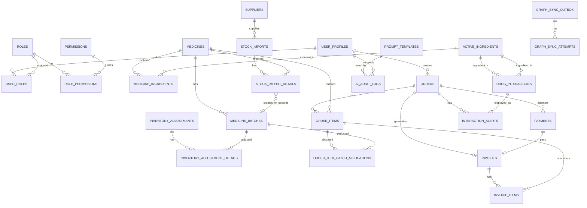
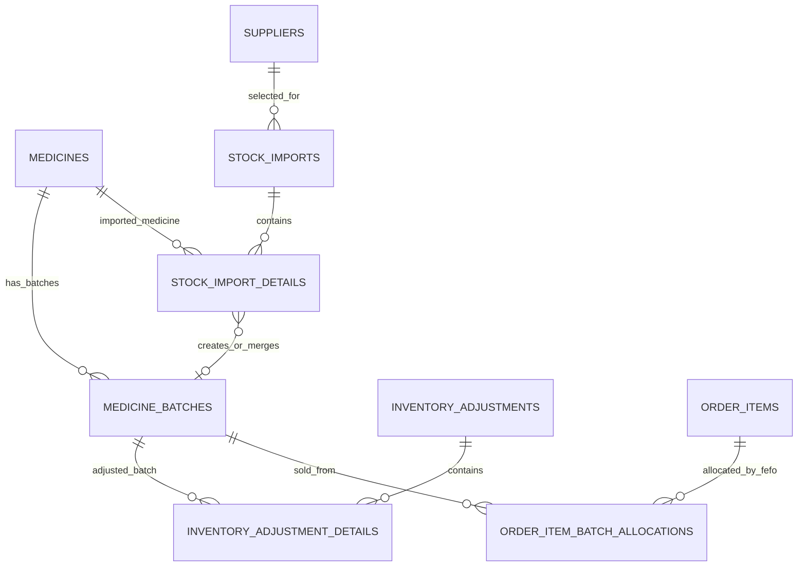
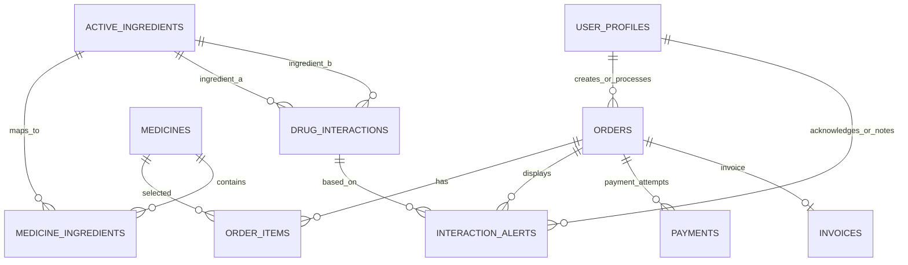
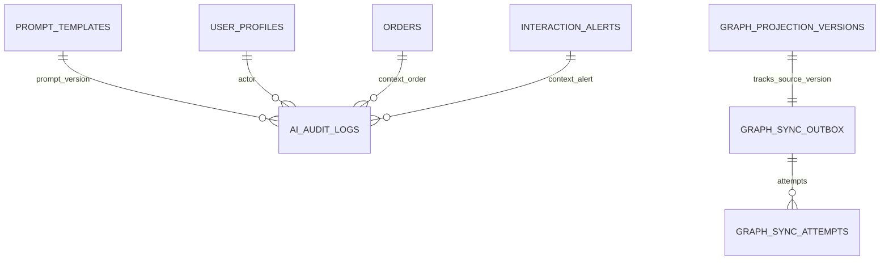

# Document 13 — Database Design & ERD

# Tài liệu 13 — Thiết kế Database & ERD

---

## Metadata

| Mục                     | Nội dung                                                                                                                                                                   |
| ----------------------- | -------------------------------------------------------------------------------------------------------------------------------------------------------------------------- |
| Document ID             | DOC-13                                                                                                                                                                     |
| File name               | `13_database_design_erd.md`                                                                                                                                                |
| Document Name           | Database Design & ERD                                                                                                                                                      |
| Tên tiếng Việt          | Thiết kế Database & ERD                                                                                                                                                    |
| Project                 | PharmaAssist AI Intelligence                                                                                                                                               |
| Version                 | 1.0 Draft                                                                                                                                                                  |
| Status                  | Draft                                                                                                                                                                      |
| Created Date            | 08/06/2026                                                                                                                                                                 |
| Last Updated            | 08/06/2026                                                                                                                                                                 |
| Owner                   | Database Designer / Backend Lead                                                                                                                                           |
| Reviewer                | Backend Developer, Prisma Implementer, Tester, Project Leader, Giảng viên hướng dẫn                                                                                        |
| Baseline Source         | Document 06 — SRS, Document 07 — Roles/Permissions, Document 12 — API Specification, Document 16 — AI Architecture, Document 17 — Knowledge Graph, Document 18 — Demo Data |
| Related Documents       | Document 12, Document 14, Document 18, Document 20                                                                                                                         |
| Database                | PostgreSQL                                                                                                                                                                 |
| ORM                     | Prisma                                                                                                                                                                     |
| Authentication Provider | Supabase Auth                                                                                                                                                              |
| Source of Truth         | PostgreSQL                                                                                                                                                                 |
| Graph Projection        | Neo4j                                                                                                                                                                      |
| Language Rule           | Nội dung chính viết bằng tiếng Việt; tên bảng, cột, enum, entity, API và thuật ngữ kỹ thuật giữ tiếng Anh khi cần                                                          |

---

## 1. Mục đích tài liệu

Tài liệu **Database Design & ERD** thiết kế database chính thức cho hệ thống **PharmaAssist AI Intelligence** ở mức ERD, entity, relationship, constraints, indexes, state, audit và data integrity.

Tài liệu này nhằm:

1. Xác định database scope chính thức cho MVP.
2. Phân biệt rõ MVP core subset với extended/commercial 100-table design.
3. Xác định PostgreSQL là source of truth.
4. Thiết kế các entity groups chính.
5. Mô tả table-by-table design ở mức database design.
6. Xác định conceptual data types.
7. Xác định required/nullable columns.
8. Xác định primary keys, foreign keys, unique constraints và indexes.
9. Xác định enum design.
10. Xác định state models.
11. Xác định transaction/data integrity rules.
12. Xác định soft delete/deactivation rules.
13. Xác định audit logging design.
14. Xác định idempotency records design.
15. Xác định graph sync outbox design.
16. Xác định MVP / Should-have / Future tables.
17. Ghi rõ các rejected database patterns không được dùng lại.
18. Cung cấp ERD diagram ở mức conceptual.
19. Tạo input chính thức cho Document 14 — Prisma Schema & Migration Design.
20. Tạo input cho seed/demo data và testing.

Tài liệu này **không** viết Prisma schema syntax đầy đủ, không viết API endpoint chi tiết, không viết UI flow, không viết test case đầy đủ và không đưa full 100-table schema thành MVP.

---

## 2. Database Design Principles

### 2.1. PostgreSQL là source of truth

PostgreSQL là nguồn dữ liệu chính thức cho toàn bộ nghiệp vụ.

PostgreSQL lưu:

1. User profile và RBAC.
2. Medicine.
3. ActiveIngredient.
4. Medicine–ActiveIngredient mapping.
5. Supplier.
6. MedicineBatch.
7. Stock Import.
8. Inventory Adjustment.
9. Order/POS.
10. Checkout allocations.
11. Payment.
12. Invoice.
13. DrugInteraction Rule.
14. InteractionAlert.
15. PromptTemplate.
16. AI Audit.
17. Graph Sync Outbox.
18. Graph Sync Attempts.
19. System Settings.
20. Audit Log.
21. Idempotency Records.
22. Demo seed data.

Neo4j chỉ là projection, không phải source of truth.

### 2.2. Không lưu password/password_hash

Database nghiệp vụ không được lưu:

1. `password`.
2. `password_hash`.
3. custom JWT secret.
4. credential tự xây.

Supabase Auth là nơi quản lý credentials.

PostgreSQL chỉ lưu:

1. `supabase_user_id`.
2. user profile.
3. role/permission.
4. `must_change_password` application-level flag.

### 2.3. MedicineBatch là inventory source of truth

Tồn kho không được lưu bằng aggregate inventory source-of-truth.

Nguồn tồn kho chính thức là:

```text
medicine_batches.quantity_remaining
```

Tồn kho tổng hợp, sellable quantity, low-stock và near-expiry là dữ liệu tính toán từ MedicineBatch.

### 2.4. Inventory chỉ thay đổi qua workflow chính thức

Quantity của MedicineBatch chỉ thay đổi thông qua:

1. Confirm Stock Import.
2. Confirm Inventory Adjustment.
3. Checkout FEFO allocation.

Không có direct quantity edit table/API chính thức trong MVP.

### 2.5. Checkout là transaction boundary chính

Checkout phải đảm bảo atomicity cho:

1. Order status update.
2. FEFO batch allocation.
3. MedicineBatch deduction.
4. Payment attempt.
5. Invoice creation.
6. Audit.
7. Idempotency record.

Nếu lỗi, rollback để tránh dữ liệu nửa vời.

### 2.6. Interaction Rule ở ActiveIngredient level

DrugInteraction Rule chính thức ở cấp:

```text
ActiveIngredient ↔ ActiveIngredient
```

Không dùng Medicine–Medicine rule làm official rule.

Medicine interaction được suy ra từ Medicine–ActiveIngredient mapping.

### 2.7. InteractionAlert phải persist

Mọi cảnh báo interaction hiển thị trong order phải được persist.

Đặc biệt:

1. HIGH alert cần `acknowledged_by`.
2. HIGH alert cần `acknowledged_at`.
3. HIGH alert cần `consultation_note`.
4. HIGH alert cần `consultation_note_by`.
5. HIGH alert cần `consultation_note_at`.
6. Alert cũ không còn áp dụng phải được inactive, không xóa mất history.

### 2.8. Auditability by design

Các bảng quan trọng phải có audit metadata:

1. `created_at`.
2. `updated_at`.
3. `created_by`.
4. `updated_by`.
5. `confirmed_by`.
6. `confirmed_at`.
7. `processed_by`.
8. `processed_at`.
9. `deactivated_by`.
10. `deactivated_at`.

Không phải bảng nào cũng cần tất cả field, nhưng các workflow quan trọng phải trace được actor.

### 2.9. Soft delete / deactivation thay vì hard delete

Các entity có lịch sử nghiệp vụ không nên xóa cứng.

Áp dụng cho:

1. UserProfile.
2. Medicine.
3. ActiveIngredient.
4. Supplier.
5. DrugInteraction Rule.
6. Graph projected entities.
7. PromptTemplate.

Hard delete chỉ dùng cho Draft detail chưa có lịch sử nếu business rule cho phép.

### 2.10. MVP core subset, không phải full 100-table schema

Database 100 bảng là extended/commercial design, không phải full MVP schema.

MVP chỉ implement core subset để:

1. Demo nghiệp vụ chính.
2. Đảm bảo safety.
3. Đảm bảo AI/Graph technical complexity.
4. Không quá tải timeline.

---

## 3. PostgreSQL as Source of Truth

### 3.1. Source of truth table categories

| Category                   | Source of Truth                                        |
| -------------------------- | ------------------------------------------------------ |
| Authentication credentials | Supabase Auth                                          |
| User profile / RBAC        | PostgreSQL                                             |
| Medicine catalog MVP       | PostgreSQL                                             |
| Inventory                  | PostgreSQL MedicineBatch                               |
| Interaction rules          | PostgreSQL                                             |
| Interaction alerts         | PostgreSQL                                             |
| Checkout results           | PostgreSQL                                             |
| Payment simulation         | PostgreSQL                                             |
| Invoice                    | PostgreSQL                                             |
| AI Audit                   | PostgreSQL                                             |
| Graph projection source    | PostgreSQL                                             |
| Settings                   | PostgreSQL                                             |
| Reports                    | Computed from PostgreSQL                               |
| Demo state                 | PostgreSQL + Supabase users + Neo4j projection rebuild |

### 3.2. PostgreSQL vs Neo4j responsibility

| Data/Decision           |    PostgreSQL |               Neo4j |
| ----------------------- | ------------: | ------------------: |
| Medicine source         |           Yes |     Projection only |
| ActiveIngredient source |           Yes |     Projection only |
| DrugInteraction source  |           Yes |     Projection only |
| Checkout decision       |           Yes |                  No |
| Stock deduction         |           Yes |                  No |
| HIGH alert blocking     |           Yes |                  No |
| Reports                 |           Yes |                  No |
| Graph-RAG context       |  May fallback |        Yes if fresh |
| Graph visualization     |   Source data |  Projection display |
| Sync freshness          | Source/outbox | Projection metadata |

### 3.3. PostgreSQL data integrity expectations

PostgreSQL must enforce important integrity through:

1. Primary keys.
2. Foreign keys.
3. Unique constraints.
4. Check constraints where practical.
5. Partial unique indexes where needed.
6. Transactions.
7. Enum constraints.
8. Non-null constraints.
9. Audit references.
10. Idempotency records.

---

## 4. MVP Database Scope

### 4.1. MVP core tables

MVP core database includes:

#### Identity & Access

1. `user_profiles`
2. `roles`
3. `permissions`
4. `user_roles`
5. `role_permissions`

#### Medicine & ActiveIngredient

6. `medicines`
7. `active_ingredients`
8. `medicine_ingredients`

#### Supplier

9. `suppliers`

#### MedicineBatch & Inventory

10. `medicine_batches`

#### Stock Import

11. `stock_imports`
12. `stock_import_details`

#### Inventory Adjustment

13. `inventory_adjustments`
14. `inventory_adjustment_details`

#### Sales / Order

15. `orders`
16. `order_items`

#### Checkout / Payment / Invoice

17. `order_item_batch_allocations`
18. `payments`
19. `invoices`
20. `invoice_items`

#### DrugInteraction

21. `drug_interactions`

#### InteractionAlert

22. `interaction_alerts`

#### AI / Prompt / Audit

23. `prompt_templates`
24. `ai_provider_configs`
25. `ai_audit_logs`

#### Graph Sync

26. `graph_sync_outbox`
27. `graph_sync_attempts`
28. `graph_projection_versions`

#### Settings / Audit / Idempotency

29. `system_settings`
30. `audit_logs`
31. `idempotency_records`

### 4.2. MVP optional but useful tables

Các bảng sau có thể thêm nếu implementation cần rõ hơn, nhưng không bắt buộc nếu có cách lưu đơn giản hơn:

1. `invoice_items` — recommended để lưu invoice snapshot theo dòng.
2. `graph_projection_versions` — recommended để freshness detection rõ.
3. `ai_provider_configs` — có thể dùng env config thay thế nếu chưa cần DB config.
4. `audit_logs` — backend audit mandatory, UI generic audit Should-have.

### 4.3. MVP tables not included

Không đưa vào MVP bắt buộc:

1. `products`
2. `product_variants`
3. `cart`
4. `wishlist`
5. `shipping`
6. `coupon`
7. `review`
8. `cms_pages`
9. `stores`
10. `warehouses`
11. `stock_transfers`
12. `purchase_orders`
13. `refunds`
14. `returns`
15. `credit_notes`
16. `bank_reconciliations`
17. `customer_accounts`
18. `customer_portal_sessions`

Những bảng này thuộc Should-have/Future/Commercial Expansion nếu cần.

---

## 5. Extended / Commercial Database Scope

### 5.1. Vai trò của 100-table design

Database 100 bảng được xem là:

1. Extended/commercial design.
2. Future expansion reference.
3. Không phải full MVP schema.
4. Không phải bắt buộc implement trong demo.
5. Không được làm Jira/API/UI/test MVP phình to.

### 5.2. Extended categories

Extended/commercial design có thể bao gồm:

1. Online commerce.
2. Product variants.
3. Customer portal.
4. Cart/wishlist.
5. Shipping.
6. Coupon/promotion.
7. Review/rating.
8. CMS.
9. Multi-store.
10. Multi-warehouse.
11. Stock transfer.
12. Purchase order.
13. Return/refund.
14. Credit note.
15. Real payment gateway.
16. Bank reconciliation.
17. Supplier contract.
18. Advanced analytics.
19. Forecasting.
20. AI cache.
21. Drug taxonomy enrichment.
22. Symptom/Condition/RedFlag graph enrichment.

### 5.3. Extended design rule

Future-ready tables may be documented in ERD extension, but:

1. Không đưa vào MVP API.
2. Không đưa vào MVP UI.
3. Không đưa vào MVP test exit criteria.
4. Không thay thế MedicineBatch.
5. Không thay thế ActiveIngredient-level interaction rule.
6. Không biến full Customer Management thành MVP blocker.
7. Không biến product_variant thành sales key cho MVP.

---

## 6. ERD Overview

### 6.1. Main entity relationship summary

```text
UserProfile -- UserRole -- Role -- RolePermission -- Permission

Medicine -- MedicineIngredient -- ActiveIngredient
Medicine -- MedicineBatch
Supplier -- StockImport -- StockImportDetail -- Medicine
StockImportDetail -> MedicineBatch after confirm

MedicineBatch -- InventoryAdjustmentDetail -- InventoryAdjustment

UserProfile -- Order -- OrderItem -- Medicine
OrderItem -- OrderItemBatchAllocation -- MedicineBatch

Order -- Payment
Order -- Invoice -- InvoiceItem

ActiveIngredient -- DrugInteraction -- ActiveIngredient
Order -- InteractionAlert -- DrugInteraction
InteractionAlert -- UserProfile for acknowledgement/note

PromptTemplate -- AIAuditLog
AIProviderConfig -- AIAuditLog

GraphSyncOutbox -- GraphSyncAttempt
GraphProjectionVersion tracks projected source versions

SystemSetting stores near-expiry threshold
AuditLog stores general audit
IdempotencyRecord supports checkout safety
```

### 6.2. ERD boundary

ERD chính thức có ba tầng:

1. **MVP Core ERD** — bắt buộc cho demo.
2. **Should-have ERD Extension** — có thể thêm nếu còn thời gian.
3. **Future / Commercial ERD Extension** — không thuộc MVP.

Document này tập trung chi tiết vào MVP Core ERD.

---

# 7. Entity Groups

---

## 7.1. Identity & Access

Tables:

1. `user_profiles`
2. `roles`
3. `permissions`
4. `user_roles`
5. `role_permissions`

Mục tiêu:

1. Liên kết Supabase Auth user với hệ thống.
2. Hỗ trợ multi-role RBAC.
3. Hỗ trợ permission-based authorization.
4. Không lưu password.
5. Hỗ trợ deactivation và first-login flow.

---

## 7.2. Medicine & ActiveIngredient

Tables:

1. `medicines`
2. `active_ingredients`
3. `medicine_ingredients`

Mục tiêu:

1. Quản lý Medicine core cho MVP.
2. Quản lý curated ActiveIngredient.
3. Mapping Medicine với ActiveIngredient.
4. Làm nền cho interaction checking và graph projection.

---

## 7.3. Supplier

Tables:

1. `suppliers`

Mục tiêu:

1. Quản lý nhà cung cấp.
2. Cho Stock Import chọn supplier.
3. Warehouse có thể create/update.
4. Admin mới được deactivate.

---

## 7.4. MedicineBatch & Inventory

Tables:

1. `medicine_batches`

Mục tiêu:

1. Lưu batch/lô thuốc.
2. Là source of truth cho tồn kho.
3. Hỗ trợ FEFO.
4. Hỗ trợ near-expiry.
5. Hỗ trợ expired exclusion.
6. Hỗ trợ low-stock calculation.

---

## 7.5. Stock Import

Tables:

1. `stock_imports`
2. `stock_import_details`

Mục tiêu:

1. Quản lý phiếu nhập kho.
2. DRAFT → CONFIRMED/CANCELLED.
3. Confirm mới cập nhật MedicineBatch.
4. Batch uniqueness/merge rule.
5. Expiry mismatch reject.

---

## 7.6. Inventory Adjustment

Tables:

1. `inventory_adjustments`
2. `inventory_adjustment_details`

Mục tiêu:

1. Điều chỉnh tồn kho có reason.
2. Không direct quantity edit.
3. Confirm mới cập nhật MedicineBatch.
4. Audit đầy đủ.

---

## 7.7. Sales / Order

Tables:

1. `orders`
2. `order_items`

Mục tiêu:

1. Quản lý Draft Order.
2. Hỗ trợ khách lẻ.
3. Staff ownership.
4. Order status DRAFT/PAID/CANCELLED.
5. Chuẩn bị cho checkout.

---

## 7.8. Checkout / Payment / Invoice

Tables:

1. `order_item_batch_allocations`
2. `payments`
3. `invoices`
4. `invoice_items`

Mục tiêu:

1. Lưu batch allocation theo FEFO.
2. Truy vết batch đã bán.
3. Lưu payment attempts.
4. Đảm bảo một successful payment per order.
5. Lưu invoice snapshot.

---

## 7.9. DrugInteraction

Tables:

1. `drug_interactions`

Mục tiêu:

1. Lưu rule tương tác ActiveIngredient–ActiveIngredient.
2. Hỗ trợ severity LOW/MEDIUM/HIGH.
3. Không dùng Medicine-level official interaction.
4. Trigger Graph Sync projection.

---

## 7.10. InteractionAlert

Tables:

1. `interaction_alerts`

Mục tiêu:

1. Persist alert đã hiển thị.
2. Lưu snapshot rule khi alert hiển thị.
3. HIGH alert acknowledgement.
4. HIGH alert consultation note.
5. Alert lifecycle active/inactive.
6. Admin alert history.

---

## 7.11. AI / Prompt / Audit

Tables:

1. `prompt_templates`
2. `ai_provider_configs`
3. `ai_audit_logs`

Mục tiêu:

1. Version prompt templates.
2. Lưu provider configuration nếu DB-based.
3. Lưu AI audit metadata.
4. Không lưu raw PII.
5. Trace provider/fallback/guardrail.

---

## 7.12. Graph Sync

Tables:

1. `graph_sync_outbox`
2. `graph_sync_attempts`
3. `graph_projection_versions`

Mục tiêu:

1. Đồng bộ PostgreSQL source data sang Neo4j.
2. Outbox pattern.
3. Retry.
4. Failure logging.
5. Freshness detection.
6. Stale graph handling.

---

## 7.13. Settings / Audit / Idempotency

Tables:

1. `system_settings`
2. `audit_logs`
3. `idempotency_records`

Mục tiêu:

1. Lưu near-expiry threshold.
2. Lưu generic audit.
3. Hỗ trợ checkout idempotency.
4. Hỗ trợ traceability.

---

## 7.14. Reports Support

MVP reports không cần bảng riêng bắt buộc.

Reports đọc từ:

1. `orders`
2. `order_items`
3. `payments`
4. `invoices`
5. `invoice_items`
6. `medicine_batches`
7. `order_item_batch_allocations`
8. `medicines`
9. `system_settings`

Report snapshot/materialized tables là Should-have/Future nếu cần performance.

---

# 8. Table-by-table Design

---

# 8.1. Identity & Access Tables

---

## 8.1.1. `user_profiles`

### Purpose

Lưu profile nội bộ của user được authenticate bởi Supabase Auth.

### Columns

| Column                 | Type conceptual | Required | Description                          |
| ---------------------- | --------------- | -------: | ------------------------------------ |
| `id`                   | uuid            |      Yes | Primary key nội bộ                   |
| `supabase_user_id`     | uuid/text       |      Yes | ID user từ Supabase Auth             |
| `email`                | text            |      Yes | Email hiển thị/lookup                |
| `full_name`            | text            |      Yes | Tên user                             |
| `phone`                | text            |       No | Số điện thoại nếu cần                |
| `avatar_url`           | text            |       No | Optional                             |
| `is_active`            | boolean         |      Yes | User active/inactive                 |
| `must_change_password` | boolean         |      Yes | Required first-login password change |
| `created_at`           | timestamptz     |      Yes | Created time                         |
| `updated_at`           | timestamptz     |      Yes | Updated time                         |
| `created_by`           | uuid            |       No | Admin tạo profile, FK self           |
| `updated_by`           | uuid            |       No | Admin cập nhật, FK self              |
| `deactivated_at`       | timestamptz     |       No | Deactivation time                    |
| `deactivated_by`       | uuid            |       No | Admin deactivate                     |

### Constraints

1. Primary key: `id`.
2. Unique: `supabase_user_id`.
3. Unique: `email`.
4. `email` must be lowercase-normalized if possible.
5. `is_active` default true.
6. `must_change_password` default false unless created as new-staff flow.

### Foreign keys

1. `created_by` → `user_profiles.id`.
2. `updated_by` → `user_profiles.id`.
3. `deactivated_by` → `user_profiles.id`.

### Business rules

1. Không lưu password/password_hash.
2. Supabase Auth lưu credentials.
3. User inactive không được truy cập protected business APIs.
4. `must_change_password = true` chặn main app cho đến khi complete first-login.
5. Demo accounts chính có thể `must_change_password = false`.
6. New-staff demo account có thể `must_change_password = true`.

### Indexes

1. Unique index on `supabase_user_id`.
2. Unique index on `email`.
3. Index on `is_active`.

---

## 8.1.2. `roles`

### Purpose

Lưu role chính thức của hệ thống.

### Columns

| Column        | Type conceptual | Required | Description                                  |
| ------------- | --------------- | -------: | -------------------------------------------- |
| `id`          | uuid            |      Yes | Primary key                                  |
| `key`         | text            |      Yes | Role key, e.g. `admin`, `staff`, `warehouse` |
| `name`        | text            |      Yes | Display name                                 |
| `description` | text            |       No | Description                                  |
| `is_active`   | boolean         |      Yes | Active role                                  |
| `is_system`   | boolean         |      Yes | Built-in role flag                           |
| `created_at`  | timestamptz     |      Yes | Created time                                 |
| `updated_at`  | timestamptz     |      Yes | Updated time                                 |

### Constraints

1. Primary key: `id`.
2. Unique: `key`.
3. `key` lowercase.
4. Built-in roles seeded:

   * `admin`
   * `staff`
   * `warehouse`

### Business rules

1. MVP có 3 role chính thức.
2. Không tự thêm role mới ngoài scope.
3. Inactive role không cấp permissions.
4. Không hard delete built-in roles.

### Indexes

1. Unique index on `key`.
2. Index on `is_active`.

---

## 8.1.3. `permissions`

### Purpose

Lưu permission keys cho permission-based authorization.

### Columns

| Column        | Type conceptual | Required | Description                    |
| ------------- | --------------- | -------: | ------------------------------ |
| `id`          | uuid            |      Yes | Primary key                    |
| `key`         | text            |      Yes | Permission key                 |
| `module`      | text            |      Yes | Module name                    |
| `action`      | text            |      Yes | Action                         |
| `scope`       | text            |       No | own/all/manage/readonly/system |
| `description` | text            |       No | Description                    |
| `is_active`   | boolean         |      Yes | Active permission              |
| `created_at`  | timestamptz     |      Yes | Created time                   |
| `updated_at`  | timestamptz     |      Yes | Updated time                   |

### Constraints

1. Primary key: `id`.
2. Unique: `key`.
3. `key` format recommended: `module.action_scope`.
4. `key` lowercase.

### Business rules

1. Backend checks permission keys.
2. Frontend uses permissions for visibility only.
3. Inactive permission has no effect.
4. Permission matrix seeded according to Document 07.

### Indexes

1. Unique index on `key`.
2. Index on `module`.
3. Index on `is_active`.

---

## 8.1.4. `user_roles`

### Purpose

Many-to-many mapping between UserProfile and Role.

### Columns

| Column        | Type conceptual | Required | Description      |
| ------------- | --------------- | -------: | ---------------- |
| `id`          | uuid            |      Yes | Primary key      |
| `user_id`     | uuid            |      Yes | FK user_profiles |
| `role_id`     | uuid            |      Yes | FK roles         |
| `is_active`   | boolean         |      Yes | Active mapping   |
| `assigned_at` | timestamptz     |      Yes | Assigned time    |
| `assigned_by` | uuid            |       No | Admin actor      |
| `removed_at`  | timestamptz     |       No | Removed time     |
| `removed_by`  | uuid            |       No | Admin actor      |

### Constraints

1. Primary key: `id`.
2. FK `user_id` → `user_profiles.id`.
3. FK `role_id` → `roles.id`.
4. Unique active mapping recommended:

   * partial unique index on `(user_id, role_id)` where `is_active = true`.

### Business rules

1. User can have multiple roles.
2. Effective permissions = union of active roles.
3. Inactive user still blocked.
4. Inactive user-role mapping does not grant role.

### Indexes

1. Index on `user_id`.
2. Index on `role_id`.
3. Partial unique active index on `(user_id, role_id)`.

---

## 8.1.5. `role_permissions`

### Purpose

Many-to-many mapping between Role and Permission.

### Columns

| Column          | Type conceptual | Required | Description    |
| --------------- | --------------- | -------: | -------------- |
| `id`            | uuid            |      Yes | Primary key    |
| `role_id`       | uuid            |      Yes | FK roles       |
| `permission_id` | uuid            |      Yes | FK permissions |
| `is_active`     | boolean         |      Yes | Active mapping |
| `created_at`    | timestamptz     |      Yes | Created time   |
| `created_by`    | uuid            |       No | Admin actor    |

### Constraints

1. Primary key: `id`.
2. FK `role_id` → `roles.id`.
3. FK `permission_id` → `permissions.id`.
4. Unique active mapping:

   * partial unique index on `(role_id, permission_id)` where `is_active = true`.

### Business rules

1. Built-in role-permission mappings seeded.
2. Role-permission UI is Should-have, not mandatory MVP.
3. Admin role must retain essential access.

### Indexes

1. Index on `role_id`.
2. Index on `permission_id`.
3. Partial unique active index.

---

# 8.2. Medicine & ActiveIngredient Tables

---

## 8.2.1. `medicines`

### Purpose

Lưu Medicine core entity dùng cho inventory, POS, checkout, reports và graph projection.

### Columns

| Column            | Type conceptual | Required | Description                    |
| ----------------- | --------------- | -------: | ------------------------------ |
| `id`              | uuid            |      Yes | Primary key                    |
| `code`            | text            |       No | Internal code/SKU nếu có       |
| `name`            | text            |      Yes | Medicine name                  |
| `normalized_name` | text            |      Yes | Search/dedup normalized name   |
| `description`     | text            |       No | Description                    |
| `unit`            | text            |      Yes | Unit, e.g. tablet, bottle      |
| `dosage_form`     | text            |       No | Tablet, capsule, syrup if used |
| `strength_text`   | text            |       No | e.g. 500mg                     |
| `selling_price`   | numeric(12,2)   |      Yes | Sale price                     |
| `min_stock`       | integer         |      Yes | Low-stock threshold            |
| `is_active`       | boolean         |      Yes | Active for sale/inventory      |
| `created_at`      | timestamptz     |      Yes | Created time                   |
| `updated_at`      | timestamptz     |      Yes | Updated time                   |
| `created_by`      | uuid            |       No | FK user_profiles               |
| `updated_by`      | uuid            |       No | FK user_profiles               |
| `deactivated_at`  | timestamptz     |       No | Deactivation time              |
| `deactivated_by`  | uuid            |       No | FK user_profiles               |

### Constraints

1. Primary key: `id`.
2. Unique recommended: `code` if code is used.
3. Unique or non-unique indexed `normalized_name` depending duplicate policy.
4. Check: `selling_price > 0`.
5. Check: `min_stock >= 0`.

### Foreign keys

1. `created_by` → `user_profiles.id`.
2. `updated_by` → `user_profiles.id`.
3. `deactivated_by` → `user_profiles.id`.

### Business rules

1. Medicine is MVP sales key.
2. `selling_price = 0` is not allowed for sellable Medicine.
3. Inactive Medicine cannot be added to new Draft Order.
4. Product/product_variant does not replace Medicine in MVP.
5. Medicine changes relevant to graph projection create Graph Sync outbox event.

### Indexes

1. Index on `normalized_name`.
2. Index on `is_active`.
3. Optional full-text index for search.
4. Unique index on `code` if present.

---

## 8.2.2. `active_ingredients`

### Purpose

Lưu curated ActiveIngredient chính thức.

### Columns

| Column            | Type conceptual | Required | Description                   |
| ----------------- | --------------- | -------: | ----------------------------- |
| `id`              | uuid            |      Yes | Primary key                   |
| `name`            | text            |      Yes | Ingredient name               |
| `normalized_name` | text            |      Yes | Normalized name               |
| `description`     | text            |       No | Description                   |
| `is_active`       | boolean         |      Yes | Active ingredient             |
| `source_note`     | text            |       No | Curated source note if needed |
| `created_at`      | timestamptz     |      Yes | Created time                  |
| `updated_at`      | timestamptz     |      Yes | Updated time                  |
| `created_by`      | uuid            |       No | FK user_profiles              |
| `updated_by`      | uuid            |       No | FK user_profiles              |
| `deactivated_at`  | timestamptz     |       No | Deactivation time             |
| `deactivated_by`  | uuid            |       No | FK user_profiles              |

### Constraints

1. Primary key: `id`.
2. Unique: `normalized_name`.
3. `is_active` default true.

### Business rules

1. ActiveIngredient list must be curated.
2. Scraped ingredient strings are reference only.
3. Interaction rules use ActiveIngredient IDs.
4. Changes create Graph Sync outbox event.

### Indexes

1. Unique index on `normalized_name`.
2. Index on `is_active`.

---

## 8.2.3. `medicine_ingredients`

### Purpose

Mapping Medicine với ActiveIngredient.

### Columns

| Column                 | Type conceptual | Required | Description           |
| ---------------------- | --------------- | -------: | --------------------- |
| `id`                   | uuid            |      Yes | Primary key           |
| `medicine_id`          | uuid            |      Yes | FK medicines          |
| `active_ingredient_id` | uuid            |      Yes | FK active_ingredients |
| `amount_text`          | text            |       No | e.g. 500mg            |
| `sort_order`           | integer         |       No | Display order         |
| `is_active`            | boolean         |      Yes | Active mapping        |
| `created_at`           | timestamptz     |      Yes | Created time          |
| `updated_at`           | timestamptz     |      Yes | Updated time          |
| `created_by`           | uuid            |       No | FK user_profiles      |
| `updated_by`           | uuid            |       No | FK user_profiles      |

### Constraints

1. Primary key: `id`.
2. FK `medicine_id` → `medicines.id`.
3. FK `active_ingredient_id` → `active_ingredients.id`.
4. Unique active mapping:

   * partial unique index on `(medicine_id, active_ingredient_id)` where `is_active = true`.

### Business rules

1. Mapping drives interaction checking.
2. Mapping drives Neo4j CONTAINS projection.
3. Mapping changes create Graph Sync outbox event.
4. Duplicate active mapping not allowed.

### Indexes

1. Index on `medicine_id`.
2. Index on `active_ingredient_id`.
3. Partial unique active mapping index.

---

# 8.3. Supplier Table

---

## 8.3.1. `suppliers`

### Purpose

Lưu Supplier phục vụ Stock Import.

### Columns

| Column            | Type conceptual | Required | Description       |
| ----------------- | --------------- | -------: | ----------------- |
| `id`              | uuid            |      Yes | Primary key       |
| `name`            | text            |      Yes | Supplier name     |
| `normalized_name` | text            |      Yes | Normalized name   |
| `phone`           | text            |       No | Contact phone     |
| `email`           | text            |       No | Contact email     |
| `address`         | text            |       No | Address           |
| `tax_code`        | text            |       No | Optional          |
| `contact_person`  | text            |       No | Optional          |
| `is_active`       | boolean         |      Yes | Active supplier   |
| `created_at`      | timestamptz     |      Yes | Created time      |
| `updated_at`      | timestamptz     |      Yes | Updated time      |
| `created_by`      | uuid            |       No | FK user_profiles  |
| `updated_by`      | uuid            |       No | FK user_profiles  |
| `deactivated_at`  | timestamptz     |       No | Deactivation time |
| `deactivated_by`  | uuid            |       No | FK user_profiles  |

### Constraints

1. Primary key: `id`.
2. Unique recommended on `normalized_name` if business wants no duplicate supplier.
3. `is_active` default true.

### Business rules

1. Warehouse can create/update/read.
2. Admin can deactivate.
3. Warehouse cannot deactivate.
4. Supplier with import history should not be hard deleted.
5. Inactive Supplier should not be used for new Stock Import.

### Indexes

1. Index on `normalized_name`.
2. Index on `is_active`.

---

# 8.4. MedicineBatch & Inventory Table

---

## 8.4.1. `medicine_batches`

### Purpose

Lưu lô/batch thuốc và là source of truth cho inventory.

### Columns

| Column                          | Type conceptual | Required | Description                |
| ------------------------------- | --------------- | -------: | -------------------------- |
| `id`                            | uuid            |      Yes | Primary key                |
| `medicine_id`                   | uuid            |      Yes | FK medicines               |
| `batch_number`                  | text            |      Yes | Original batch number      |
| `normalized_batch_number`       | text            |      Yes | Normalized batch number    |
| `expiry_date`                   | date            |      Yes | Expiration date            |
| `quantity_received`             | integer         |      Yes | Total received quantity    |
| `quantity_remaining`            | integer         |      Yes | Current remaining quantity |
| `unit_cost`                     | numeric(12,2)   |       No | Import cost if tracked     |
| `source_stock_import_detail_id` | uuid            |       No | Initial source detail      |
| `is_active`                     | boolean         |      Yes | Active batch               |
| `created_at`                    | timestamptz     |      Yes | Created time               |
| `updated_at`                    | timestamptz     |      Yes | Updated time               |
| `created_by`                    | uuid            |       No | FK user_profiles           |
| `updated_by`                    | uuid            |       No | FK user_profiles           |

### Constraints

1. Primary key: `id`.
2. FK `medicine_id` → `medicines.id`.
3. FK `source_stock_import_detail_id` → `stock_import_details.id` nullable.
4. Unique:

   * `(medicine_id, normalized_batch_number)` may be insufficient because expiry mismatch must be rejected.
   * Recommended unique: `(medicine_id, normalized_batch_number, expiry_date)`.
5. Check: `quantity_received >= 0`.
6. Check: `quantity_remaining >= 0`.
7. Check: `quantity_remaining <= quantity_received + confirmed_adjustment_net` cannot be simple DB check unless derived. Enforce in service/transaction.

### Business rules

1. MedicineBatch is inventory source of truth.
2. Expired batches excluded from sellable stock.
3. FEFO uses `expiry_date`.
4. Batch number mandatory.
5. Batch merge only if same:

   * `medicine_id`
   * `normalized_batch_number`
   * `expiry_date`
6. Same medicine + same normalized batch number + different expiry date must be rejected during import.
7. Quantity cannot go negative.
8. Direct quantity edit is rejected.

### Indexes

1. Unique index on `(medicine_id, normalized_batch_number, expiry_date)`.
2. Index on `medicine_id`.
3. Index on `expiry_date`.
4. Index on `(medicine_id, expiry_date)` for FEFO.
5. Index on `quantity_remaining`.
6. Index on `is_active`.

---

# 8.5. Stock Import Tables

---

## 8.5.1. `stock_imports`

### Purpose

Lưu phiếu nhập kho.

### Columns

| Column          | Type conceptual          | Required | Description               |
| --------------- | ------------------------ | -------: | ------------------------- |
| `id`            | uuid                     |      Yes | Primary key               |
| `supplier_id`   | uuid                     |      Yes | FK suppliers              |
| `status`        | enum `StockImportStatus` |      Yes | DRAFT/CONFIRMED/CANCELLED |
| `import_date`   | date                     |      Yes | Import date               |
| `note`          | text                     |       No | Note                      |
| `created_at`    | timestamptz              |      Yes | Created time              |
| `updated_at`    | timestamptz              |      Yes | Updated time              |
| `created_by`    | uuid                     |      Yes | User actor                |
| `updated_by`    | uuid                     |       No | User actor                |
| `confirmed_at`  | timestamptz              |       No | Confirm time              |
| `confirmed_by`  | uuid                     |       No | User actor                |
| `cancelled_at`  | timestamptz              |       No | Cancel time               |
| `cancelled_by`  | uuid                     |       No | User actor                |
| `cancel_reason` | text                     |       No | Cancel reason             |

### Constraints

1. Primary key: `id`.
2. FK `supplier_id` → `suppliers.id`.
3. FK actor fields → `user_profiles.id`.
4. `status` required.
5. `supplier_id` not nullable in MVP.

### Business rules

1. Starts as DRAFT.
2. DRAFT can be updated/cancelled.
3. Confirmed import cannot be confirmed again.
4. Cancelled import cannot be confirmed.
5. Confirm creates/updates MedicineBatch.
6. Confirm must be transactional.

### Indexes

1. Index on `supplier_id`.
2. Index on `status`.
3. Index on `import_date`.
4. Index on `created_by`.

---

## 8.5.2. `stock_import_details`

### Purpose

Lưu các dòng thuốc nhập trong Stock Import.

### Columns

| Column                    | Type conceptual | Required | Description                       |
| ------------------------- | --------------- | -------: | --------------------------------- |
| `id`                      | uuid            |      Yes | Primary key                       |
| `stock_import_id`         | uuid            |      Yes | FK stock_imports                  |
| `medicine_id`             | uuid            |      Yes | FK medicines                      |
| `batch_number`            | text            |      Yes | Batch number                      |
| `normalized_batch_number` | text            |      Yes | Normalized batch                  |
| `expiry_date`             | date            |      Yes | Expiration date                   |
| `quantity`                | integer         |      Yes | Imported quantity                 |
| `unit_cost`               | numeric(12,2)   |       No | Cost                              |
| `created_batch_id`        | uuid            |       No | FK medicine_batches after confirm |
| `created_at`              | timestamptz     |      Yes | Created time                      |
| `updated_at`              | timestamptz     |      Yes | Updated time                      |

### Constraints

1. Primary key: `id`.
2. FK `stock_import_id` → `stock_imports.id`.
3. FK `medicine_id` → `medicines.id`.
4. FK `created_batch_id` → `medicine_batches.id` nullable.
5. Check: `quantity > 0`.
6. `batch_number` not nullable.
7. `expiry_date` not nullable.

### Business rules

1. Detail cannot update after parent confirmed.
2. Confirm validates every detail.
3. Same batch matching rule enforced by service.
4. Expiry mismatch rejected.
5. `created_batch_id` records affected batch after confirm.

### Indexes

1. Index on `stock_import_id`.
2. Index on `medicine_id`.
3. Index on `(medicine_id, normalized_batch_number, expiry_date)`.

---

# 8.6. Inventory Adjustment Tables

---

## 8.6.1. `inventory_adjustments`

### Purpose

Lưu phiếu điều chỉnh tồn kho.

### Columns

| Column         | Type conceptual                  | Required | Description               |
| -------------- | -------------------------------- | -------: | ------------------------- |
| `id`           | uuid                             |      Yes | Primary key               |
| `status`       | enum `InventoryAdjustmentStatus` |      Yes | DRAFT/CONFIRMED/CANCELLED |
| `reason`       | text                             |      Yes | Required reason           |
| `note`         | text                             |       No | Additional note           |
| `created_at`   | timestamptz                      |      Yes | Created time              |
| `updated_at`   | timestamptz                      |      Yes | Updated time              |
| `created_by`   | uuid                             |      Yes | Actor                     |
| `updated_by`   | uuid                             |       No | Actor                     |
| `confirmed_at` | timestamptz                      |       No | Confirm time              |
| `confirmed_by` | uuid                             |       No | Actor                     |
| `cancelled_at` | timestamptz                      |       No | Cancel time               |
| `cancelled_by` | uuid                             |       No | Actor                     |

### Constraints

1. Primary key: `id`.
2. FK actor fields → `user_profiles.id`.
3. `reason` required.
4. `status` required.

### Business rules

1. Adjustment must have reason.
2. Confirmed adjustment immutable.
3. Correction requires new adjustment.
4. Confirm is transaction.
5. No direct quantity edit.

### Indexes

1. Index on `status`.
2. Index on `created_by`.
3. Index on `created_at`.

---

## 8.6.2. `inventory_adjustment_details`

### Purpose

Lưu dòng điều chỉnh theo MedicineBatch.

### Columns

| Column                    | Type conceptual | Required | Description              |
| ------------------------- | --------------- | -------: | ------------------------ |
| `id`                      | uuid            |      Yes | Primary key              |
| `inventory_adjustment_id` | uuid            |      Yes | FK inventory_adjustments |
| `medicine_batch_id`       | uuid            |      Yes | FK medicine_batches      |
| `quantity_change`         | integer         |      Yes | Positive or negative     |
| `before_quantity`         | integer         |       No | Snapshot before confirm  |
| `after_quantity`          | integer         |       No | Snapshot after confirm   |
| `created_at`              | timestamptz     |      Yes | Created time             |
| `updated_at`              | timestamptz     |      Yes | Updated time             |

### Constraints

1. Primary key: `id`.
2. FK `inventory_adjustment_id` → `inventory_adjustments.id`.
3. FK `medicine_batch_id` → `medicine_batches.id`.
4. Check: `quantity_change != 0`.
5. Confirm service must ensure `after_quantity >= 0`.

### Business rules

1. Cannot make stock negative.
2. Confirm records before/after quantity.
3. Detail cannot update after parent confirmed.
4. Correction via new adjustment.

### Indexes

1. Index on `inventory_adjustment_id`.
2. Index on `medicine_batch_id`.

---

# 8.7. Sales / Order Tables

---

## 8.7.1. `orders`

### Purpose

Lưu order bán thuốc tại POS.

### Columns

| Column                  | Type conceptual    | Required | Description                                      |
| ----------------------- | ------------------ | -------: | ------------------------------------------------ |
| `id`                    | uuid               |      Yes | Primary key                                      |
| `order_number`          | text               |      Yes | Human-readable unique order number               |
| `status`                | enum `OrderStatus` |      Yes | DRAFT/PAID/CANCELLED                             |
| `customer_id`           | uuid               |       No | Should-have customer reference; null for walk-in |
| `customer_display_name` | text               |       No | Snapshot/display for walk-in if needed           |
| `subtotal_amount`       | numeric(12,2)      |      Yes | Computed subtotal                                |
| `discount_amount`       | numeric(12,2)      |      Yes | MVP default 0                                    |
| `total_amount`          | numeric(12,2)      |      Yes | Final total                                      |
| `note`                  | text               |       No | Order note                                       |
| `created_at`            | timestamptz        |      Yes | Created time                                     |
| `updated_at`            | timestamptz        |      Yes | Updated time                                     |
| `created_by`            | uuid               |      Yes | Staff/Admin creator                              |
| `processed_by`          | uuid               |       No | Checkout processor                               |
| `paid_at`               | timestamptz        |       No | Paid time                                        |
| `cancelled_at`          | timestamptz        |       No | Cancel time                                      |
| `cancelled_by`          | uuid               |       No | Actor                                            |
| `cancel_reason`         | text               |       No | Reason                                           |

### Constraints

1. Primary key: `id`.
2. Unique: `order_number`.
3. FK `created_by` → `user_profiles.id`.
4. FK `processed_by` → `user_profiles.id`.
5. FK `cancelled_by` → `user_profiles.id`.
6. Check: amounts >= 0.
7. `status` required.

### Business rules

1. MVP statuses: DRAFT, PAID, CANCELLED.
2. No READY_FOR_CHECKOUT.
3. No PENDING.
4. Staff can view own orders only.
5. Staff can cancel own DRAFT.
6. Admin can view/cancel any DRAFT.
7. PAID order cannot be edited/cancelled.
8. Walk-in customer supported with `customer_id = null`.
9. Full Customer Management is Should-have.

### Indexes

1. Unique index on `order_number`.
2. Index on `status`.
3. Index on `created_by`.
4. Index on `processed_by`.
5. Index on `created_at`.
6. Index on `paid_at`.

---

## 8.7.2. `order_items`

### Purpose

Lưu dòng Medicine trong Order.

### Columns

| Column        | Type conceptual | Required | Description           |
| ------------- | --------------- | -------: | --------------------- |
| `id`          | uuid            |      Yes | Primary key           |
| `order_id`    | uuid            |      Yes | FK orders             |
| `medicine_id` | uuid            |      Yes | FK medicines          |
| `quantity`    | integer         |      Yes | Ordered quantity      |
| `unit_price`  | numeric(12,2)   |      Yes | Price snapshot        |
| `line_total`  | numeric(12,2)   |      Yes | quantity * unit_price |
| `created_at`  | timestamptz     |      Yes | Created time          |
| `updated_at`  | timestamptz     |      Yes | Updated time          |

### Constraints

1. Primary key: `id`.
2. FK `order_id` → `orders.id`.
3. FK `medicine_id` → `medicines.id`.
4. Check: `quantity > 0`.
5. Check: `unit_price > 0`.
6. Check: `line_total >= 0`.
7. Unique recommended on `(order_id, medicine_id)` if duplicate medicine lines not allowed.

### Business rules

1. Items editable only when Order DRAFT.
2. Adding/updating item triggers interaction check.
3. Checkout recalculates totals server-side.
4. Price snapshot prevents historical price drift.

### Indexes

1. Index on `order_id`.
2. Index on `medicine_id`.
3. Optional unique index on `(order_id, medicine_id)`.

---

# 8.8. Checkout / Payment / Invoice Tables

---

## 8.8.1. `order_item_batch_allocations`

### Purpose

Lưu allocation từ OrderItem sang MedicineBatch trong checkout theo FEFO.

### Columns

| Column                  | Type conceptual | Required | Description           |
| ----------------------- | --------------- | -------: | --------------------- |
| `id`                    | uuid            |      Yes | Primary key           |
| `order_id`              | uuid            |      Yes | FK orders             |
| `order_item_id`         | uuid            |      Yes | FK order_items        |
| `medicine_batch_id`     | uuid            |      Yes | FK medicine_batches   |
| `quantity_allocated`    | integer         |      Yes | Allocated quantity    |
| `expiry_date_snapshot`  | date            |      Yes | Batch expiry snapshot |
| `batch_number_snapshot` | text            |      Yes | Batch number snapshot |
| `created_at`            | timestamptz     |      Yes | Allocation time       |
| `created_by`            | uuid            |      Yes | Checkout actor        |

### Constraints

1. Primary key: `id`.
2. FK `order_id` → `orders.id`.
3. FK `order_item_id` → `order_items.id`.
4. FK `medicine_batch_id` → `medicine_batches.id`.
5. FK `created_by` → `user_profiles.id`.
6. Check: `quantity_allocated > 0`.
7. Unique not required because one order item can allocate multiple batches.

### Business rules

1. Created only during checkout.
2. FEFO allocation.
3. Supports traceability of sold batches.
4. Cannot allocate expired batch.
5. Total allocations per order item must equal order item quantity.
6. Allocation created in same checkout transaction as stock deduction.

### Indexes

1. Index on `order_id`.
2. Index on `order_item_id`.
3. Index on `medicine_batch_id`.
4. Index on `created_at`.

---

## 8.8.2. `payments`

### Purpose

Lưu payment attempts cho Order.

### Columns

| Column                  | Type conceptual      | Required | Description                           |
| ----------------------- | -------------------- | -------: | ------------------------------------- |
| `id`                    | uuid                 |      Yes | Primary key                           |
| `order_id`              | uuid                 |      Yes | FK orders                             |
| `status`                | enum `PaymentStatus` |      Yes | SUCCESS/FAILED                        |
| `method`                | enum `PaymentMethod` |      Yes | CASH/BANK_TRANSFER_SIMULATION         |
| `amount_due`            | numeric(12,2)        |      Yes | Amount due                            |
| `amount_tendered`       | numeric(12,2)        |       No | Required for CASH                     |
| `change_amount`         | numeric(12,2)        |       No | Computed for CASH                     |
| `transaction_reference` | text                 |       No | Required for bank transfer simulation |
| `failure_reason`        | text                 |       No | Failure note                          |
| `processed_at`          | timestamptz          |      Yes | Process time                          |
| `processed_by`          | uuid                 |      Yes | User actor                            |
| `created_at`            | timestamptz          |      Yes | Created time                          |

### Constraints

1. Primary key: `id`.
2. FK `order_id` → `orders.id`.
3. FK `processed_by` → `user_profiles.id`.
4. Check: `amount_due >= 0`.
5. For CASH:

   * `amount_tendered >= amount_due`.
   * `change_amount = amount_tendered - amount_due`.
6. For BANK_TRANSFER_SIMULATION:

   * `transaction_reference` required.
7. Partial unique index:

   * one SUCCESS payment per order.

### Business rules

1. Each order may have only one successful payment.
2. Failed attempts may be retained.
3. Payment created through checkout.
4. No public direct payment command to complete order.
5. Cash requires amount_tendered >= order total.
6. Bank transfer simulation requires transaction_reference.
7. No PENDING transfer status in MVP.

### Indexes

1. Index on `order_id`.
2. Index on `status`.
3. Partial unique index on `order_id` where `status = 'SUCCESS'`.
4. Optional unique index on `transaction_reference` for bank simulation if required.

---

## 8.8.3. `invoices`

### Purpose

Lưu invoice sau successful payment.

### Columns

| Column                  | Type conceptual | Required | Description                          |
| ----------------------- | --------------- | -------: | ------------------------------------ |
| `id`                    | uuid            |      Yes | Primary key                          |
| `invoice_number`        | text            |      Yes | Human-readable unique invoice number |
| `order_id`              | uuid            |      Yes | FK orders                            |
| `payment_id`            | uuid            |      Yes | FK payments                          |
| `customer_display_name` | text            |       No | Snapshot                             |
| `subtotal_amount`       | numeric(12,2)   |      Yes | Snapshot                             |
| `discount_amount`       | numeric(12,2)   |      Yes | Snapshot                             |
| `total_amount`          | numeric(12,2)   |      Yes | Snapshot                             |
| `issued_at`             | timestamptz     |      Yes | Issue time                           |
| `issued_by`             | uuid            |      Yes | User actor                           |
| `created_at`            | timestamptz     |      Yes | Created time                         |

### Constraints

1. Primary key: `id`.
2. Unique: `invoice_number`.
3. Unique: `order_id`.
4. Unique or FK: `payment_id` references successful payment.
5. FK `order_id` → `orders.id`.
6. FK `payment_id` → `payments.id`.
7. FK `issued_by` → `user_profiles.id`.
8. Check: amounts >= 0.

### Business rules

1. Invoice created only after successful payment.
2. One invoice per PAID order.
3. Invoice creation happens inside checkout transaction.
4. No public direct invoice creation command.
5. Invoice snapshot protects history.

### Indexes

1. Unique index on `invoice_number`.
2. Unique index on `order_id`.
3. Index on `issued_at`.

---

## 8.8.4. `invoice_items`

### Purpose

Lưu invoice item snapshot.

### Columns

| Column                   | Type conceptual | Required | Description          |
| ------------------------ | --------------- | -------: | -------------------- |
| `id`                     | uuid            |      Yes | Primary key          |
| `invoice_id`             | uuid            |      Yes | FK invoices          |
| `order_item_id`          | uuid            |      Yes | FK order_items       |
| `medicine_id`            | uuid            |      Yes | FK medicines         |
| `medicine_name_snapshot` | text            |      Yes | Name at invoice time |
| `unit_snapshot`          | text            |      Yes | Unit at invoice time |
| `quantity`               | integer         |      Yes | Quantity             |
| `unit_price`             | numeric(12,2)   |      Yes | Price snapshot       |
| `line_total`             | numeric(12,2)   |      Yes | Total                |
| `created_at`             | timestamptz     |      Yes | Created time         |

### Constraints

1. Primary key: `id`.
2. FK `invoice_id` → `invoices.id`.
3. FK `order_item_id` → `order_items.id`.
4. FK `medicine_id` → `medicines.id`.
5. Check: `quantity > 0`.
6. Check: `unit_price > 0`.
7. Check: `line_total >= 0`.

### Business rules

1. Created with invoice.
2. Snapshot should not change when Medicine changes later.
3. Supports invoice display and reports.

### Indexes

1. Index on `invoice_id`.
2. Index on `medicine_id`.
3. Index on `order_item_id`.

---

# 8.9. DrugInteraction Table

---

## 8.9.1. `drug_interactions`

### Purpose

Lưu official interaction rules ở cấp ActiveIngredient–ActiveIngredient.

### Columns

| Column               | Type conceptual            | Required | Description             |
| -------------------- | -------------------------- | -------: | ----------------------- |
| `id`                 | uuid                       |      Yes | Primary key             |
| `ingredient_a_id`    | uuid                       |      Yes | FK active_ingredients   |
| `ingredient_b_id`    | uuid                       |      Yes | FK active_ingredients   |
| `canonical_pair_key` | text                       |      Yes | Stable sorted pair key  |
| `severity`           | enum `InteractionSeverity` |      Yes | LOW/MEDIUM/HIGH         |
| `description`        | text                       |      Yes | Interaction description |
| `recommendation`     | text                       |      Yes | Recommendation text     |
| `source`             | text                       |       No | Source note             |
| `source_version`     | text                       |       No | Version metadata        |
| `is_active`          | boolean                    |      Yes | Active rule             |
| `created_at`         | timestamptz                |      Yes | Created time            |
| `updated_at`         | timestamptz                |      Yes | Updated time            |
| `created_by`         | uuid                       |       No | FK user_profiles        |
| `updated_by`         | uuid                       |       No | FK user_profiles        |
| `deactivated_at`     | timestamptz                |       No | Deactivation time       |
| `deactivated_by`     | uuid                       |       No | FK user_profiles        |

### Constraints

1. Primary key: `id`.
2. FK `ingredient_a_id` → `active_ingredients.id`.
3. FK `ingredient_b_id` → `active_ingredients.id`.
4. Check: `ingredient_a_id != ingredient_b_id`.
5. Unique active canonical pair:

   * partial unique index on `canonical_pair_key` where `is_active = true`.
6. Severity allowed: LOW, MEDIUM, HIGH.

### Business rules

1. Official rule is ActiveIngredient–ActiveIngredient.
2. A–B and B–A represent same interaction.
3. `canonical_pair_key` prevents duplicate reverse pairs.
4. CRITICAL is outside MVP.
5. Medicine–Medicine interaction rule not official.
6. Rule changes create Graph Sync outbox event.
7. Deactivation keeps history.

### Indexes

1. Index on `ingredient_a_id`.
2. Index on `ingredient_b_id`.
3. Unique partial index on active `canonical_pair_key`.
4. Index on `severity`.
5. Index on `is_active`.

---

# 8.10. InteractionAlert Table

---

## 8.10.1. `interaction_alerts`

### Purpose

Lưu cảnh báo interaction đã hiển thị trong Order.

### Columns

| Column                    | Type conceptual            | Required | Description                         |
| ------------------------- | -------------------------- | -------: | ----------------------------------- |
| `id`                      | uuid                       |      Yes | Primary key                         |
| `order_id`                | uuid                       |      Yes | FK orders                           |
| `drug_interaction_id`     | uuid                       |      Yes | FK drug_interactions                |
| `ingredient_a_id`         | uuid                       |      Yes | FK active_ingredients snapshot/ref  |
| `ingredient_b_id`         | uuid                       |      Yes | FK active_ingredients snapshot/ref  |
| `severity`                | enum `InteractionSeverity` |      Yes | Severity snapshot                   |
| `description_snapshot`    | text                       |      Yes | Rule description at display time    |
| `recommendation_snapshot` | text                       |      Yes | Rule recommendation at display time |
| `is_active`               | boolean                    |      Yes | Still applies to order              |
| `display_count`           | integer                    |      Yes | Number of times displayed/updated   |
| `first_displayed_at`      | timestamptz                |      Yes | First displayed                     |
| `last_displayed_at`       | timestamptz                |      Yes | Last displayed                      |
| `acknowledged_by`         | uuid                       |       No | FK user_profiles                    |
| `acknowledged_at`         | timestamptz                |       No | Acknowledgement time                |
| `consultation_note`       | text                       |       No | Required for HIGH before checkout   |
| `consultation_note_by`    | uuid                       |       No | FK user_profiles                    |
| `consultation_note_at`    | timestamptz                |       No | Note time                           |
| `inactivated_at`          | timestamptz                |       No | Inactive time                       |
| `inactivation_reason`     | text                       |       No | e.g. order item removed             |
| `created_at`              | timestamptz                |      Yes | Created time                        |
| `updated_at`              | timestamptz                |      Yes | Updated time                        |

### Constraints

1. Primary key: `id`.
2. FK `order_id` → `orders.id`.
3. FK `drug_interaction_id` → `drug_interactions.id`.
4. FK `ingredient_a_id` → `active_ingredients.id`.
5. FK `ingredient_b_id` → `active_ingredients.id`.
6. FK `acknowledged_by` → `user_profiles.id`.
7. FK `consultation_note_by` → `user_profiles.id`.
8. `display_count >= 1`.
9. Partial unique active alert recommended:

   * `(order_id, drug_interaction_id)` where `is_active = true`.

### Business rules

1. Every displayed order interaction alert must be persisted.
2. HIGH alert must have acknowledgement before checkout.
3. HIGH alert must have consultation note before checkout.
4. LOW/MEDIUM do not require ack/note.
5. InteractionAlert stores snapshots so history remains stable if rule changes.
6. Alert no longer applicable becomes inactive.
7. Admin can view all history.
8. Staff can view only own order alerts.
9. Warehouse no access in MVP.

### Indexes

1. Index on `order_id`.
2. Index on `drug_interaction_id`.
3. Index on `severity`.
4. Index on `is_active`.
5. Index on `acknowledged_by`.
6. Index on `consultation_note_by`.
7. Partial unique active index on `(order_id, drug_interaction_id)`.

---

# 8.11. AI / Prompt / Audit Tables

---

## 8.11.1. `prompt_templates`

### Purpose

Lưu prompt templates có version.

### Columns

| Column          | Type conceptual             | Required | Description            |
| --------------- | --------------------------- | -------: | ---------------------- |
| `id`            | uuid                        |      Yes | Primary key            |
| `key`           | text                        |      Yes | Prompt key             |
| `version`       | integer                     |      Yes | Prompt version         |
| `title`         | text                        |      Yes | Display title          |
| `template_text` | text                        |      Yes | Prompt template        |
| `purpose`       | text                        |      Yes | Use purpose            |
| `status`        | enum `PromptTemplateStatus` |      Yes | DRAFT/APPROVED/RETIRED |
| `is_official`   | boolean                     |      Yes | Official seeded prompt |
| `created_at`    | timestamptz                 |      Yes | Created time           |
| `updated_at`    | timestamptz                 |      Yes | Updated time           |
| `created_by`    | uuid                        |       No | FK user_profiles       |
| `approved_at`   | timestamptz                 |       No | Approval time          |
| `approved_by`   | uuid                        |       No | FK user_profiles       |

### Constraints

1. Primary key: `id`.
2. Unique: `(key, version)`.
3. Only APPROVED prompts used in MVP runtime unless local/dev override.
4. Prompt editing UI is Should-have, but seed official prompts in MVP.

### Business rules

1. AI Audit records exact prompt version.
2. Prompt templates seeded official.
3. Unapproved prompt not used in production/demo runtime unless explicitly allowed.

### Indexes

1. Unique index on `(key, version)`.
2. Index on `key`.
3. Index on `status`.

---

## 8.11.2. `ai_provider_configs`

### Purpose

Lưu AI provider/model configuration nếu dùng DB config.

### Columns

| Column         | Type conceptual | Required | Description             |
| -------------- | --------------- | -------: | ----------------------- |
| `id`           | uuid            |      Yes | Primary key             |
| `provider_key` | text            |      Yes | e.g. GOOGLE_AI, MOCK_AI |
| `model_name`   | text            |       No | Model name              |
| `priority`     | integer         |      Yes | Provider priority       |
| `is_enabled`   | boolean         |      Yes | Enabled flag            |
| `timeout_ms`   | integer         |       No | Timeout                 |
| `config_json`  | jsonb           |       No | Non-secret config       |
| `created_at`   | timestamptz     |      Yes | Created time            |
| `updated_at`   | timestamptz     |      Yes | Updated time            |
| `updated_by`   | uuid            |       No | FK user_profiles        |

### Constraints

1. Primary key: `id`.
2. Unique: `provider_key`.
3. Secrets should not be stored here unless encrypted/approved.
4. API keys should use environment secrets.

### Business rules

1. Google AI Provider preferred.
2. MockAI fallback.
3. Provider/model UI is Should-have.
4. Backend config mandatory via env/database config.

### Indexes

1. Unique index on `provider_key`.
2. Index on `is_enabled`.
3. Index on `priority`.

---

## 8.11.3. `ai_audit_logs`

### Purpose

Lưu audit metadata cho AI requests.

### Columns

| Column                         | Type conceptual         | Required | Description                                      |
| ------------------------------ | ----------------------- | -------: | ------------------------------------------------ |
| `id`                           | uuid                    |      Yes | Primary key                                      |
| `user_id`                      | uuid                    |      Yes | Actor                                            |
| `action_type`                  | enum `AIActionType`     |      Yes | EXPLAIN_ALERT / NOTE_DRAFT / FOLLOW_UP_QUESTIONS |
| `related_order_id`             | uuid                    |       No | FK orders                                        |
| `related_interaction_alert_id` | uuid                    |       No | FK interaction_alerts                            |
| `prompt_template_id`           | uuid                    |       No | FK prompt_templates                              |
| `prompt_version`               | integer                 |       No | Exact version used                               |
| `provider_requested`           | text                    |      Yes | Requested provider                               |
| `provider_used`                | text                    |      Yes | Actual provider                                  |
| `model_used`                   | text                    |       No | Model name                                       |
| `fallback_used`                | boolean                 |      Yes | Fallback flag                                    |
| `fallback_reason`              | text                    |       No | Reason                                           |
| `input_guardrail_status`       | enum `GuardrailStatus`  |      Yes | PASSED/BLOCKED/ERROR                             |
| `output_guardrail_status`      | enum `GuardrailStatus`  |      Yes | PASSED/BLOCKED/ERROR                             |
| `schema_validation_status`     | enum `ValidationStatus` |       No | PASSED/FAILED/SKIPPED                            |
| `latency_ms`                   | integer                 |       No | Runtime latency                                  |
| `request_summary`              | text                    |       No | Minimized summary                                |
| `response_summary`             | text                    |       No | Minimized summary                                |
| `error_code`                   | text                    |       No | Error if any                                     |
| `created_at`                   | timestamptz             |      Yes | Created time                                     |

### Constraints

1. Primary key: `id`.
2. FK `user_id` → `user_profiles.id`.
3. FK `related_order_id` → `orders.id`.
4. FK `related_interaction_alert_id` → `interaction_alerts.id`.
5. FK `prompt_template_id` → `prompt_templates.id`.
6. No raw PII.
7. No full sensitive prompt/input/output if it contains PII.

### Business rules

1. AI Audit is MVP.
2. Store minimized summary and metadata.
3. Do not store real medical-record data.
4. AI draft is not official consultation note until user confirms.
5. Fallback must be recorded.

### Indexes

1. Index on `user_id`.
2. Index on `action_type`.
3. Index on `provider_used`.
4. Index on `fallback_used`.
5. Index on `created_at`.
6. Index on `related_interaction_alert_id`.

---

# 8.12. Graph Sync Tables

---

## 8.12.1. `graph_sync_outbox`

### Purpose

Lưu outbox events để đồng bộ PostgreSQL source data sang Neo4j projection.

### Columns

| Column               | Type conceptual           | Required | Description                                                 |
| -------------------- | ------------------------- | -------: | ----------------------------------------------------------- |
| `id`                 | uuid                      |      Yes | Primary key                                                 |
| `event_type`         | enum `GraphSyncEventType` |      Yes | MEDICINE_UPSERT, INGREDIENT_UPSERT, etc.                    |
| `aggregate_type`     | text                      |      Yes | Medicine/ActiveIngredient/Rule/Mapping                      |
| `aggregate_id`       | uuid/text                 |      Yes | Source entity ID                                            |
| `source_version`     | integer/bigint            |      Yes | Source version                                              |
| `payload`            | jsonb                     |       No | Event payload snapshot/minimal                              |
| `status`             | enum `GraphSyncStatus`    |      Yes | PENDING/PROCESSING/SUCCEEDED/RETRY_SCHEDULED/FAILED/SKIPPED |
| `retry_count`        | integer                   |      Yes | Attempt count                                               |
| `next_retry_at`      | timestamptz               |       No | Scheduled retry time                                        |
| `last_error_code`    | text                      |       No | Error code                                                  |
| `last_error_message` | text                      |       No | Error summary                                               |
| `created_at`         | timestamptz               |      Yes | Created time                                                |
| `updated_at`         | timestamptz               |      Yes | Updated time                                                |
| `processed_at`       | timestamptz               |       No | Success/final time                                          |

### Constraints

1. Primary key: `id`.
2. `retry_count >= 0`.
3. `source_version` required.
4. Status enum required.

### Business rules

1. Graph Sync is mandatory MVP.
2. Outbox created after relevant PostgreSQL source changes.
3. Worker processes outbox.
4. Pending/failed relevant events make graph stale.
5. Deactivation projected with `isActive=false`.
6. Replayed/out-of-order events must be handled safely.

### Indexes

1. Index on `status`.
2. Index on `aggregate_type`.
3. Index on `aggregate_id`.
4. Index on `(aggregate_type, aggregate_id, source_version)`.
5. Index on `next_retry_at`.
6. Index on `created_at`.

---

## 8.12.2. `graph_sync_attempts`

### Purpose

Lưu từng attempt xử lý graph sync event.

### Columns

| Column                    | Type conceptual               | Required | Description          |
| ------------------------- | ----------------------------- | -------: | -------------------- |
| `id`                      | uuid                          |      Yes | Primary key          |
| `outbox_id`               | uuid                          |      Yes | FK graph_sync_outbox |
| `attempt_number`          | integer                       |      Yes | Attempt number       |
| `status`                  | enum `GraphSyncAttemptStatus` |      Yes | SUCCESS/FAILED       |
| `started_at`              | timestamptz                   |      Yes | Start time           |
| `finished_at`             | timestamptz                   |       No | Finish time          |
| `duration_ms`             | integer                       |       No | Duration             |
| `error_code`              | text                          |       No | Error code           |
| `error_message`           | text                          |       No | Safe error           |
| `neo4j_operation_summary` | jsonb                         |       No | Summary only         |
| `created_at`              | timestamptz                   |      Yes | Created time         |

### Constraints

1. Primary key: `id`.
2. FK `outbox_id` → `graph_sync_outbox.id`.
3. `attempt_number > 0`.

### Business rules

1. Each worker try creates attempt.
2. Failures auditable.
3. No sensitive data in error payload.
4. Helps freshness/debug/demo evidence.

### Indexes

1. Index on `outbox_id`.
2. Index on `status`.
3. Index on `started_at`.

---

## 8.12.3. `graph_projection_versions`

### Purpose

Lưu source version đã được project sang Neo4j để freshness detection.

### Columns

| Column                     | Type conceptual | Required | Description                                       |
| -------------------------- | --------------- | -------: | ------------------------------------------------- |
| `id`                       | uuid            |      Yes | Primary key                                       |
| `aggregate_type`           | text            |      Yes | Medicine/ActiveIngredient/Mapping/DrugInteraction |
| `aggregate_id`             | uuid/text       |      Yes | Source entity ID                                  |
| `projected_source_version` | integer/bigint  |      Yes | Latest projected version                          |
| `is_active_projection`     | boolean         |      Yes | Active projection flag                            |
| `synced_at`                | timestamptz     |      Yes | Last sync time                                    |
| `created_at`               | timestamptz     |      Yes | Created time                                      |
| `updated_at`               | timestamptz     |      Yes | Updated time                                      |

### Constraints

1. Primary key: `id`.
2. Unique: `(aggregate_type, aggregate_id)`.

### Business rules

1. Used to determine graph freshness.
2. Graph stale if relevant source version not projected.
3. Graph stale if relevant outbox event pending/failed.
4. Not based only on elapsed time.

### Indexes

1. Unique index on `(aggregate_type, aggregate_id)`.
2. Index on `synced_at`.
3. Index on `is_active_projection`.

---

# 8.13. Settings / Audit / Idempotency Tables

---

## 8.13.1. `system_settings`

### Purpose

Lưu system settings, đặc biệt near-expiry threshold.

### Columns

| Column        | Type conceptual | Required | Description                |
| ------------- | --------------- | -------: | -------------------------- |
| `id`          | uuid            |      Yes | Primary key                |
| `key`         | text            |      Yes | Setting key                |
| `value_json`  | jsonb           |      Yes | Setting value              |
| `value_type`  | text            |      Yes | number/string/boolean/json |
| `description` | text            |       No | Description                |
| `is_active`   | boolean         |      Yes | Active flag                |
| `created_at`  | timestamptz     |      Yes | Created time               |
| `updated_at`  | timestamptz     |      Yes | Updated time               |
| `updated_by`  | uuid            |       No | FK user_profiles           |

### Constraints

1. Primary key: `id`.
2. Unique: `key`.
3. `key` required.
4. `near_expiry_threshold_days` default 90.

### Business rules

1. MVP setting: near-expiry threshold.
2. Default 90 days.
3. Report `withinDays` filter does not update setting.
4. Admin only update.
5. Update must audit.

### Indexes

1. Unique index on `key`.
2. Index on `is_active`.

---

## 8.13.2. `audit_logs`

### Purpose

Lưu generic audit events.

### Columns

| Column          | Type conceptual    | Required | Description          |
| --------------- | ------------------ | -------: | -------------------- |
| `id`            | uuid               |      Yes | Primary key          |
| `actor_user_id` | uuid               |       No | FK user_profiles     |
| `action`        | text               |      Yes | Action key           |
| `resource_type` | text               |      Yes | Entity/resource type |
| `resource_id`   | text/uuid          |       No | Resource ID          |
| `result`        | enum `AuditResult` |      Yes | SUCCESS/FAILED       |
| `request_id`    | text               |       No | Request trace ID     |
| `ip_address`    | text               |       No | Optional             |
| `user_agent`    | text               |       No | Optional             |
| `summary`       | text               |       No | Safe summary         |
| `metadata`      | jsonb              |       No | Safe metadata        |
| `error_code`    | text               |       No | Error if failed      |
| `created_at`    | timestamptz        |      Yes | Event time           |

### Constraints

1. Primary key: `id`.
2. FK `actor_user_id` → `user_profiles.id`.
3. No raw PII in metadata.
4. No secret values.

### Business rules

1. Backend audit logging mandatory for critical actions.
2. Generic System Audit UI is Should-have.
3. AI-specific audit uses `ai_audit_logs`.
4. Audit must preserve traceability.

### Indexes

1. Index on `actor_user_id`.
2. Index on `action`.
3. Index on `resource_type`.
4. Index on `resource_id`.
5. Index on `created_at`.
6. Index on `result`.

---

## 8.13.3. `idempotency_records`

### Purpose

Ngăn xử lý lặp command nguy hiểm, đặc biệt checkout.

### Columns

| Column             | Type conceptual          | Required | Description                  |
| ------------------ | ------------------------ | -------: | ---------------------------- |
| `id`               | uuid                     |      Yes | Primary key                  |
| `idempotency_key`  | text                     |      Yes | Client-generated key         |
| `user_id`          | uuid                     |      Yes | Actor                        |
| `operation`        | text                     |      Yes | e.g. CHECKOUT                |
| `request_hash`     | text                     |      Yes | Hash of normalized payload   |
| `status`           | enum `IdempotencyStatus` |      Yes | PROCESSING/SUCCEEDED/FAILED  |
| `resource_type`    | text                     |       No | Related resource type        |
| `resource_id`      | text/uuid                |       No | Related resource id          |
| `response_summary` | jsonb                    |       No | Safe previous result summary |
| `error_code`       | text                     |       No | Error                        |
| `created_at`       | timestamptz              |      Yes | Created time                 |
| `updated_at`       | timestamptz              |      Yes | Updated time                 |
| `completed_at`     | timestamptz              |       No | Completed time               |

### Constraints

1. Primary key: `id`.
2. FK `user_id` → `user_profiles.id`.
3. Unique: `(user_id, operation, idempotency_key)`.
4. `request_hash` required.

### Business rules

1. Required for checkout.
2. Same key + same payload returns previous result.
3. Same key + different payload rejects.
4. Prevent duplicate stock deduction/payment/invoice.
5. Does not replace transaction.

### Indexes

1. Unique index on `(user_id, operation, idempotency_key)`.
2. Index on `status`.
3. Index on `created_at`.
4. Index on `resource_type, resource_id`.

---

# 9. Enum Design

## 9.1. Core enums

### `OrderStatus`

| Value       | Meaning                  |
| ----------- | ------------------------ |
| `DRAFT`     | Order đang chỉnh sửa     |
| `PAID`      | Checkout/payment success |
| `CANCELLED` | Draft order bị hủy       |

Không dùng:

1. READY_FOR_CHECKOUT.
2. PENDING.
3. COMPLETED.

---

### `StockImportStatus`

| Value       | Meaning                      |
| ----------- | ---------------------------- |
| `DRAFT`     | Phiếu nhập đang soạn         |
| `CONFIRMED` | Đã confirm và cập nhật batch |
| `CANCELLED` | Đã hủy trước confirm         |

---

### `InventoryAdjustmentStatus`

| Value       | Meaning                      |
| ----------- | ---------------------------- |
| `DRAFT`     | Adjustment đang soạn         |
| `CONFIRMED` | Đã confirm và cập nhật batch |
| `CANCELLED` | Đã hủy trước confirm         |

---

### `PaymentStatus`

| Value     | Meaning            |
| --------- | ------------------ |
| `SUCCESS` | Payment thành công |
| `FAILED`  | Payment thất bại   |

Không dùng PENDING trong MVP.

---

### `PaymentMethod`

| Value                      | Meaning                 |
| -------------------------- | ----------------------- |
| `CASH`                     | Cash simulation         |
| `BANK_TRANSFER_SIMULATION` | Simulated bank transfer |

---

### `InteractionSeverity`

| Value    | Meaning                    |
| -------- | -------------------------- |
| `LOW`    | Cảnh báo thấp              |
| `MEDIUM` | Cảnh báo trung bình        |
| `HIGH`   | Cảnh báo cao, cần ack/note |

Không dùng CRITICAL trong MVP.

---

### `PromptTemplateStatus`

| Value      | Meaning                  |
| ---------- | ------------------------ |
| `DRAFT`    | Draft prompt             |
| `APPROVED` | Approved official prompt |
| `RETIRED`  | Không dùng nữa           |

---

### `GuardrailStatus`

| Value     | Meaning                  |
| --------- | ------------------------ |
| `PASSED`  | Passed guardrail         |
| `BLOCKED` | Blocked                  |
| `ERROR`   | Guardrail error          |
| `SKIPPED` | Not applied if justified |

---

### `ValidationStatus`

| Value     | Meaning           |
| --------- | ----------------- |
| `PASSED`  | Validation passed |
| `FAILED`  | Validation failed |
| `SKIPPED` | Skipped           |

---

### `GraphSyncStatus`

| Value             | Meaning                       |
| ----------------- | ----------------------------- |
| `PENDING`         | Waiting                       |
| `PROCESSING`      | Worker processing             |
| `SUCCEEDED`       | Sync success                  |
| `RETRY_SCHEDULED` | Retry scheduled               |
| `FAILED`          | Failed after retries or fatal |
| `SKIPPED`         | Obsolete/skipped              |

---

### `GraphSyncAttemptStatus`

| Value     | Meaning           |
| --------- | ----------------- |
| `SUCCESS` | Attempt succeeded |
| `FAILED`  | Attempt failed    |

---

### `IdempotencyStatus`

| Value        | Meaning            |
| ------------ | ------------------ |
| `PROCESSING` | Command processing |
| `SUCCEEDED`  | Command completed  |
| `FAILED`     | Command failed     |

---

### `AuditResult`

| Value     | Meaning          |
| --------- | ---------------- |
| `SUCCESS` | Successful event |
| `FAILED`  | Failed event     |

---

### `AIActionType`

| Value                      | Meaning                   |
| -------------------------- | ------------------------- |
| `INTERACTION_EXPLANATION`  | Explain interaction alert |
| `CONSULTATION_NOTE_DRAFT`  | Generate note draft       |
| `SAFE_FOLLOW_UP_QUESTIONS` | Generate safe questions   |
| `GUARDRAIL_REFUSAL`        | AI refusal event          |
| `REPORT_NARRATIVE`         | Should-have               |

---

# 10. State Models

## 10.1. Order State Model

```text
DRAFT → PAID
DRAFT → CANCELLED
```

Invalid transitions:

1. PAID → DRAFT.
2. PAID → CANCELLED.
3. CANCELLED → PAID.
4. CANCELLED → DRAFT.
5. DRAFT → READY_FOR_CHECKOUT.

Business rule:

1. PAID cannot be directly edited/cancelled.
2. CANCELLED cannot checkout.
3. Checkout failure keeps DRAFT.

---

## 10.2. Stock Import State Model

```text
DRAFT → CONFIRMED
DRAFT → CANCELLED
```

Invalid transitions:

1. CONFIRMED → DRAFT.
2. CONFIRMED → CANCELLED.
3. CANCELLED → CONFIRMED.
4. CONFIRMED → CONFIRMED.

Business rule:

1. Confirm updates MedicineBatch once.
2. No double confirm.
3. Cancelled import never updates stock.

---

## 10.3. Inventory Adjustment State Model

```text
DRAFT → CONFIRMED
DRAFT → CANCELLED
```

Invalid transitions:

1. CONFIRMED → DRAFT.
2. CONFIRMED → CANCELLED.
3. CANCELLED → CONFIRMED.
4. CONFIRMED → CONFIRMED.

Business rule:

1. Confirm updates MedicineBatch once.
2. Correction uses new adjustment.

---

## 10.4. InteractionAlert Lifecycle

Conceptual lifecycle:

```text
ACTIVE_UNRESOLVED
→ ACTIVE_ACKNOWLEDGED
→ ACTIVE_RESOLVED

ACTIVE_UNRESOLVED
→ ACTIVE_NOTED
→ ACTIVE_RESOLVED

Any ACTIVE
→ INACTIVE
```

Implemented through columns:

1. `is_active`.
2. `acknowledged_by`.
3. `acknowledged_at`.
4. `consultation_note`.
5. `consultation_note_by`.
6. `consultation_note_at`.

HIGH alert checkout-resolved condition:

```text
severity = HIGH
AND acknowledged_at IS NOT NULL
AND consultation_note IS NOT NULL
```

---

## 10.5. Graph Sync Job State Model

```text
PENDING
→ PROCESSING
→ SUCCEEDED

PROCESSING
→ RETRY_SCHEDULED
→ PENDING

PROCESSING
→ FAILED

PROCESSING
→ SKIPPED
```

Graph stale if:

1. Relevant job PENDING.
2. Relevant job FAILED.
3. Relevant source version not projected.
4. Required projection missing.

---

# 11. Relationship Design

## 11.1. Identity relationships

1. UserProfile M:N Role through UserRole.
2. Role M:N Permission through RolePermission.
3. UserProfile referenced by audit/actor fields.

## 11.2. Medicine relationships

1. Medicine M:N ActiveIngredient through MedicineIngredient.
2. Medicine 1:N MedicineBatch.
3. Medicine referenced by OrderItem.
4. Medicine referenced by StockImportDetail.

## 11.3. Inventory relationships

1. Supplier 1:N StockImport.
2. StockImport 1:N StockImportDetail.
3. StockImportDetail may point to affected MedicineBatch after confirm.
4. InventoryAdjustment 1:N InventoryAdjustmentDetail.
5. InventoryAdjustmentDetail N:1 MedicineBatch.

## 11.4. Sales relationships

1. Order 1:N OrderItem.
2. OrderItem N:1 Medicine.
3. OrderItem 1:N OrderItemBatchAllocation.
4. OrderItemBatchAllocation N:1 MedicineBatch.
5. Order 1:N Payment attempts.
6. Order 1:1 Invoice after successful payment.
7. Invoice 1:N InvoiceItem.

## 11.5. Interaction relationships

1. DrugInteraction N:1 ActiveIngredient as ingredient A.
2. DrugInteraction N:1 ActiveIngredient as ingredient B.
3. Order 1:N InteractionAlert.
4. InteractionAlert N:1 DrugInteraction.
5. InteractionAlert references UserProfile for ack/note.

## 11.6. AI/Graph relationships

1. PromptTemplate 1:N AIAuditLog.
2. UserProfile 1:N AIAuditLog.
3. InteractionAlert 1:N AIAuditLog optional.
4. GraphSyncOutbox 1:N GraphSyncAttempt.
5. GraphProjectionVersion tracks aggregate projection.

---

# 12. Constraints and Indexes

## 12.1. Critical unique constraints

| Table                       | Constraint                                                   |
| --------------------------- | ------------------------------------------------------------ |
| `user_profiles`             | unique `supabase_user_id`                                    |
| `user_profiles`             | unique `email`                                               |
| `roles`                     | unique `key`                                                 |
| `permissions`               | unique `key`                                                 |
| `user_roles`                | unique active `(user_id, role_id)`                           |
| `role_permissions`          | unique active `(role_id, permission_id)`                     |
| `active_ingredients`        | unique `normalized_name`                                     |
| `medicine_ingredients`      | unique active `(medicine_id, active_ingredient_id)`          |
| `medicine_batches`          | unique `(medicine_id, normalized_batch_number, expiry_date)` |
| `orders`                    | unique `order_number`                                        |
| `payments`                  | partial unique successful payment per order                  |
| `invoices`                  | unique `invoice_number`                                      |
| `invoices`                  | unique `order_id`                                            |
| `drug_interactions`         | unique active `canonical_pair_key`                           |
| `interaction_alerts`        | unique active `(order_id, drug_interaction_id)`              |
| `prompt_templates`          | unique `(key, version)`                                      |
| `system_settings`           | unique `key`                                                 |
| `idempotency_records`       | unique `(user_id, operation, idempotency_key)`               |
| `graph_projection_versions` | unique `(aggregate_type, aggregate_id)`                      |

## 12.2. Critical check constraints

| Table                          | Check                                |
| ------------------------------ | ------------------------------------ |
| `medicines`                    | `selling_price > 0`                  |
| `medicines`                    | `min_stock >= 0`                     |
| `medicine_batches`             | `quantity_received >= 0`             |
| `medicine_batches`             | `quantity_remaining >= 0`            |
| `stock_import_details`         | `quantity > 0`                       |
| `inventory_adjustment_details` | `quantity_change != 0`               |
| `orders`                       | amounts >= 0                         |
| `order_items`                  | `quantity > 0`, `unit_price > 0`     |
| `order_item_batch_allocations` | `quantity_allocated > 0`             |
| `payments`                     | `amount_due >= 0`                    |
| `invoice_items`                | `quantity > 0`, `unit_price > 0`     |
| `drug_interactions`            | `ingredient_a_id != ingredient_b_id` |
| `graph_sync_outbox`            | `retry_count >= 0`                   |

## 12.3. Performance indexes

Important indexes:

1. `orders(status, created_at)`.
2. `orders(created_by)`.
3. `orders(processed_by)`.
4. `order_items(order_id)`.
5. `medicine_batches(medicine_id, expiry_date)`.
6. `medicine_batches(expiry_date)`.
7. `medicine_batches(quantity_remaining)`.
8. `interaction_alerts(order_id, is_active)`.
9. `interaction_alerts(severity, is_active)`.
10. `payments(order_id, status)`.
11. `invoices(order_id)`.
12. `stock_imports(status, import_date)`.
13. `inventory_adjustments(status, created_at)`.
14. `graph_sync_outbox(status, next_retry_at)`.
15. `ai_audit_logs(created_at, action_type)`.
16. `audit_logs(resource_type, resource_id)`.
17. `audit_logs(created_at)`.

---

# 13. Transaction / Data Integrity Rules

## 13.1. Stock Import Confirm

Must be transactional:

1. Load import with details.
2. Validate status DRAFT.
3. Validate supplier active.
4. Validate details.
5. For each detail:

   * normalize batch number.
   * find existing batch.
   * if same medicine + batch number + same expiry: add quantity.
   * if same medicine + batch number + different expiry: reject.
   * if not exists: create batch.
6. Mark import CONFIRMED.
7. Write audit.
8. Commit.

Rollback if any detail invalid.

## 13.2. Inventory Adjustment Confirm

Must be transactional:

1. Load adjustment with details.
2. Validate status DRAFT.
3. Validate reason.
4. For each detail:

   * load MedicineBatch.
   * compute after quantity.
   * reject if negative.
5. Update MedicineBatch quantity.
6. Store before/after snapshots.
7. Mark adjustment CONFIRMED.
8. Write audit.
9. Commit.

## 13.3. Checkout

Must be transactional:

1. Validate idempotency.
2. Load order.
3. Validate status DRAFT.
4. Validate ownership.
5. Validate order items.
6. Recalculate totals.
7. Validate active HIGH alerts:

   * acknowledged.
   * consultation note exists.
8. Validate stock.
9. Allocate batches by FEFO.
10. Deduct MedicineBatch quantity.
11. Create OrderItemBatchAllocation.
12. Create Payment.
13. If payment success:

* mark Order PAID.
* create Invoice.
* create InvoiceItems.

14. Write audit.
15. Store idempotency result.
16. Commit.

Rollback if:

1. stock insufficient.
2. HIGH alert unresolved.
3. payment failed if design requires no partial payment record.
4. transaction error.

## 13.4. Interaction Alert Update

When order items change:

1. Compute active interactions.
2. Create/update active alerts.
3. Increment display_count.
4. Update last_displayed_at.
5. Inactivate alerts no longer applicable.
6. Preserve history.

## 13.5. Graph Sync

When source changes:

1. Commit source data in PostgreSQL.
2. Create outbox event in same logical flow.
3. Worker processes outbox.
4. Success updates projection version.
5. Failure updates retry status.
6. Graph-RAG checks freshness before using Neo4j.

---

# 14. Soft Delete / Deactivation Rules

## 14.1. Deactivation preferred

Use deactivation for:

1. UserProfile.
2. Medicine.
3. ActiveIngredient.
4. Supplier.
5. DrugInteraction Rule.
6. PromptTemplate.
7. Graph projection nodes/relationships.

## 14.2. Hard delete allowed only for safe draft details

Hard delete may be allowed for:

1. StockImportDetail in DRAFT import.
2. InventoryAdjustmentDetail in DRAFT adjustment.
3. OrderItem in DRAFT order.

Not allowed for:

1. Confirmed import details.
2. Confirmed adjustment details.
3. PAID order items.
4. Payments.
5. Invoices.
6. InteractionAlerts.
7. Audit logs.
8. AI Audit logs.
9. Graph sync attempts.

## 14.3. Deactivation must audit

Deactivation should store:

1. `deactivated_at`.
2. `deactivated_by`.
3. optional reason.
4. audit log.

---

# 15. Audit Logging Design

## 15.1. Generic audit log

Use `audit_logs` for general critical actions.

Required audit examples:

1. User created/deactivated.
2. Role assigned/removed.
3. Supplier deactivated.
4. Medicine deactivated.
5. Stock Import confirmed/cancelled.
6. Inventory Adjustment confirmed.
7. Checkout success.
8. DrugInteraction Rule changed.
9. HIGH alert acknowledged.
10. HIGH alert note saved.
11. System Settings updated.
12. Demo reset run.
13. Graph sync failure.

## 15.2. AI audit

Use `ai_audit_logs` for AI events.

Do not store:

1. Raw PII.
2. Full sensitive customer context.
3. Full medical record.
4. Secret provider credentials.

## 15.3. Audit retention

MVP retains audit logs for the demo/project lifecycle.

No automatic deletion required in MVP.

---

# 16. Idempotency Records Design

## 16.1. Required use

`idempotency_records` required for checkout.

## 16.2. Checkout idempotency behavior

If same key + same payload:

```text
Return previous result.
```

If same key + different payload:

```text
Reject with IDEMPOTENCY_PAYLOAD_MISMATCH.
```

## 16.3. Integrity purpose

Idempotency prevents:

1. Double stock deduction.
2. Duplicate successful payment.
3. Duplicate invoice.
4. Duplicate order state update.

## 16.4. Relationship to transaction

Idempotency does not replace transaction.

Checkout still must be transactional.

---

# 17. Graph Sync Outbox Design

## 17.1. Source entities covered

Graph Sync MVP covers:

1. Medicine.
2. ActiveIngredient.
3. MedicineIngredient mapping.
4. DrugInteraction Rule.

## 17.2. Event types

Recommended `GraphSyncEventType`:

1. `MEDICINE_UPSERT`
2. `MEDICINE_DEACTIVATE`
3. `ACTIVE_INGREDIENT_UPSERT`
4. `ACTIVE_INGREDIENT_DEACTIVATE`
5. `MEDICINE_INGREDIENT_MAPPING_UPSERT`
6. `MEDICINE_INGREDIENT_MAPPING_DEACTIVATE`
7. `DRUG_INTERACTION_UPSERT`
8. `DRUG_INTERACTION_DEACTIVATE`
9. `GRAPH_REBUILD_REQUESTED`

## 17.3. Freshness design

Graph is fresh for a query only if:

1. Required source versions are projected.
2. No relevant pending outbox jobs.
3. No relevant failed outbox jobs.
4. Projection version metadata matches source version.

If not fresh:

1. Interaction explanation uses PostgreSQL fallback.
2. Pure graph query returns safe error.
3. Response includes degraded/freshness indicator.

---

# 18. MVP vs Should-have vs Future Tables

## 18.1. MVP tables

| Table                          |                            MVP |
| ------------------------------ | -----------------------------: |
| `user_profiles`                |                            Yes |
| `roles`                        |                            Yes |
| `permissions`                  |                            Yes |
| `user_roles`                   |                            Yes |
| `role_permissions`             |                            Yes |
| `medicines`                    |                            Yes |
| `active_ingredients`           |                            Yes |
| `medicine_ingredients`         |                            Yes |
| `suppliers`                    |                            Yes |
| `medicine_batches`             |                            Yes |
| `stock_imports`                |                            Yes |
| `stock_import_details`         |                            Yes |
| `inventory_adjustments`        |                            Yes |
| `inventory_adjustment_details` |                            Yes |
| `orders`                       |                            Yes |
| `order_items`                  |                            Yes |
| `order_item_batch_allocations` |                            Yes |
| `payments`                     |                            Yes |
| `invoices`                     |                            Yes |
| `invoice_items`                |                Recommended MVP |
| `drug_interactions`            |                            Yes |
| `interaction_alerts`           |                            Yes |
| `prompt_templates`             |                            Yes |
| `ai_provider_configs`          | Optional MVP / env alternative |
| `ai_audit_logs`                |                            Yes |
| `graph_sync_outbox`            |                            Yes |
| `graph_sync_attempts`          |                            Yes |
| `graph_projection_versions`    |                Recommended MVP |
| `system_settings`              |                            Yes |
| `audit_logs`                   |                            Yes |
| `idempotency_records`          |                            Yes |

## 18.2. Should-have tables

| Table                          | Purpose                          |
| ------------------------------ | -------------------------------- |
| `customers`                    | Full Customer Management         |
| `customer_contacts`            | Customer contact info            |
| `customer_order_history_notes` | Optional notes                   |
| `system_audit_views`           | View/materialized view if needed |
| `notifications`                | Notification module              |
| `graph_sync_admin_actions`     | Admin retry/status UI            |
| `report_snapshots`             | Optional report snapshots        |
| `ai_report_narratives`         | AI report narrative              |
| `reorder_suggestions`          | Simple reorder suggestion        |

## 18.3. Future / Commercial tables

| Table category      | Examples                                                         |
| ------------------- | ---------------------------------------------------------------- |
| Commerce            | products, product_variants, carts, cart_items, wishlists         |
| Shipping            | shipping_addresses, shipments, carriers                          |
| Promotion           | coupons, promotions, promotion_redemptions                       |
| Reviews             | product_reviews, moderation_actions                              |
| CMS                 | pages, banners, articles                                         |
| Multi-store         | stores, warehouses, store_staff                                  |
| Stock transfer      | stock_transfers, stock_transfer_details                          |
| Procurement         | purchase_orders, purchase_order_details                          |
| Return/refund       | returns, return_items, refunds, credit_notes                     |
| Payment integration | payment_gateway_transactions, bank_reconciliations               |
| AI/Graph future     | ai_cache, drug_groups, symptom_nodes, condition_nodes, red_flags |

---

# 19. Rejected Database Patterns

## 19.1. `users.password_hash`

Rejected.

Reason:

1. Supabase Auth is official.
2. PostgreSQL must not store password/password_hash.

## 19.2. Custom JWT users table

Rejected.

Reason:

1. Authentication handled by Supabase Auth.
2. Authorization handled by PostgreSQL RBAC.

## 19.3. Aggregate `inventories` as source of truth

Rejected.

Reason:

1. MedicineBatch is source of truth.
2. Aggregate inventory causes FEFO/batch traceability issues.

Allowed:

1. Inventory summary view/query computed from MedicineBatch.
2. Materialized report view in Future if clearly derived.

## 19.4. Medicine-level `medicine_interactions` official rule

Rejected.

Reason:

1. Official rule is ActiveIngredient–ActiveIngredient.
2. Medicine-level interactions are derived.

## 19.5. 1:1 Payment only on Order

Rejected if it prevents failed attempts.

Correct:

1. Order can have many payment attempts.
2. Only one SUCCESS payment per order.

## 19.6. Invoice created outside checkout

Rejected.

Reason:

1. Invoice only after successful payment.
2. Checkout transaction must control invoice creation.

## 19.7. Nullable batch/expiry in stock import details

Rejected for MVP.

Reason:

1. batch_number mandatory.
2. expiry_date mandatory.
3. MedicineBatch requires both.

## 19.8. Seed selling_price = 0

Rejected.

Reason:

1. Sellable medicine must have price > 0.

## 19.9. Raw scraped ingredients as official ActiveIngredient list

Rejected.

Reason:

1. Scraped data is reference.
2. MVP needs curated operational seed.

## 19.10. Graph as source of truth

Rejected.

Reason:

1. Neo4j is projection only.
2. PostgreSQL source of truth.

---

# 20. ERD Diagrams

## 20.1. Core MVP ERD — Mermaid



---

## 20.2. Inventory ERD — Mermaid



---

## 20.3. Sales / Interaction ERD — Mermaid



---

## 20.4. AI / Graph ERD — Mermaid



---

# 21. Traceability

## 21.1. Traceability to SRS

| Entity Group            | SRS Requirement Groups    |
| ----------------------- | ------------------------- |
| Identity & Access       | FR-AUTH, FR-RBAC, NFR-SEC |
| Medicine                | FR-MED                    |
| ActiveIngredient        | FR-ACT                    |
| Supplier                | FR-SUP                    |
| MedicineBatch/Inventory | FR-BAT, BR-INV            |
| Stock Import            | FR-STI, BR-STI            |
| Inventory Adjustment    | FR-ADJ, BR-ADJ            |
| Order/POS               | FR-POS, BR-SALES          |
| Checkout                | FR-CHK, NFR-DINT          |
| Payment                 | FR-PAY, BR-PAY            |
| Invoice                 | FR-INV                    |
| DrugInteraction         | FR-DRG, BR-INT            |
| InteractionAlert        | FR-ALT, BR-ALT            |
| AI Audit                | FR-AIA                    |
| Prompt                  | FR-AIC, FR-AIG            |
| Graph Sync              | FR-GSY, BR-GPH            |
| Graph-RAG support       | FR-GRG                    |
| Settings                | FR-SET                    |
| Demo Reset              | FR-DMO                    |

---

## 21.2. Traceability to API

| Table                                                                   | API Group                    |
| ----------------------------------------------------------------------- | ---------------------------- |
| `user_profiles`                                                         | Auth/Profile, User APIs      |
| `roles`, `permissions`, `user_roles`, `role_permissions`                | User/Role/Permission APIs    |
| `medicines`                                                             | Medicine APIs                |
| `active_ingredients`                                                    | ActiveIngredient APIs        |
| `medicine_ingredients`                                                  | Mapping APIs                 |
| `suppliers`                                                             | Supplier APIs                |
| `medicine_batches`                                                      | Inventory/MedicineBatch APIs |
| `stock_imports`, `stock_import_details`                                 | Stock Import APIs            |
| `inventory_adjustments`, `inventory_adjustment_details`                 | Inventory Adjustment APIs    |
| `orders`, `order_items`                                                 | Order/POS APIs               |
| `order_item_batch_allocations`                                          | Checkout API                 |
| `payments`                                                              | Checkout/Payment APIs        |
| `invoices`, `invoice_items`                                             | Checkout/Invoice APIs        |
| `drug_interactions`                                                     | Interaction APIs             |
| `interaction_alerts`                                                    | InteractionAlert APIs        |
| `prompt_templates`, `ai_provider_configs`, `ai_audit_logs`              | AI APIs                      |
| `graph_sync_outbox`, `graph_sync_attempts`, `graph_projection_versions` | Graph Sync/Graph-RAG APIs    |
| `system_settings`                                                       | Settings APIs                |
| `audit_logs`                                                            | Audit APIs                   |
| `idempotency_records`                                                   | Checkout API                 |

---

## 21.3. Traceability to Prisma

Document 14 must convert this database design into:

1. Prisma models.
2. Enums.
3. Relations.
4. Indexes.
5. Unique constraints.
6. Check constraints via migrations where Prisma cannot express.
7. Partial unique indexes via raw SQL migrations if needed.
8. Seed strategy.

---

## 21.4. Traceability to Data / Demo Seed

Document 18 must seed:

1. Demo users.
2. Roles/permissions.
3. Medicines.
4. Curated ActiveIngredients.
5. MedicineIngredient mappings.
6. Suppliers.
7. Stock Imports.
8. MedicineBatches generated from confirmed imports.
9. Inventory Adjustments.
10. Orders with DRAFT/PAID/CANCELLED.
11. Payment success/failed attempts.
12. Invoices.
13. Batch allocations.
14. DrugInteraction Rules.
15. InteractionAlerts.
16. AI prompt templates.
17. Graph projection.
18. Reports data.

Demo data must not use real personal medical data.

---

## 21.5. Traceability to Testing

Document 20 must test:

1. Auth/RBAC constraints.
2. No password storage.
3. Medicine price > 0.
4. MedicineBatch uniqueness.
5. Stock Import confirm.
6. Expiry mismatch reject.
7. No double confirm.
8. Inventory Adjustment reason required.
9. No negative stock.
10. Staff ownership.
11. Checkout transaction.
12. Checkout idempotency.
13. FEFO allocation.
14. HIGH alert blocking.
15. One successful payment.
16. Invoice after payment success.
17. ActiveIngredient-level interaction rules.
18. InteractionAlert persistence.
19. AI Audit no raw PII.
20. Graph Sync freshness.
21. Demo reset local only.

---

# 22. Database Design Quality Checklist

| Checklist item                                         | Expected |
| ------------------------------------------------------ | -------- |
| PostgreSQL source of truth                             | Yes      |
| No password/password_hash                              | Yes      |
| Supabase user mapped by `supabase_user_id`             | Yes      |
| Multi-role RBAC supported                              | Yes      |
| Permission-based authorization supported               | Yes      |
| MedicineBatch source of truth                          | Yes      |
| No aggregate inventory source table as source of truth | Yes      |
| Batch number mandatory                                 | Yes      |
| Expiry date mandatory                                  | Yes      |
| Batch uniqueness supports expiry rule                  | Yes      |
| Stock Import confirm transactional                     | Yes      |
| Inventory Adjustment confirm transactional             | Yes      |
| Checkout transactional                                 | Yes      |
| Checkout idempotency supported                         | Yes      |
| FEFO traceability supported                            | Yes      |
| One successful payment per order                       | Yes      |
| Invoice created after successful payment               | Yes      |
| ActiveIngredient-level DrugInteraction                 | Yes      |
| InteractionAlert persisted                             | Yes      |
| HIGH ack/note supported                                | Yes      |
| AI Audit supported                                     | Yes      |
| Graph Sync outbox supported                            | Yes      |
| Graph freshness supported                              | Yes      |
| Near-expiry threshold setting supported                | Yes      |
| Demo reset support possible                            | Yes      |
| Full 100-table schema not forced into MVP              | Yes      |

---

## 23. Kết luận

Document 13 — Database Design & ERD đã thiết kế database chính thức cho **PharmaAssist AI Intelligence** ở mức ERD, entity, relationship, constraints, indexes, state, audit, idempotency và graph sync.

Tài liệu này xác định rõ:

1. PostgreSQL là source of truth.
2. Supabase Auth quản lý credentials.
3. PostgreSQL không lưu password/password_hash.
4. MVP database scope là core subset, không phải full 100-table design.
5. Extended/commercial database scope được tách riêng.
6. MedicineBatch là source of truth cho inventory.
7. Stock Import confirm mới cập nhật MedicineBatch.
8. Inventory Adjustment là workflow điều chỉnh tồn kho chính thức.
9. Checkout là transaction boundary chính.
10. FEFO allocation có bảng traceability.
11. Payment hỗ trợ failed attempts nhưng chỉ một SUCCESS per order.
12. Invoice chỉ tạo sau successful payment.
13. DrugInteraction Rule ở cấp ActiveIngredient–ActiveIngredient.
14. InteractionAlert phải persist.
15. HIGH alert có acknowledgement và consultation note.
16. AI prompt versioning và AI Audit được hỗ trợ.
17. Graph Sync Outbox/Attempt/Freshness được thiết kế.
18. System Settings hỗ trợ near-expiry threshold default 90 ngày.
19. Idempotency Records hỗ trợ checkout safety.
20. Audit Logs hỗ trợ traceability.
21. Rejected database patterns được ghi rõ.
22. ERD diagrams được cung cấp ở mức conceptual.
23. Traceability sang SRS/API/Prisma/Data/Testing đã được thiết lập.

Các thiết kế cũ tuyệt đối không quay lại:

1. Custom username/password/JWT auth.
2. Lưu password/password_hash trong PostgreSQL.
3. Aggregate inventory làm source of truth.
4. Medicine-level interaction official rule.
5. Payment/invoice tách khỏi checkout transaction.
6. Full 100-table schema làm MVP requirement.
7. Dữ liệu scraped ingredients làm ActiveIngredient chính thức không curated.
8. Seed selling_price = 0 cho thuốc bán được.
9. Bỏ HIGH alert acknowledgement/note.
10. Bỏ Graph Sync Outbox/freshness detection.

Document 13 là input trực tiếp cho:

1. Document 14 — Prisma Schema & Migration Design.
2. Migration planning.
3. Seed/demo data.
4. Backend implementation.
5. API integration.
6. Testing and traceability.

Bước tiếp theo hợp lý là viết **Document 14 — Prisma Schema & Migration Design**, vì database design đã đủ rõ để chuyển thành Prisma models, enums, relations, indexes, migration strategy và seed strategy.
