# 14_UML_DIAGRAM_PACKAGE

**Mã tài liệu:** 14_UML_Diagram_Package  
**Tên tài liệu:** UML Diagram Package  
**Dự án:** PharmaAssist AI Intelligence  
**Loại tài liệu:** Bộ tài liệu sơ đồ UML  
**Phiên bản:** v1.0  
**Ngày cập nhật:** 17/05/2026  
**Đối tượng sử dụng:** Nhóm phát triển, giảng viên hướng dẫn, Business Analyst, System Analyst, Backend Developer, Frontend Developer, Tester, người viết báo cáo, người chuẩn bị slide và demo  

---

## 1. Mục đích tài liệu

Tài liệu **UML Diagram Package** tập hợp các sơ đồ UML quan trọng của hệ thống **PharmaAssist AI Intelligence**. UML giúp mô tả hệ thống ở nhiều góc nhìn khác nhau, từ góc nhìn người dùng, quy trình nghiệp vụ, tương tác giữa các thành phần đến cấu trúc class/entity/service trong hệ thống.

Trong đồ án môn **Công Nghệ Phần Mềm**, UML là phần quan trọng để chứng minh nhóm đã phân tích và thiết kế hệ thống trước khi lập trình. Với đề tài PharmaAssist AI Intelligence, các sơ đồ UML cần thể hiện được cả nghiệp vụ quản lý nhà thuốc cơ bản và điểm nổi bật kỹ thuật như cảnh báo tương tác thuốc, AI Copilot, Knowledge Graph và Graph-RAG.

Tài liệu này dùng để:

- Xác định danh sách sơ đồ UML cần chuẩn bị.
- Mô tả mục đích của từng loại sơ đồ.
- Mô tả actor, use case và quan hệ giữa các chức năng.
- Mô tả luồng nghiệp vụ chính bằng Activity Diagram.
- Mô tả tương tác giữa UI, backend, database, AI và graph bằng Sequence Diagram.
- Mô tả cấu trúc class/entity/service bằng Class Diagram.
- Cung cấp PlantUML mẫu để nhóm dễ vẽ sơ đồ.
- Làm cơ sở đưa hình UML vào báo cáo và slide bảo vệ.

---

## 2. Phạm vi tài liệu

Tài liệu này bao gồm các sơ đồ UML sau:

| Loại sơ đồ | Nội dung |
|---|---|
| Use Case Diagram | Actor và chức năng chính của hệ thống |
| Activity Diagram | Luồng bán thuốc, nhập kho, cảnh báo tương tác, AI tư vấn |
| Sequence Diagram | Tương tác giữa UI, Backend, DB, AI, Graph |
| Class Diagram | Class/entity/service chính |

Tài liệu này không yêu cầu vẽ toàn bộ mọi chi tiết nhỏ của hệ thống. Mục tiêu là tạo bộ sơ đồ đủ rõ, đủ nhất quán với SRS, Database Design, API Specification và System Architecture.

---

## 3. Danh sách sơ đồ cần có

| Mã sơ đồ | Loại sơ đồ | Tên sơ đồ | Mục đích | Mức ưu tiên |
|---|---|---|---|---|
| UML-UC-01 | Use Case Diagram | Use Case tổng quan hệ thống | Thể hiện actor và chức năng chính | High |
| UML-ACT-01 | Activity Diagram | Luồng bán thuốc tại quầy | Thể hiện quy trình tạo đơn, kiểm tra tồn, tương tác, thanh toán | High |
| UML-ACT-02 | Activity Diagram | Luồng nhập thuốc | Thể hiện quy trình nhập kho và cập nhật tồn | High |
| UML-ACT-03 | Activity Diagram | Luồng cảnh báo tương tác thuốc | Thể hiện rule-based interaction checking | High |
| UML-ACT-04 | Activity Diagram | Luồng AI tư vấn tham khảo | Thể hiện Guardrail, AI và xác nhận của người dùng | Medium |
| UML-SEQ-01 | Sequence Diagram | Login | UI → Auth API → Database | High |
| UML-SEQ-02 | Sequence Diagram | Create Order | UI → Sales Service → Inventory → Database | High |
| UML-SEQ-03 | Sequence Diagram | Check Interaction | UI → Rule Engine → DrugInteraction DB | High |
| UML-SEQ-04 | Sequence Diagram | AI Copilot | UI → AI Orchestrator → Guardrail → AI Provider → Audit Log | Medium |
| UML-SEQ-05 | Sequence Diagram | Graph-RAG | UI → Backend → Neo4j → Context Builder → AI | Medium |
| UML-CLS-01 | Class Diagram | Class Diagram tổng quan | Thể hiện entity/service chính | High |

---

## 4. Actor hệ thống

| Actor | Mô tả | Vai trò trong UML |
|---|---|---|
| Admin | Chủ nhà thuốc hoặc người quản trị hệ thống | Quản lý user, thuốc, danh mục, báo cáo, AI log |
| Nhân viên nhà thuốc | Người bán thuốc, xem cảnh báo, thanh toán | Tạo đơn, kiểm tra tương tác, thanh toán, hóa đơn, AI Copilot |
| Nhân viên kho | Người nhập thuốc và theo dõi tồn kho | Nhập thuốc, xem tồn kho, cảnh báo sắp hết/gần hết hạn |
| Khách hàng | Người mua thuốc, không đăng nhập trong MVP | Nhận hóa đơn, có thể được lưu thông tin cơ bản |
| Hệ thống AI | Thành phần sinh nội dung tham khảo | AI Copilot, tạo câu hỏi, ghi chú, giải thích cảnh báo |
| Neo4j | Thành phần cung cấp dữ liệu graph | Graph Explorer, Graph-RAG context |
| AI Provider | MockAI/Gemini/OpenRouter/Ollama | Sinh nội dung AI nếu có |

---

## 5. Use Case tổng quan

### 5.1. Danh sách use case chính

| Mã use case | Tên use case | Actor chính | Mô tả ngắn |
|---|---|---|---|
| UC-01 | Đăng nhập | Admin, Nhân viên nhà thuốc, Nhân viên kho | Người dùng nội bộ đăng nhập hệ thống |
| UC-02 | Quản lý user | Admin | Admin tạo, sửa, khóa tài khoản và phân quyền |
| UC-03 | Quản lý thuốc | Admin | Admin thêm, sửa, xóa/ẩn, tìm kiếm thuốc |
| UC-04 | Quản lý danh mục thuốc | Admin | Admin quản lý danh mục thuốc |
| UC-05 | Nhập thuốc | Nhân viên kho | Tạo phiếu nhập thuốc và cập nhật tồn kho |
| UC-06 | Xem tồn kho | Admin, Nhân viên nhà thuốc, Nhân viên kho | Xem số lượng tồn và trạng thái kho |
| UC-07 | Xem cảnh báo kho | Admin, Nhân viên kho | Xem thuốc sắp hết và gần hết hạn |
| UC-08 | Quản lý khách hàng | Nhân viên nhà thuốc, Admin | Lưu thông tin khách hàng cơ bản |
| UC-09 | Tạo đơn bán thuốc | Nhân viên nhà thuốc | Tạo đơn và thêm thuốc vào đơn |
| UC-10 | Kiểm tra tồn kho khi bán | Hệ thống | Không cho bán vượt số lượng tồn |
| UC-11 | Kiểm tra tương tác thuốc | Hệ thống, Nhân viên nhà thuốc | Kiểm tra cặp thuốc trong đơn theo rule mẫu |
| UC-12 | Ghi chú tư vấn | Nhân viên nhà thuốc | Ghi chú khi có cảnh báo hoặc khi cần lưu ý |
| UC-13 | Thanh toán | Nhân viên nhà thuốc | Ghi nhận thanh toán mô phỏng |
| UC-14 | In/Xem hóa đơn | Nhân viên nhà thuốc, Khách hàng | Tạo và xem/in hóa đơn sau thanh toán |
| UC-15 | Xem báo cáo | Admin | Xem doanh thu, thuốc bán chạy, tồn kho |
| UC-16 | AI Copilot | Nhân viên nhà thuốc, Hệ thống AI | Tạo câu hỏi, ghi chú, giải thích cảnh báo tham khảo |
| UC-17 | Graph Explorer | Admin, Nhân viên nhà thuốc, Neo4j | Xem quan hệ thuốc/tương tác dạng graph |
| UC-18 | Xem AI Audit Log | Admin | Xem lịch sử request/response AI |

### 5.2. Quan hệ include/extend đề xuất

| Use case chính | Quan hệ | Use case liên quan | Ý nghĩa |
|---|---|---|---|
| Tạo đơn bán thuốc | include | Kiểm tra tồn kho khi bán | Khi thêm thuốc cần kiểm tra tồn kho |
| Tạo đơn bán thuốc | include | Kiểm tra tương tác thuốc | Khi đơn có từ 2 thuốc trở lên cần kiểm tra tương tác |
| Kiểm tra tương tác thuốc | extend | Ghi chú tư vấn | Nếu có cảnh báo, nhân viên có thể ghi chú |
| Thanh toán | include | Tạo hóa đơn | Sau thanh toán thành công tạo hóa đơn |
| AI Copilot | include | Kiểm tra Guardrail | AI phải được kiểm soát an toàn |
| AI Copilot | include | Ghi AI Audit Log | Lưu lịch sử gọi AI nếu có |
| Graph-RAG | include | Truy vấn Neo4j | Lấy context graph cho AI |

---

## 6. Use Case Diagram tổng quan - PlantUML

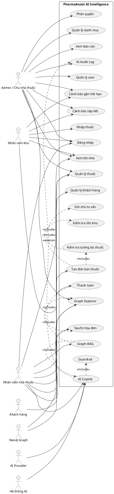

---

## 7. Activity Diagram cần chuẩn bị

| Activity | Mô tả | Mức ưu tiên |
|---|---|---|
| Bán thuốc | Tìm thuốc → thêm vào đơn → kiểm tra tồn → kiểm tra tương tác → thanh toán | High |
| Nhập thuốc | Chọn nhà cung cấp → nhập chi tiết thuốc → cập nhật tồn | High |
| Cảnh báo tương tác | Lấy danh sách thuốc → tạo cặp → kiểm tra rule → hiển thị cảnh báo | High |
| AI tư vấn | Nhập thông tin → kiểm tra guardrail → lấy context → gọi AI → xác nhận | Medium |

---

## 8. Activity Diagram - Luồng bán thuốc tại quầy

### 8.1. Mô tả

Luồng bán thuốc tại quầy là luồng nghiệp vụ quan trọng nhất của MVP. Nhân viên nhà thuốc tìm thuốc, thêm thuốc vào đơn, hệ thống kiểm tra tồn kho, kiểm tra tương tác thuốc nếu có nhiều thuốc, sau đó thanh toán và tạo hóa đơn.

### 8.2. PlantUML

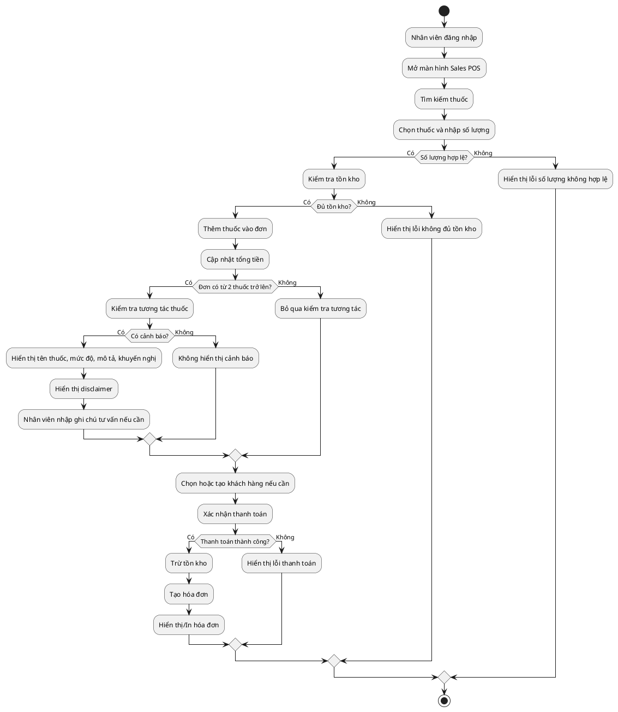

---

## 9. Activity Diagram - Luồng nhập thuốc

### 9.1. Mô tả

Luồng nhập thuốc do Nhân viên kho hoặc Admin thực hiện. Sau khi phiếu nhập được xác nhận, hệ thống cập nhật tồn kho.

### 9.2. PlantUML

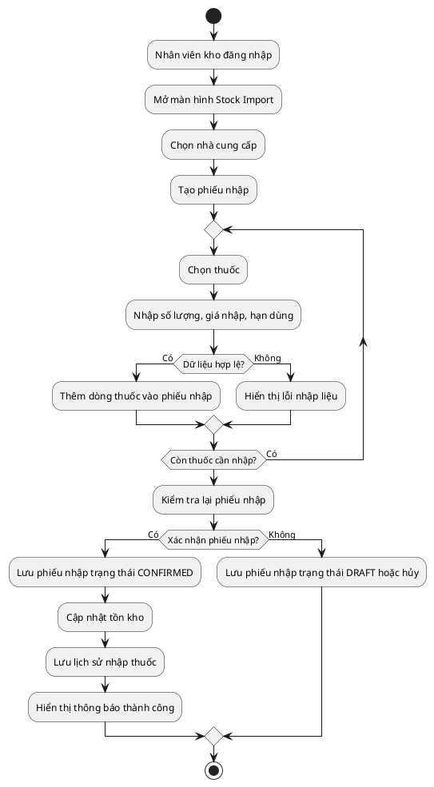

---

## 10. Activity Diagram - Luồng cảnh báo tương tác thuốc

### 10.1. Mô tả

Luồng cảnh báo tương tác thuốc được kích hoạt khi đơn hàng có từ hai thuốc trở lên. Hệ thống sinh các cặp thuốc và kiểm tra bảng DrugInteraction.

### 10.2. PlantUML

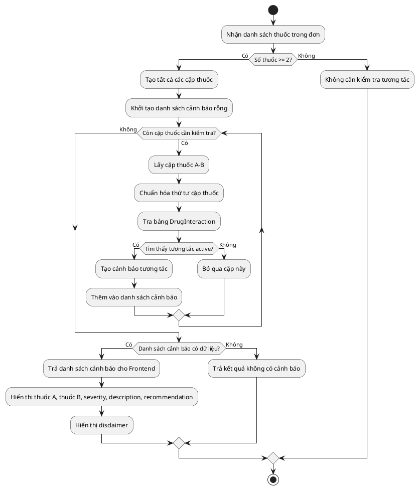

---

## 11. Activity Diagram - Luồng AI tư vấn tham khảo

### 11.1. Mô tả

Luồng AI tư vấn là chức năng nâng cao. AI chỉ sinh nội dung tham khảo, không chẩn đoán, không kê đơn và nội dung phải được người dùng xác nhận trước khi lưu.

### 11.2. PlantUML

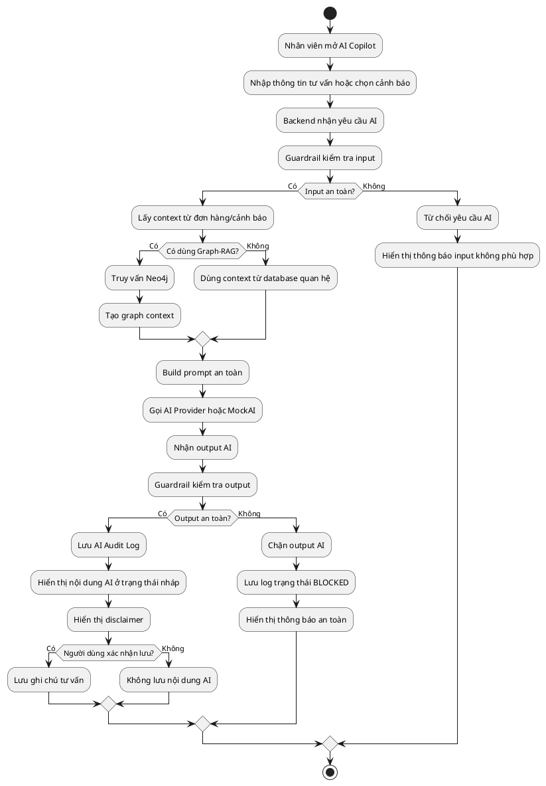

---

## 12. Sequence Diagram cần chuẩn bị

| Sequence | Thành phần | Mức ưu tiên |
|---|---|---|
| Login | UI → Auth API → Database | High |
| Create Order | UI → Sales Service → Inventory → Database | High |
| Check Interaction | UI → Rule Engine → DrugInteraction DB | High |
| AI Copilot | UI → AI Orchestrator → Guardrail → AI Provider → Audit Log | Medium |
| Graph-RAG | UI → Backend → Neo4j → Context Builder → AI | Medium |

---

## 13. Sequence Diagram - Login

### 13.1. Mô tả

Mô tả quá trình người dùng đăng nhập vào hệ thống.

### 13.2. PlantUML

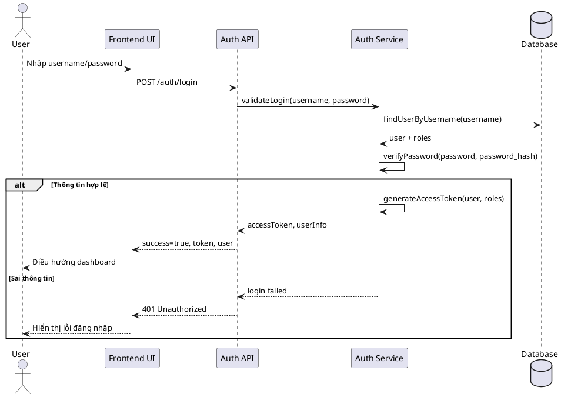

---

## 14. Sequence Diagram - Create Order

### 14.1. Mô tả

Mô tả quá trình nhân viên tạo đơn hàng và thêm thuốc vào đơn.

### 14.2. PlantUML

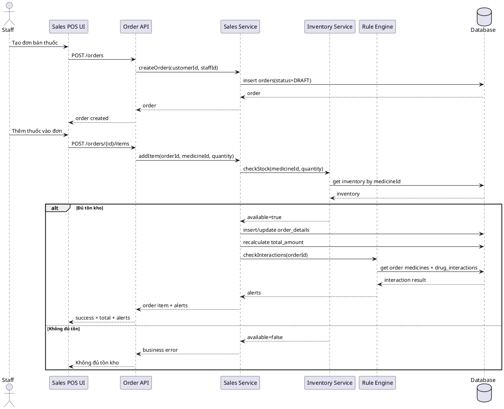

---

## 15. Sequence Diagram - Check Interaction

### 15.1. Mô tả

Mô tả quá trình kiểm tra tương tác thuốc bằng Rule Engine.

### 15.2. PlantUML

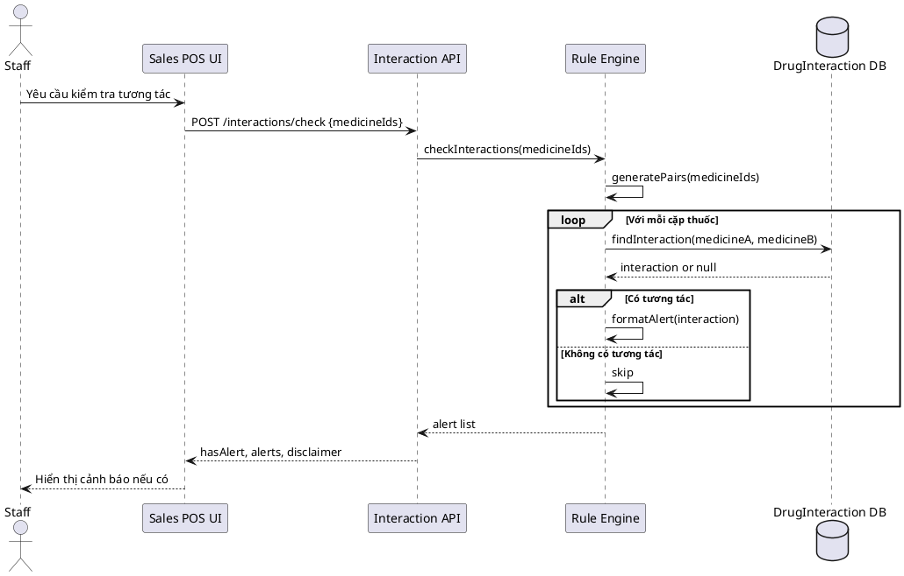

---

## 16. Sequence Diagram - AI Copilot

### 16.1. Mô tả

Mô tả quá trình AI Copilot tạo nội dung tham khảo.

### 16.2. PlantUML

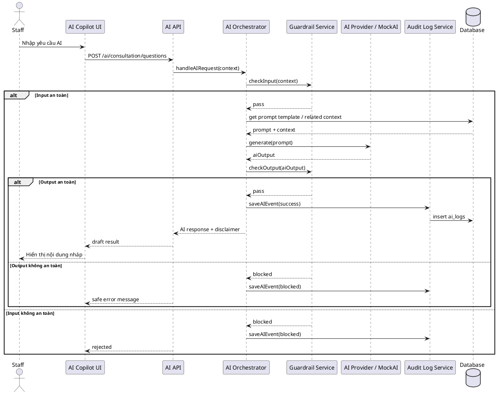

---

## 17. Sequence Diagram - Graph-RAG

### 17.1. Mô tả

Mô tả luồng truy xuất Knowledge Graph từ Neo4j để tạo context cho AI.

### 17.2. PlantUML

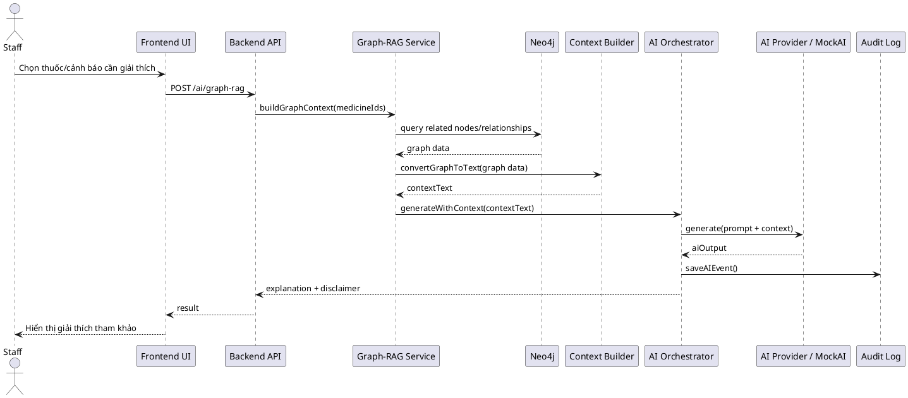

---

## 18. Class Diagram nhóm class

| Nhóm | Class |
|---|---|
| User | User, Role, UserRole |
| Medicine | Medicine, MedicineCategory, ActiveIngredient |
| Inventory | Inventory, StockImport, StockImportDetail, Supplier |
| Sales | Order, OrderDetail, Payment, Invoice, Customer |
| Interaction | DrugInteraction, InteractionAlert |
| Consultation | ConsultationSession, ConsultationNote |
| AI | AIService, AIProvider, AIOrchestrator, AILog, AIPromptTemplate |
| Graph | GraphService, GraphNode, GraphRelationship |
| Report | ReportService, SalesDailySummary, InventoryForecast |

---

## 19. Class Diagram tổng quan - PlantUML

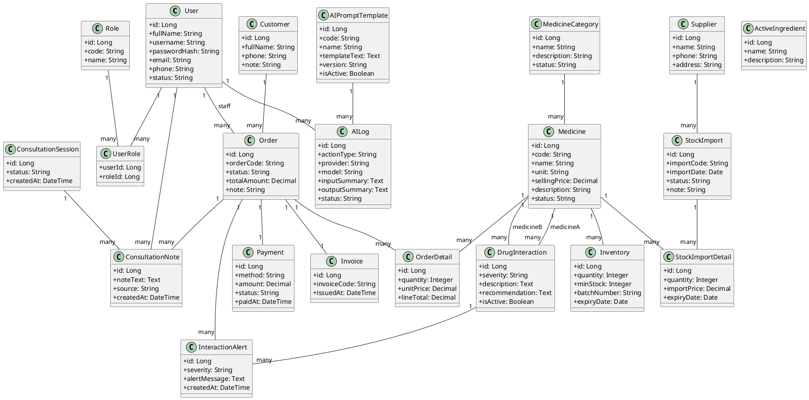

---

## 20. Class Diagram service-level - PlantUML

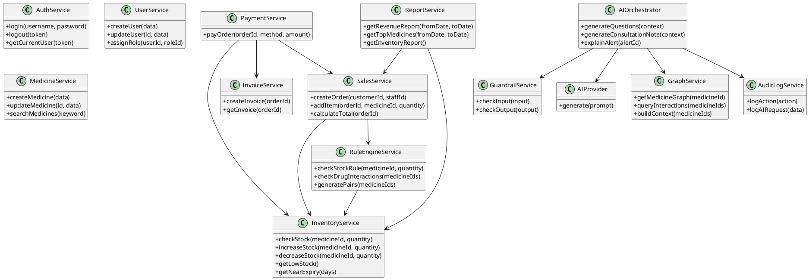

---

## 21. Mapping UML với tài liệu khác

| UML | Tài liệu liên quan |
|---|---|
| Use Case Diagram | SRS, Actor Role Permission Matrix, Use Case Specification |
| Activity Diagram bán thuốc | BRD, SRS, Business Rule, API Specification |
| Activity Diagram nhập thuốc | BRD, SRS, Database Design |
| Activity Diagram tương tác thuốc | Business Rule, Database Design, Rule Engine Design |
| Activity Diagram AI tư vấn | AI Architecture, Safety Rule, API Specification |
| Sequence Login | API Specification, Module Design |
| Sequence Create Order | API Specification, Module Design, Database Design |
| Sequence Check Interaction | Business Rule, Rule Engine, Database Design |
| Sequence AI Copilot | AI Architecture, Guardrail, Audit Log |
| Sequence Graph-RAG | Graph Design, AI Architecture |
| Class Diagram | Database Design, Module Design, System Architecture |

---

## 22. Quy tắc vẽ UML cho đồ án

| Quy tắc | Mô tả |
|---|---|
| Không vẽ quá nhiều chi tiết phụ | Tập trung vào luồng chính và module chính |
| Tên actor thống nhất | Admin, Nhân viên nhà thuốc, Nhân viên kho |
| Tên use case thống nhất với SRS | Không đổi tên tùy tiện giữa các tài liệu |
| Class/entity thống nhất với database | Medicine, Order, Payment, Invoice... |
| Sequence thống nhất với API | Endpoint trong sequence nên khớp API Specification |
| Activity thể hiện decision rõ | Dùng if/else cho kiểm tra tồn, tương tác, thanh toán |
| AI/Graph phải có disclaimer/safety | Thể hiện Guardrail và Audit Log trong sequence AI |

---

## 23. Checklist hoàn thành UML

| Hạng mục | Có/Không |
|---|---|
| Có Use Case Diagram tổng quan chưa? |  |
| Use Case có đầy đủ actor chính chưa? |  |
| Có Activity Diagram bán thuốc chưa? |  |
| Có Activity Diagram nhập thuốc chưa? |  |
| Có Activity Diagram kiểm tra tương tác chưa? |  |
| Có Activity Diagram AI tư vấn nếu làm AI chưa? |  |
| Có Sequence Diagram Login chưa? |  |
| Có Sequence Diagram Create Order chưa? |  |
| Có Sequence Diagram Check Interaction chưa? |  |
| Có Sequence Diagram AI Copilot nếu làm AI chưa? |  |
| Có Sequence Diagram Graph-RAG nếu làm graph chưa? |  |
| Có Class Diagram entity tổng quan chưa? |  |
| Có Class Diagram service-level nếu cần chưa? |  |
| UML có thống nhất với SRS/API/Database không? |  |
| Sơ đồ có thể đưa vào báo cáo/slide không? |  |

---

## 24. Kết luận

Tài liệu **UML Diagram Package** đã tập hợp các sơ đồ UML quan trọng cho hệ thống **PharmaAssist AI Intelligence**, bao gồm Use Case Diagram, Activity Diagram, Sequence Diagram và Class Diagram. Các sơ đồ này giúp mô tả hệ thống từ nhiều góc nhìn khác nhau: người dùng, quy trình nghiệp vụ, tương tác giữa các thành phần và cấu trúc class/entity/service.

Trong MVP, nhóm cần ưu tiên hoàn thiện Use Case Diagram tổng quan, Activity Diagram bán thuốc, Activity Diagram nhập thuốc, Activity Diagram kiểm tra tương tác, Sequence Diagram Login, Sequence Diagram Create Order, Sequence Diagram Check Interaction và Class Diagram tổng quan. Các sơ đồ AI Copilot và Graph-RAG có thể bổ sung nếu nhóm triển khai hoặc mô phỏng chức năng nâng cao.

Các sơ đồ UML cần được giữ thống nhất với các tài liệu SRS, Module Design, API Specification, Database Design và Business Rule/Safety Rule để đảm bảo bộ hồ sơ đồ án có tính nhất quán cao.

**Thông tin cảnh báo chỉ mang tính tham khảo, không thay thế tư vấn của dược sĩ, bác sĩ hoặc chuyên gia y tế.**

