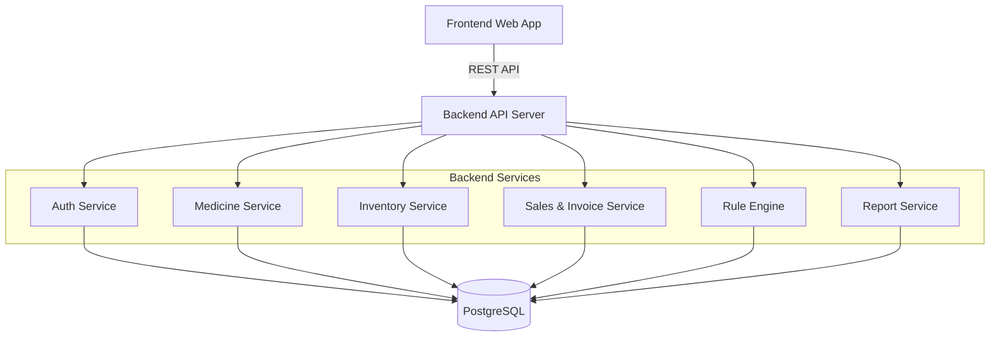

<div align="center">
  <h1>💊 PharmaAssist AI Intelligence</h1>
  <p><strong>Hệ thống quản lý nhà thuốc thông minh, an toàn và hiệu quả</strong></p>

  <!-- Badges -->
  <p>
    
    
    
    
    
    
  </p>
</div>

---

**PharmaAssist AI Intelligence** là website quản lý nhà thuốc toàn diện, hỗ trợ tối ưu hóa các nghiệp vụ: quản lý danh mục thuốc, tồn kho, nhập xuất, POS bán hàng, thanh toán, hóa đơn và báo cáo thống kê. Điểm nhấn của dự án là khả năng **tự động cảnh báo tương tác thuốc** dựa trên Rule Engine và định hướng mở rộng AI Copilot.

Dự án được thực hiện trong phạm vi môn **Công Nghệ Phần Mềm**, tuân thủ nghiêm ngặt quy trình phân tích, thiết kế, phát triển, và kiểm thử phần mềm chuẩn kỹ nghệ.

> ⚠️ **Lưu ý an toàn (Disclaimer):**  
> Mọi thông tin cảnh báo tương tác thuốc trong hệ thống chỉ mang tính chất **tham khảo (dữ liệu mẫu)**, không thay thế tư vấn y khoa chuyên môn từ dược sĩ hay bác sĩ. Hệ thống không thực hiện chức năng chẩn đoán hay kê đơn y tế.

---

## 📑 Bảng Mục Lục

- [1. Mục tiêu dự án](#1-mục-tiêu-dự-án)
- [2. Chức năng cốt lõi (MVP) & Mở rộng](#2-chức-năng-cốt-lõi-mvp--mở-rộng)
- [3. Phân quyền người dùng](#3-phân-quyền-người-dùng)
- [4. Điểm nhấn: Rule-based Drug Interaction Alert](#4-điểm-nhấn-rule-based-drug-interaction-alert)
- [5. Kiến trúc hệ thống](#5-kiến-trúc-hệ-thống)
- [6. Công nghệ sử dụng](#6-công-nghệ-sử-dụng)
- [7. Hướng dẫn cài đặt & Khởi chạy (Quick Start)](#7-hướng-dẫn-cài-đặt--khởi-chạy-quick-start)
- [8. Dữ liệu & Tài khoản Demo](#8-dữ-liệu--tài-khoản-demo)
- [9. Business Rules & An toàn hệ thống](#9-business-rules--an-toàn-hệ-thống)
- [10. API nổi bật](#10-api-nổi-bật)

---

## 🚀 1. Mục tiêu dự án

PharmaAssist AI Intelligence được thiết kế để giải quyết các bài toán vận hành của các nhà thuốc vừa và nhỏ thông qua:
- Số hóa toàn diện quy trình quản lý thông tin thuốc và tồn kho.
- Tăng tốc độ và tính chính xác khi bán hàng tại quầy (POS).
- Giảm thiểu rủi ro y tế thông qua hệ thống cảnh báo tương tác thuốc và thuốc sắp hết hạn.
- Cung cấp cái nhìn tổng quan về tình hình kinh doanh qua các báo cáo trực quan.

---

## ✨ 2. Chức năng cốt lõi (MVP) & Mở rộng

### 📦 Chức năng MVP (Cơ bản)
- **Xác thực & Phân quyền:** Đăng nhập/Đăng xuất an toàn (JWT), kiểm soát truy cập (RBAC).
- **Quản lý Danh mục:** Thuốc, danh mục, nhà cung cấp, khách hàng.
- **Quản lý Tồn kho:** Theo dõi lô/hạn sử dụng, nhập thuốc, cảnh báo sắp hết hàng/gần hết hạn.
- **Bán hàng (POS):** Tạo đơn, kiểm tra tồn kho realtime, thêm ghi chú tư vấn, thanh toán mô phỏng.
- **Rule Engine:** Tự động phát hiện và cảnh báo tương tác thuốc khi lên đơn.
- **Tài chính & Báo cáo:** In hóa đơn, xem lịch sử giao dịch, thống kê doanh thu và sản phẩm bán chạy.

### 🤖 Tính năng mở rộng (Advanced)
- **AI Pharmacist Copilot:** Hỗ trợ giải thích các cảnh báo tương tác thuốc phức tạp.
- **AI Guardrail & Audit Log:** Giám sát an toàn các truy vấn AI và theo dõi lịch sử thao tác người dùng.
- **Knowledge Graph:** Trực quan hóa mối quan hệ giữa các hoạt chất và thuốc (Neo4j).

---

## 👥 3. Phân quyền người dùng

Hệ thống cung cấp trải nghiệm chuyên biệt cho 4 nhóm đối tượng:

| Vai trò | Mô tả Quyền hạn |
| :--- | :--- |
| 👑 **Admin / Chủ nhà thuốc** | Quản lý toàn hệ thống, người dùng, báo cáo doanh thu, thiết lập cấu hình. |
| 🧑‍⚕️ **Nhân viên nhà thuốc** | Lên đơn POS, tư vấn thuốc, xem cảnh báo tương tác, thanh toán & in hóa đơn. |
| 📦 **Nhân viên kho** | Nhập thuốc, cập nhật tồn kho, theo dõi hạn sử dụng và ngưỡng an toàn. |
| 👤 **Khách hàng** | Đối tượng mua thuốc. (Không bắt buộc tạo tài khoản trong phiên bản MVP). |

---

## 🚨 4. Điểm nhấn: Rule-based Drug Interaction Alert

Một trong những tính năng lõi giúp giảm thiểu sai sót y khoa. Khi nhân viên thêm từ 2 loại thuốc trở lên vào đơn hàng, hệ thống tự động:
1. Quét dữ liệu chéo trong `drug_interactions`.
2. Hiển thị mức độ cảnh báo (`LOW`, `MEDIUM`, `HIGH`).
3. Cung cấp chi tiết mô tả nguy cơ và khuyến nghị xử lý.
4. Yêu cầu nhập ghi chú tư vấn trước khi thanh toán.

---

## 🏗 5. Kiến trúc hệ thống

Ứng dụng áp dụng mô hình phân lớp rõ ràng, đảm bảo tính dễ bảo trì và mở rộng:



---

## 🛠 6. Công nghệ sử dụng

| Tầng / Nhiệm vụ | Công nghệ & Công cụ |
| :--- | :--- |
| **Frontend** | React / Next.js, TypeScript, Tailwind CSS, Axios, Chart libraries |
| **Backend** | Node.js, NestJS (hoặc Express), JWT (Auth), REST API |
| **Database** | PostgreSQL, Prisma ORM (TypeORM) |
| **Hạ tầng & DevOps** | Git, GitHub, Docker (Optional), npm/yarn |
| **Công cụ thiết kế** | Figma, PlantUML, dbdiagram.io, Postman |

---

## ⚙️ 7. Hướng dẫn Cài đặt & Triển khai (Installation & Deployment)

PharmaAssist được thiết kế để dễ dàng cài đặt cho các lập trình viên muốn lấy dự án về phát triển, cũng như có thể triển khai lên môi trường thực tế.

### 📋 Yêu cầu hệ thống cơ bản
- **Node.js**: v20.0+ (Bắt buộc)
- **Database**: PostgreSQL (Local hoặc Supabase/Neon)
- **Công cụ dòng lệnh**: Git, Terminal (Bash/Zsh/PowerShell)

### 🚀 Môi trường Phát triển (Local Development) - Khuyến nghị

Chúng tôi đã xây dựng sẵn một công cụ CLI là `run.js` nằm ngay ở thư mục gốc để tự động hóa toàn bộ quá trình cài đặt mà **không cần** bạn phải gõ từng lệnh thủ công.

**Bước 1: Clone dự án**
```bash
git clone https://github.com/TwotNguyenVN/PharmaAssist.git
cd PharmaAssist
```

**Bước 2: Cài đặt và Khởi chạy tự động**
Thay vì phải vào từng thư mục để cài đặt, bạn chỉ cần chạy công cụ điều phối của chúng tôi:
```bash
node run.js
```
1. Chọn **[1] Cài đặt dự án (Setup)**: Hệ thống sẽ tự động cài thư viện cho cả Backend và Frontend, thiết lập cấu trúc Prisma, và tự động copy các file cấu hình `.env` nếu bạn chưa có.
2. (Bắt buộc) Mở file `backend/.env` và cập nhật biến `DATABASE_URL` thành chuỗi kết nối PostgreSQL của bạn.
3. Chạy `npx prisma db push` trong thư mục `backend` để khởi tạo cấu trúc bảng.
4. Chạy lại `node run.js` và chọn **[2] Chạy đồng thời dự án (Start)**: Cả Frontend và Backend sẽ chạy chung trên một cửa sổ Terminal.
   - Frontend web sẽ mở tại: `http://localhost:3000`
   - Backend API sẽ mở tại: `http://localhost:3001`

> **💡 Mẹo:** Khi muốn xem chi tiết hướng dẫn trực tiếp qua terminal, bạn có thể chạy:
> `node run.js docs` hoặc chọn mục `[0] Xem Hướng dẫn` trong Menu.

### 🌍 Môi trường Sản xuất (Production Deployment)

Nếu bạn muốn deploy dự án này lên các server thực tế (như Ubuntu VPS, Vercel, Render), hãy thực hiện:

**1. Deployment Backend (NestJS):**
Khuyến nghị deploy trên Render, Heroku hoặc VPS.
```bash
cd backend
npm install --omit=dev
npx prisma generate
npm run build
npm run start:prod
```
*Lưu ý: Phải thiết lập biến `DATABASE_URL` trỏ đến database production trên server.*

**2. Deployment Frontend (Next.js):**
Khuyến nghị deploy Frontend lên **Vercel** để tự động tối ưu hóa SSR và caching.
Nếu tự deploy trên VPS bằng Node.js:
```bash
cd frontend
npm install
npm run build
npm run start
```
*Lưu ý: Phải thiết lập biến môi trường `NEXT_PUBLIC_API_URL` trỏ về domain của Backend API (Ví dụ: `https://api.pharmaassist.com`).*

---

## 🔑 8. Dữ liệu & Tài khoản Demo

Để trải nghiệm trọn vẹn luồng nghiệp vụ (POS → Alert → Payment → Invoice), bạn có thể sử dụng các tài khoản và dữ liệu được seed sẵn:

**Tài khoản đăng nhập:**
| Vai trò | Email đăng nhập | Mật khẩu |
| :--- | :--- | :--- |
| Admin | `admin@pharmaassist.com` | `admin123` |
| Nhân viên bán thuốc | `staff@pharmaassist.com` | `staff123` |
| Nhân viên kho | `warehouse@pharmaassist.com` | `warehouse123` |

**Thuốc Demo:**
- **MED001** & **MED002**: Ghép chung vào đơn để kích hoạt **Cảnh báo tương tác HIGH**.
- **MED003**: Dùng để xem cảnh báo sắp hết hàng.
- **MED004**: Dùng để xem cảnh báo gần hết hạn.

---

## 📋 9. Business Rules & An toàn hệ thống

Các quy tắc (Rules) quan trọng được hard-coded và kiểm tra nghiêm ngặt:

- **BR-05 / BR-06:** Không được phép bán thuốc vượt số lượng tồn kho khả dụng. Số lượng không được âm.
- **BR-09:** Đơn hàng phải có ít nhất 1 loại thuốc trước khi checkout.
- **BR-10 / BR-12:** Chỉ trừ tồn kho thực tế và xuất hóa đơn SAU KHI thanh toán thành công.
- **BR-13:** Bắt buộc quét tương tác thuốc khi đơn có ≥ 2 sản phẩm.

**Bảo mật:**
- Không hard-code `.env`, credentials hoặc API Keys.
- Validation mọi input từ phía Client ở tầng Controller (Backend).
- Không chia sẻ dữ liệu y khoa thật.

---

## 🔌 10. API nổi bật

Hệ thống tuân chuẩn RESTful, dưới đây là các endpoint tiêu biểu:

| Nghiệp vụ | Method | Endpoint |
| :--- | :--- | :--- |
| **Authentication** | `POST` | `/auth/login` |
| **Inventory** | `GET` | `/inventory/low-stock` |
| **Sales (POS)** | `POST` | `/orders` |
| **Interactions** | `POST` | `/orders/{id}/check-interactions` |
| **Payment** | `POST` | `/orders/{id}/pay` |
| **Reports** | `GET` | `/reports/revenue` |

*(Chi tiết đầy đủ xem thêm tại tài liệu API Specification / Swagger)*

---
*Built with ❤️ for Công Nghệ Phần Mềm course.*
 
