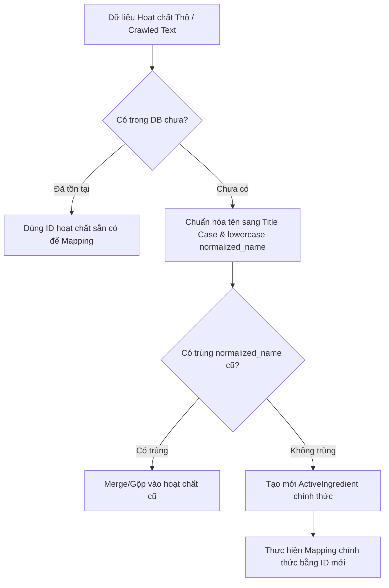

# ActiveIngredient Data Quality Review Checklist
## Mã JIRA: PAC-296 | PAC-TASK-086

Tài liệu này định nghĩa các tiêu chuẩn chất lượng dữ liệu, quy tắc đặt tên, quy trình kiểm soát trùng lặp và hướng dẫn nhập liệu cho Danh mục Hoạt chất (`ActiveIngredient`) trong hệ thống PharmaAssist.

---

## 1. Quy tắc Đặt tên Hoạt chất (Naming Rules)
Tên hoạt chất chính thức lưu trữ trong hệ thống bắt buộc phải tuân thủ các quy tắc sau:

- **Định dạng Title Case**: Viết hoa chữ cái đầu tiên của mỗi từ và viết thường các chữ cái còn lại.
  * *Hợp lệ*: `Paracetamol`, `Acid Acetylsalicylic`, `Amoxicillin Trihydrate`.
  * *Không hợp lệ*: `PARACETAMOL`, `paracetamol`, `Amoxicillin trihydrate`.
- **Dọn dẹp khoảng trắng**:
  * Loại bỏ toàn bộ khoảng trắng thừa ở đầu và cuối chuỗi.
  * Thu gọn các khoảng trắng kép hoặc nhiều khoảng trắng liên tiếp ở giữa các từ thành 1 khoảng trắng duy nhất.
- **Danh pháp Quốc tế/Y học**:
  * Sử dụng danh pháp hoạt chất chuẩn tiếng Anh hoặc danh pháp y học quốc tế thông dụng được Bộ Y tế công nhận.
  * Không dùng biệt dược (Brand Name) làm tên hoạt chất (Ví dụ: dùng `Paracetamol` chứ không dùng `Panadol`).

---

## 2. Quy tắc Chống trùng lặp Dữ liệu (Uniqueness Rules)
Hệ thống sử dụng cơ chế bảo vệ 3 lớp để chống trùng lặp hoạt chất:

1. **Lớp Database (Unique Index)**:
   - Cột `normalized_name` trong bảng `active_ingredients` được cấu hình ràng buộc `UNIQUE` ở tầng PostgreSQL.
   - Bất kỳ thao tác ghi đè hoặc chèn trùng lặp `normalized_name` nào cũng sẽ bị database từ chối và rollback transaction.
2. **Lớp Backend (Index Lookup)**:
   - Trước khi thực hiện `create` hoặc `update`, service thực hiện truy vấn `findUnique` trên trường `normalizedName` (tên đã lowercase và dọn dẹp khoảng trắng).
   - Trả về mã lỗi `400 BadRequestException` với thông báo rõ ràng: `"Tên hoạt chất đã tồn tại"` để người dùng và frontend dễ dàng xử lý.
3. **Lớp Frontend (Dropdown Filter)**:
   - Khi liên kết hoạt chất vào thuốc, giao diện chỉ hiển thị danh sách hoạt chất chính thức đã được phê duyệt.
   - Lọc bỏ các hoạt chất đã được chọn ở các hàng trước đó để tránh việc gán trùng lặp hoạt chất vào cùng một thuốc (composite unique constraint `medicine_id + active_ingredient_id`).

---

## 3. Quy trình Review và Chuẩn hóa Dữ liệu Crawl (Scraped Data Pipeline)
Nghiêm cấm việc đẩy trực tiếp chuỗi hoạt chất thô chưa qua kiểm duyệt từ các nguồn thu thập (crawl/scraped) làm dữ liệu mapping chính thức. Quy trình chuẩn hóa bắt buộc phải thực hiện như sau:

- **Hướng dẫn cho AI Agent**:
  - Tuyệt đối không tự sinh hoặc chèn chuỗi text tự do vào mapping thuốc.
  - Khi viết seed data hoặc migration data, bắt buộc phải tra cứu id từ bảng `active_ingredients` bằng `normalized_name`.
  - Nếu hoạt chất mới cần thiết cho thuốc seed, phải chèn hoạt chất đó vào bảng `active_ingredients` trước theo đúng quy tắc chuẩn hóa, sau đó mới tạo liên kết mapping.

---

## 4. Bảng Checklist Kiểm soát Dữ liệu hoạt chất

| STT | Nội dung kiểm tra | Trạng thái | Phương pháp kiểm tra |
|---|---|:---:|---|
| 1 | Không tồn tại khoảng trắng thừa đầu/cuối | **Đạt** | Service `normalizeName()` tự động trim |
| 2 | Tên hiển thị viết hoa chữ cái đầu (Title Case) | **Đạt** | Service tự động split và capitalize từng từ |
| 3 | `normalized_name` lưu dưới dạng lowercase không dấu cách thừa | **Đạt** | Kiểm tra trường `normalized_name` trong database |
| 4 | Ràng buộc Unique Index trên `normalized_name` hoạt động | **Đạt** | Đã được kiểm chứng qua migration SQL & unit tests |
| 5 | mapping chặn hoàn toàn raw text thô | **Đạt** | Khóa ngoại `active_ingredient_id` được enforce ở DB & DTO |
| 6 | Selector ở UI gợi ý tạo mới thay vị nhập tự do | **Đạt** | Có prompt note hiển thị rõ trên UI new/edit medicines |
